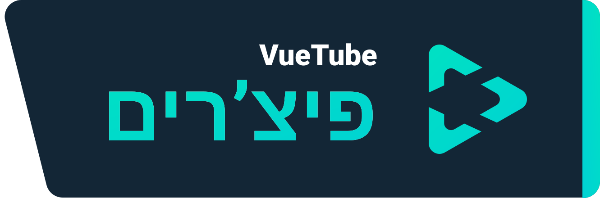
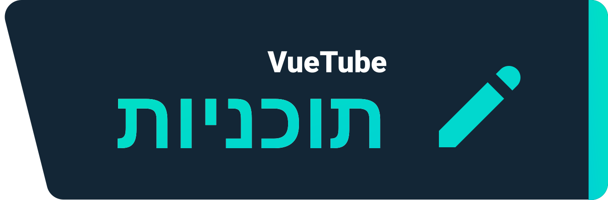

  
   
  Logo by <a href="https://github.com/afnzmn">@afnzmn</a>
   
   
<strong>אפליקציה פשוטה להזרמת וידאו (עם קוד נגיש) שמטרתה ליצור מחדש את כל התכונות מהאפליקציות עליהן בנויה (ועוד)</strong>
 
מבוטא וְויוּ טְיּוּב

  <a href="https://github.com/VueTubeApp/VueTube/blob/main/LICENSE" alt="License"></img></a>
  <a href="https://github.com/VueTubeApp/VueTube/actions/workflows/ci.yml" alt="CI"></img></a>
  <a href="https://reddit.com/r/vuetube" alt="Reddit"></img></a>
  <a href="https://t.me/VueTube" alt="Telegram"></img></a>
  <a href="https://discord.gg/7P8KJrdd5W" alt="Discord"></img></a>
  <a href="https://twitter.com/VueTubeApp" alt="Twitter"></img></a>

לקרוא בשפות אחרות: [English,](readme.md) [Español,](readme.es.md) [简体中文,](readme.zh-hans.md) [繁體中文,](readme.zh-hant.md) [日本語,](readme.ja.md) [Nederlands,](readme.nl.md) [தமிழ்,](readme.ta.md) [Bahasa Melayu,](readme.ms.md) [Македонски,](readme.mk.md) [Français](readme.fr.md)

  
## פיצ'רים \ תכונות

  

  
  

-  🎨 סטיילים: בהיר, קהה, אולד, וכל צבהי הקשת
-  🖌️ ממשק משתמש ניתן להתאמה אישית: אפשר גם להוריד את מה שאתם לא צריכים!
-  ⬆️ עדכונים אוטומטים, אפשר לשנות גרסה בחופשיות
-  👁️ הגנת מעקב: כברירת מחדל לא נשלח מידע ממכשירך
-  👎 מחזיר את הדיסלייק ביוטיוב

## הורדה והתקנה

כדי להתקין, תעברו לאתר הבא:  www.vuetube.app/install

  
או תלחצו פה כדי לראות את כל הגרסאות ה

 

### Android
|   |  |   |
| ------------- | ------------- |  ------------- |
| הרבה באגים, אבל אפשר לנסות פיצ'רים חדשים | פחות באגים, ויותר פיצ'רים מגרסה היציבה | לא ניתנה להורדה עד שהאפליקציה תהיה יותר מוכנה  

### iOS
|   |  |   |
| ------------- | ------------- |  ------------- |
| הרבה באגים, אבל אפשר לנסות פיצ'רים חדשים | פחות באגים, ויותר פיצ'רים מגרסה היציבה | לא ניתנה להורדה עד שהאפליקציה תהיה יותר מוכנה    

## תוכניות לעתיד

- 🔍 חיפוש מתקדם
- 🗞️ שמירת היסטורית הצפייה לוקלית
- ✂️ קליפים
- 🧑 כניסה עם חשבות גוגל
- 🖼️ מודה של תמונה-בתוך-תמונה
- ועוד!

  
  
## צילומי מסך

בקרו באתרינו: www.vuetube.app/info/screenshots

  
 :או תראו סיכום שלו פה 

 
  

     

### תכנולוגיות בשימוש

       

### מדוע בנינו את זה?

היה דיבור על לבנות משהו כזה בשרת דיסקורד של "החזרו את הדיסלייק ביוטיוב" / "Return Youtube Dislike" כבר די הרבה זמן, אז חשבתי לנסות!
  
  
### רוצה לעזור?

תקרא\י את הדרך לתרום לנו פה: www.vuetube.app/contributing

## תורמים

  

Made with [contrib.rocks](https://contrib.rocks). 

## תודות

- Emojis by the [Twemoji team](https://twemoji.twitter.com/), Licensed under [CC-BY 4.0](https://creativecommons.org/licenses/by/4.0/)
- VueTube Logo by [@afnzmn](https://github.com/afnzmn)

## כתב ויתור

The VueTube project and its contents are not affiliated with, funded, authorized, endorsed by, or in any way accociated with YouTube, Google LLC or any of its affiliates and subsidaries. The official YouTube website can be found at [www.youtube.com](https://www.youtube.com).

Any trademark, service mark, trade name, or other intellectual property rights used in the VueTube project are owned by the respective owners.

