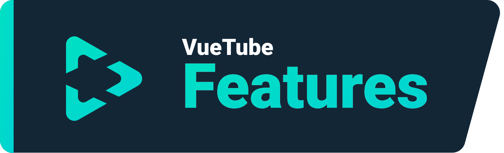
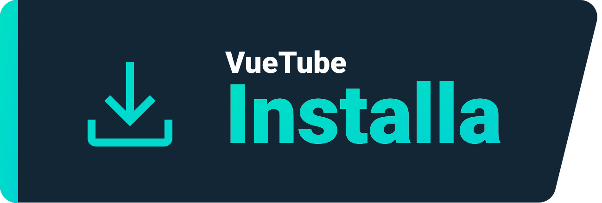
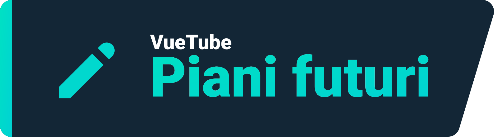

  
   
  Logo di <a href="https://github.com/afnzmn">@afnzmn</a>
   
   
<strong>Un semplice client di streaming video FOSS mirato a ricreare TUTTE le funzionalità dalle rispettive app (e altro).</strong>
 
Pronunciato View Tube (<code>/ˈvjuːˌtjuːb/</code>)

  <a href="https://github.com/VueTubeApp/VueTube/blob/main/LICENSE" alt="License"></img></a>
  <a href="https://github.com/VueTubeApp/VueTube/actions/workflows/ci.yml" alt="CI"></img></a>
  <a href="https://reddit.com/r/vuetube" alt="Reddit"></img></a>
  <a href="https://t.me/VueTube" alt="Telegram"></img></a>
  <a href="https://discord.gg/7P8KJrdd5W" alt="Discord"></img></a>
  <a href="https://twitter.com/VueTubeApp" alt="Twitter"></img></a>

Leggi questo in altre lingue: [English,](readme.md) [Español,](readme.es.md) [简体中文,](readme.zh-hans.md) [繁體中文,](readme.zh-hant.md) [日本語,](readme.ja.md) [עִברִית,](readme.he.md) [Nederlands,](readme.nl.md) [தமிழ்,](readme.ta.md) [Bahasa Melayu,](readme.ms.md) [Македонски,](readme.mk.md) [Français,](readme.fr.md) [Português Brasileiro,](readme.pt-br.md) [Bahasa Indonesia,](readme.id.md) [Polski,](readme.pl.md) [Български,](readme.bg.md) [Italiano,](readme.it.md) [한국어](readme.kr.md)

## Features

- 🎨 Temi: Chiaro, Scuro, OLED, Tutti i colori dell'arcobaleno
- 🖌️ UI personalizzabile: Puoi personalizzare completamente il colore e altre parti dell'interfaccia utente per rimuovere le funzionalità che non usi!
- ⬆️ Aggiornamento automatico: Ricevi una notifica quando è disponibile un aggiornamento ed esegui il downgrade se non ti piace!
- 👁️ Protezione dal tracciamento: Nessuna telemetria viene inviata dal tuo dispositivo per impostazione predefinita
- 📺 Video player custom
- 👎 Utilizza l'API di Return YouTube Dislike per mostrare il conteggio di non mi piace

## Installa

Per installare visita www.vuetube.app/install

  
O clicca qui per mostrare tutte le versioni disponibili

 

### Android

|  |  |  |
| ------------------------------------------------------------------------------------------------------------------------------------------- | --------------------------------------------------------------------------------------------------------------------------------------------------------------- | ----------------------------------------------------------------------------------------------- |
| Molti bug, ma accesso anticipato alle funzionalità                                                                                          | Meno bug della versione instabile, leggermente più funzionalità della stabile                                                                                   | Non disponibile fino a quando l'app non sarà più sviluppata                                     |

### iOS

|  |  |  |
| --------------------------------------------------------------------------------------------------------------------------------------- | ------------------------------------------------------------------------------------------------------------------------------------------------------------------------------ | ----------------------------------------------------------------------------------------------- |
| Molti bug, ma accesso anticipato alle funzionalità                                                                                      | Meno bug della versione instabile, leggermente più funzionalità della stabile                                                                                                  | Non disponibile fino a quando l'app non sarà più sviluppata                                     |

## Piani futuri

- 🔍 Ricerca Avanzata
- 🗞️ Cronologia visualizzazioni archiviata localmente
- ✂️ Shorts
- 🧑 Accesso all'account Google
- 🖼️ Modalità picture in picture
- e molto altro!

## Screenshots

Visualizzali nel nostro sito: www.vuetube.app/info/screenshots

  
 O clicca qui per mostrare gli screenshot 

 
  

     

### Tecnologie utilizzate

       

### Perché lo sto facendo?

Se n'è parlato sul server discord di Return Youtube Dislike per un po' di tempo, quindi ho pensato che probabilmente avrei dovuto provarci!

### Vuoi contribuire?

Leggi sul nostro sito come fare: www.vuetube.app/contributing

## Collaboratori

Creato con [contrib.rocks](https://contrib.rocks). 

## Ringraziamenti

- Emojis dal [team Twemoji](https://twemoji.twitter.com/), Sotto licenza [CC-BY 4.0](https://creativecommons.org/licenses/by/4.0/)
- Logo VueTube di [@afnzmn](https://github.com/afnzmn)
- Dati pubblici sui non mi piace forniti da [Return Youtube Dislike](https://returnyoutubedislike.com)
- Ajay e la Community per aver fornito [Sponsorblock API](https://sponsor.ajay.app), Sotto licenza [CC BY-NC-SA 4.0](https://creativecommons.org/licenses/by-nc-sa/4.0/)

## Disclaimer

Il progetto VueTube e i suoi contenuti non sono affiliati, finanziati, autorizzati, approvati o in alcun modo associati a YouTube, Google LLC o a nessuna delle sue affiliate e sussidiarie. Il sito Web ufficiale di YouTube è disponibile all'indirizzo [www.youtube.com](https://www.youtube.com).

Qualsiasi marchio, marchio di servizio, nome commerciale o altri diritti di proprietà intellettuale utilizzati nel progetto VueTube sono di proprietà dei rispettivi proprietari.
