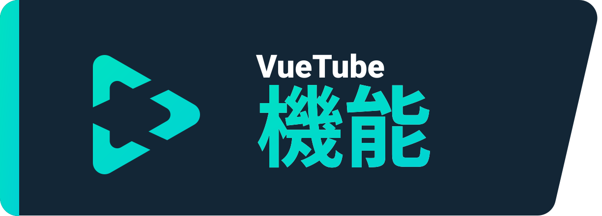
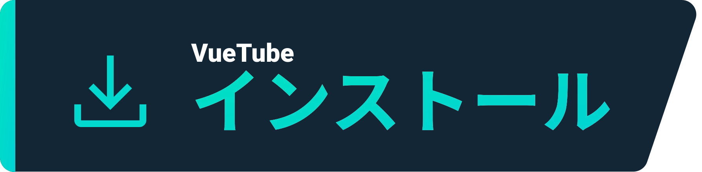
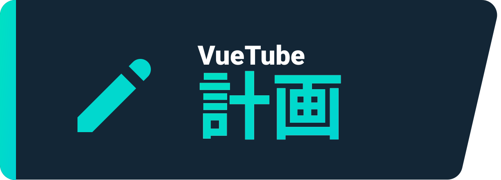

  
   
  <a href="https://github.com/afnzmn">@afnzmn</a>・ロゴ
   
   
<strong>対応する各アプリケーションの機能を書き換えて使用可能な、シンプルなオープンソースビデオストリーミングクライアントです。 </strong>
 

  <a href="https://github.com/VueTubeApp/VueTube/blob/main/LICENSE" alt="License"></img></a>
  <a href="https://github.com/VueTubeApp/VueTube/actions/workflows/ci.yml" alt="CI"></img></a>
  <a href="https://reddit.com/r/vuetube" alt="Reddit"></img></a>
  <a href="https://t.me/VueTube" alt="Telegram"></img></a>
  <a href="https://discord.gg/7P8KJrdd5W" alt="Discord"></img></a>
  <a href="https://twitter.com/VueTubeApp" alt="Twitter"></img></a>

他の言語で読む：[English,](readme.md) [Español,](readme.es.md) [简体中文,](readme.zh-hans.md) [繁體中文,](readme.zh-hant.md) [עִברִית,](readme.he.md) [Nederlands,](readme.nl.md) [தமிழ்,](readme.ta.md) [Bahasa Melayu,](readme.ms.md) [Македонски,](readme.mk.md) [Français](readme.fr.md)

## 機能

- 🎨 テーマ色をカスタマイズする：ライト系、 ダーク系、OLED、などなど
- 🖌️ UIのカストマイズ：アクセントカラーをはじめ、UIをフルカスタマイズして、使用しない機能を削除できます！
- ⬆️ 自動更新：アップデートのお知らせ＆気に入らなければダウングレードができます！
- 👁️ トラッキング防止: 自分のデバイスから送信されるデータはデフォルトでは送信されません。
- 📺 カスタムビデオプレーヤー
- 👎 ユーチューブの低評価数を取得できます。

## インストール

インストールはこちらからどうぞ: https://vuetube.app/install

  
または、ここをクリックすると、使用可能なすべてのバージョンが表示されます

 

### Android
|   |  |   |
| ------------- | ------------- |  ------------- |
| バグが発生する可能性があるのに最新の機能をいち早く試されます。 | unstable よりもバグが少ないが、stable よりも若干機能が多い。 | VueTubeが開発中のため、このバージョンは暫くダウンロードできない |
  

### iOS
|   |  |   |
| ------------- | ------------- |  ------------- |
| バグが発生する可能性があるのに最新の機能をいち早く試されます。 | unstable よりもバグが少ないが、stable よりも若干機能が多い。 | VueTubeが開発中のため、このバージョンは暫くダウンロードできない |
  

## 計画

- 🔍 アドバンストサーチ
- 🗞️ ウォッチ履歴のローカルストレージ
- ✂️ ショート
- 🧑 グーグルアカウントでログイン
- 🖼️ Picture in Picture（PiP）機能

## スクリーンショット

ウェブサイトで見る: www.vuetube.app/info/screenshots

  
 または、ここをクリックすると、スクリーンショットが表示されます 

 
  

     

### 使用技術

       

### 貢献方法

貢献したい方はこちらを読んでください: www.vuetube.app/contributing

## このアプリケーションを作った理由
こういう機能が「Return Youtube Dislike」というディスコードのサーバーで話題になり、

何か作ってみようかなと思ったからです！

## コントリビューター

[contrib.rocks](https://contrib.rocks)で作られた 

## 謝辞

- 絵文字は[Twemoji](https://twemoji.twitter.com/)のものを使用しました。ライセンスは[CC-BY 4.0](https://creativecommons.org/licenses/by/4.0/)です
- VueTubeのロゴは[@afnzmn](https://github.com/afnzmn)によります。
