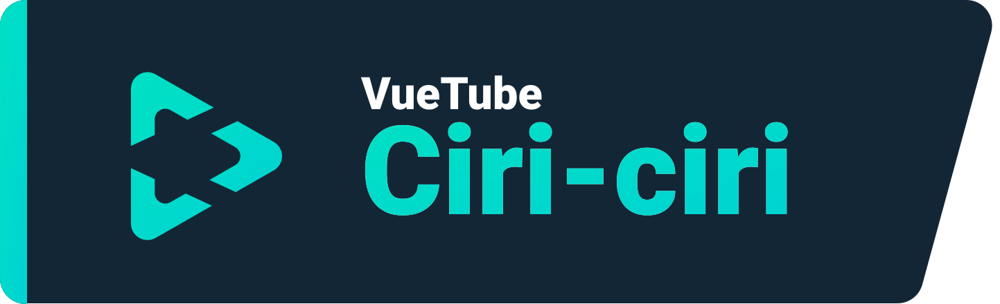
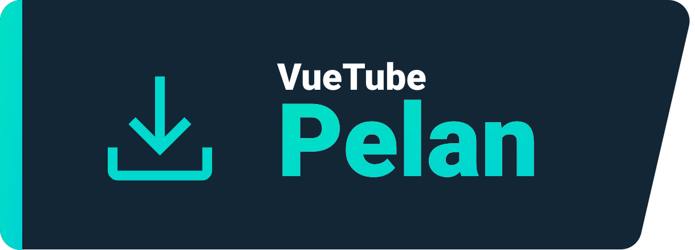
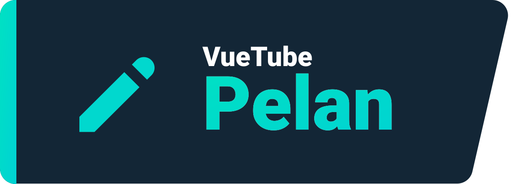

  
   
  Logo oleh <a href="https://github.com/afnzmn">@afnzmn</a> 
  Terjemahan oleh <a href="https://github.com/AdamIskandarAI">@AdamIskandarAI</a>
   
   
<strong>Sebuah klien penstriman video FOSS ringkas bertujuan untuk mencipta semula SEMUA ciri daripada aplikasi masing-masing (dan banyak lagi)</strong>
 
Disebut View Tube (<code>/ˈvjuːˌtjuːb/</code>)

  <a href="https://github.com/VueTubeApp/VueTube/blob/main/LICENSE" alt="License"></img></a>
  <a href="https://github.com/VueTubeApp/VueTube/actions/workflows/ci.yml" alt="CI"></img></a>
  <a href="https://reddit.com/r/vuetube" alt="Reddit"></img></a>
  <a href="https://t.me/VueTube" alt="Telegram"></img></a>
  <a href="https://discord.gg/7P8KJrdd5W" alt="Discord"></img></a>
  <a href="https://twitter.com/VueTubeApp" alt="Twitter"></img></a>

Baca ini dalam bahasa lain: [English,](readme.md) [Español,](readme.es.md) [简体中文,](readme.zh-hans.md) [繁體中文,](readme.zh-hant.md) [日本語,](readme.ja.md) [עִברִית,](readme.he.md) [Nederlands,](readme.nl.md) [தமிழ்,](readme.ta.md) [Bahasa Melayu,](readme.ms.md) [Македонски,](readme.mk.md) [Français,](readme.fr.md) [Português Brasileiro,](readme.pt-br.md) [Bahasa Indonesia,](readme.id.md) [Polski,](readme.pl.md) [Български,](readme.bg.md) [Italiano](readme.it.md)

## Ciri-ciri

- 🎨 Tema: Cerah, Gelap, OLED, Semua warna pelangi
- 🖌️ UI yang dibolehkan suaikan: Anda boleh menyesuaikan sepenuhnya warna aksen dan bahagian lain UI untuk mengalih keluar ciri yang anda tidak gunakan!
- ⬆️ Kemaskini Auto: Anda akan dimaklumkan apabila kemas kini tersedia & kembali ke versi lama jika anda tidak menyukainya!
- 👁️ Perlindungan Penjejak: Tiada telemetri (maklumat peribadi) dihantar daripada peranti anda secara lalai
- 📺 Pemain video yang boleh disesuaikan 
- 👎 Return YouTube Dislike: [*Maklumat lanjut*](https://returnyoutubedislike.com)
- 💰SponsorBlock: [*Maklumat lanjut*](https://sponsor.ajay.app)

## Pasang

Untuk memasang aplikasi VueTube, sila lawati www.vuetube.app/install

  
Atau klik di sini untuk memaparkan semua versi yang tersedia

 

### Android
|   |  |   |
| ------------- | ------------- |  ------------- |
| Banyak pepijat, tetapi anda boleh mendapat akses awal kepada ciri-ciri baharu | Kurang pepijat daripada tidak stabil, lebih sedikit ciri daripada stabil | Tidak tersedia sehingga aplikasi menjadi lebih berkembang |
  

### iOS
|   |  |   |
| ------------- | ------------- |  ------------- |
| Banyak pepijat, tetapi anda boleh mendapat akses awal kepada ciri-ciri baharu | Kurang pepijat daripada tidak stabil, lebih sedikit ciri daripada stabil | Tidak tersedia sehingga aplikasi menjadi lebih berkembang |
  

## Pelan

- 🔍 Carian lanjutan
- 🗞️ Simpan sejarah tontonan secara setempat (pada peranti anda)
- ✂️ YouTube Shorts (video pendek)
- 🧑 Log masuk dengan akaun Google
- 🖼️ Mod gambar dalam gambar
- dan lebih lagi!

## Tangkapan skrin

Lihat tangkapan skrin pada laman sesawang kami: www.vuetube.app/info/screenshots

  
 Atau klik sini untuk tunjukkan tangkapan skrin 

 
  

     

### Teknologi yang digunakan

       

### Kenapa saya melakukan ini?

Idea ini telah dilontarkan pada pelayan Discord Return YouTube Dislike untuk sekian lama, jadi saya fikir saya mungkin perlu mencubanya!

### Berminat untuk menyumbang?

Sila baca di laman sesawang kami tentang bagaimana untuk melakukannya: www.vuetube.app/contributing

Sekiranya anda mahu menterjemahkan aplikasi ini, klik di [sini](https://github.com/VueTubeApp/VueTube/blob/main/NUXT/plugins/languages) dan baca bagaimana untuk melakukannya 

## Penyumbang

Dibuat dengan [contrib.rocks](https://contrib.rocks). 

## Penghargaan

- Emoji oleh kumpulan [Twemoji](https://twemoji.twitter.com/), Dilesenkan di bawah [CC-BY 4.0](https://creativecommons.org/licenses/by/4.0/)
- Logo VueTube oleh [@afnzmn](https://github.com/afnzmn)
- Data kiraan tidak suka YouTube awam disediakan oleh [Return YouTube Dislike](https://returnyoutubedislike.com)
- Ajay & Komuniti kerana menyediakan [API SponsorBlock](https://sponsor.ajay.app), Dilesenkan di bawah [CC BY-NC-SA 4.0](https://creativecommons.org/licenses/by-nc-sa/4.0/)

## Penafian

Projek VueTube dan kandungannya tidak bergabung dengan, dibiayai, diberi izin, disokong oleh, atau dalam apa jua cara dikaitkan dengan YouTube, Google LLC atau mana-mana sekutu dan anak syarikatnya.  Laman web rasmi YouTube boleh didapati di [www.youtube.com](https://www.youtube.com).

Sebarang tanda dagangan, tanda perkhidmatan, nama dagangan atau hak harta intelek lain yang digunakan dalam projek VueTube dimiliki oleh pemilik masing-masing.
