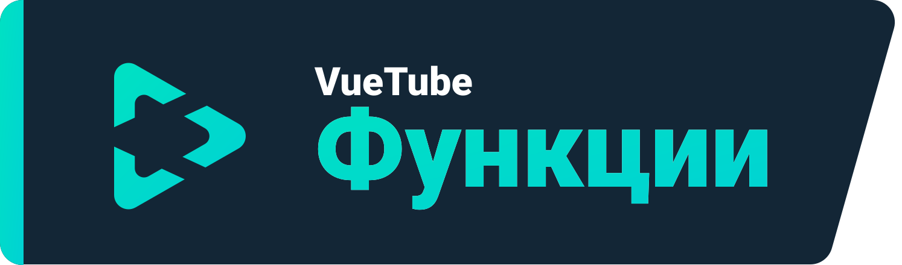
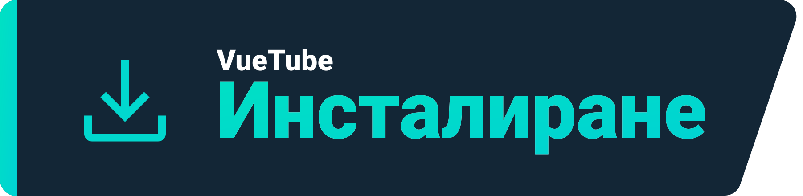
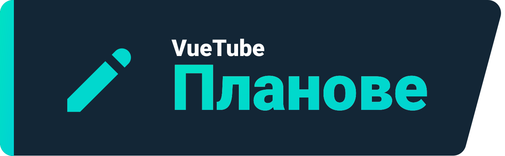

    <a href="https://vuetube.app/">
    <picture>
      <source 
        srcset="https://raw.githubusercontent.com/VueTubeApp/.github/main/readme_assets/dark/VueTube.svg"
        media="(prefers-color-scheme: dark)"
      />
      
    </picture>
  </a>
   
  Лого от <a href="https://github.com/afnzmn">@afnzmn</a>
   
   
<strong>Опростен FOSS(с отворен код) видео плейър, чиято цел е да пресъздаде ВСИЧКИ функции от съответстващите им приложения (и още).</strong>
 
Произнася се Вю Туб

  <a href="https://github.com/VueTubeApp/VueTube/blob/main/LICENSE" alt="License"></img></a>
  <a href="https://github.com/VueTubeApp/VueTube/actions/workflows/ci.yml" alt="CI"></img></a>
  <a href="https://reddit.com/r/vuetube" alt="Reddit"></img></a>
  <a href="https://t.me/VueTube" alt="Telegram"></img></a>
  <a href="https://discord.gg/7P8KJrdd5W" alt="Discord"></img></a>
  <a href="https://twitter.com/VueTubeApp" alt="Twitter"></img></a>

Прочетете съдържанието на други езици: [English,](../readme.md) [Español,](/readme/readme.es.md) [简体中文,](/readme/readme.zh-hans.md) [繁體中文,](/readme/readme.zh-hant.md) [日本語,](/readme/readme.ja.md) [עִברִית,](/readme/readme.he.md) [Nederlands,](/readme/readme.nl.md) [தமிழ்,](/readme/readme.ta.md) [Bahasa Melayu,](/readme/readme.ms.md) [Македонски,](/readme/readme.mk.md) [Français,](/readme/readme.fr.md) [Português Brasileiro,](/readme/readme.pt-br.md) [Bahasa Indonesia,](/readme/readme.id.md) [Polski,](/readme/readme.pl.md) [Български,](/readme/readme.bg.md) [Italiano,](/readme/readme.it.md) [Magyar,](/readme/readme.hu.md) [한국어,](/readme/readme.kr.md) [Tiếng Việt,](/readme/readme.vi.md) [Română,](/readme/readme.ro.md) [Українська,](/readme/readme.ua.md) [Türkçe](/readme/readme.tr.md/)

## Функции

- 🎨 Теми: Светла, Тъмна, OLED, Всички цветове на дъгата
- 🖌️ Персонализиран ПИ: Промяна на основният цвят и на други части от ПИ, в зависимост от личните ви предпочитания!
- ⬆️ Автоматична актуализация: Известява ви за наличието на нова версия, а ако не я харесате можете да се върнете към предишна!
- 👁️ Защита от проследяване: По подразбиране никакви данни не се изпращат от устройството ви
- 📺 Персонализиран видео плейър
- 👎 Връщане на броя на нехаресванията
- 💰 Блокиране на спонсори

## Инсталиране

За да инсталирате, моля посетете www.vuetube.app/install

  
Или натиснете тук за да видите всички налични версии

 

### Android

|  |  |  |
| -------------------------------------------------------------------------------------------------------------------------------------------- | ---------------------------------------------------------------------------------------------------------------------------------------------------------------- | ------------------------------------------------------------------------------------------------ |
| С много бъгове, но получавате ранен достъп до най-новите функции                                                                             | По-малко бъгове от нестабилната, малко повече функции от стабилната                                                                                              | Не е налична докато приложението не бъде достатъчно разработено                                  |

### iOS

|  |  |  |
| ---------------------------------------------------------------------------------------------------------------------------------------- | ------------------------------------------------------------------------------------------------------------------------------------------------------------------------------- | ------------------------------------------------------------------------------------------------ |
| С много бъгове, но получавате ранен достъп до най-новите функции                                                                         | По-малко бъгове от нестабилната, малко повече функции от стабилната                                                                                                             | Не е налична докато приложението не бъде достатъчно разработено                                  |

## Планове

- 🔍 Разширено търсене
- 🗞️ Локално съхранение на историята на гледанията
- ✂️ Shorts
- 🧑 Вход с Google акаунт
- 🖼️ Режим картина в картина
- И други!

## Снимки

Налични на нашият уебсайт: www.vuetube.app/info/screenshots

  
 Или натиснете тук 

 
  

     

### Използвани технологии

       

### Защо го правим?

Това е идея, която подхвърляхме известно време в Дискорд сървъра на Return Youtube Dislike, и накрая решихме да я осъществим!

### Как да помогна?

Моля, прочетете на нашият уебсайт: www.vuetube.app/contributing

## Хора, които допринесоха

Направено с [contrib.rocks](https://contrib.rocks). 

## С благодарност

- Емоджита от [Twemoji team](https://twemoji.twitter.com/), лицензирани под [CC-BY 4.0](https://creativecommons.org/licenses/by/4.0/)
- Лого от [@afnzmn](https://github.com/afnzmn)
- Данните за броя на нехаресванията са предоставени от [Return Youtube Dislike](https://returnyoutubedislike.com/)
- На Ейджей и общността за ИПП(API) на [Sponsorblock](https://https://sponsor.ajay.app/), лицензиран под [CC BY-NC-SA 4.0](https://creativecommons.org/licenses/by-nc-sa/4.0/)

## На вашето внимание

Проектът VueTube и неговото съдържание не е по никакъв начин свързано с, финансирано от, упълномощено, одобрено от, или сродно на YouTube, Google LLC или на някои от техните клонове и дъщерни дружества. Официалният сайт на YouTube можете да откриете на адрес [www.youtube.com](https://www.youtube.com).

Всякаква търговска марка, сервизна марка,търговско име, или други права на интелектуална собственост, използвани за създаването на проектът VueTube,се притежават от съответните собственици.
