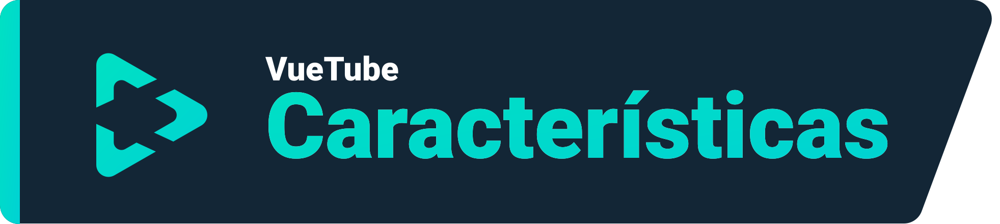
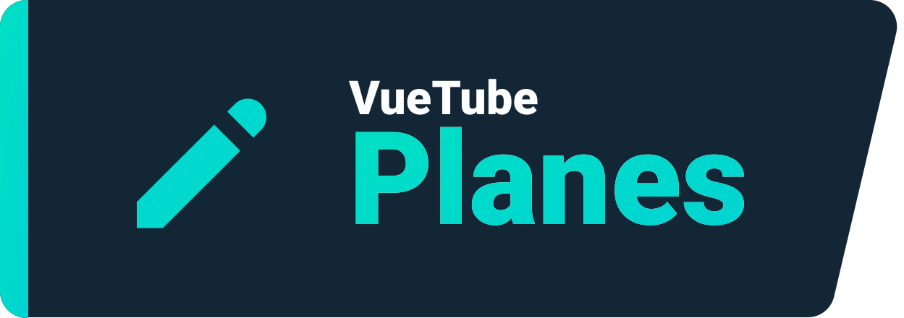

    <a href="https://vuetube.app/">
    <picture>
      <source 
        srcset="https://raw.githubusercontent.com/VueTubeApp/.github/main/readme_assets/dark/VueTube.svg"
        media="(prefers-color-scheme: dark)"
      />
      
    </picture>
  </a>
   
  

  
Mostrar créditos de la documentación

  
  Logo por <a href="https://github.com/afnzmn">@afnzmn</a>, traducción por <a href="https://github.com/gayolgate">@gayolgate</a> 
  Contribuidores del Readme en Inglés: <a href="https://github.com/404-Program-not-found">@404-Program-not-found</a>, <a href="https://github.com/Frontesque">@Frontesque</a>, <a href="https://github.com/gayolGate">@gayolGate</a>, <a href="https://github.com/ThatOneCalculator">@ThatOneCalculator</a>, <a href="https://github.com/afnzmn">@afnzmn</a>, <a href="https://github.com/tired6488">@tired6488</a>, <a href="https://github.com/DARKDRAGON532">@DARKDRAGON532</a>, <a href="https://github.com/PickleNik">@PickleNik</a> y <a href="https://github.com/Zyborg777">@Zyborg777</a>

<strong>Un cliente sencillo y abierto de streaming de vídeo diseñado para recrear TODAS las características de sus respectivas aplicaciones (y más) </strong>
 
Se pronuncia Viu Tuf (<code>/ˈvjuːˌtjuːb/</code>)

  <a href="https://github.com/VueTubeApp/VueTube/blob/main/LICENSE" alt="License"></img></a>
  <a href="https://github.com/VueTubeApp/VueTube/actions/workflows/ci.yml" alt="CI"></img></a>
  <a href="https://reddit.com/r/vuetube" alt="Reddit"></img></a>
  <a href="https://t.me/VueTube" alt="Telegram"></img></a>
  <a href="https://discord.gg/7P8KJrdd5W" alt="Discord"></img></a>
  <a href="https://twitter.com/VueTubeApp" alt="Twitter"></img></a>

**Leer en otros idiomas:** [English,](../readme.md) [Español,](/readme/readme.es.md) [简体中文,](/readme/readme.zh-hans.md) [繁體中文,](/readme/readme.zh-hant.md) [日本語,](/readme/readme.ja.md) [עִברִית,](/readme/readme.he.md) [Nederlands,](/readme/readme.nl.md) [தமிழ்,](/readme/readme.ta.md) [Bahasa Melayu,](/readme/readme.ms.md) [Македонски,](/readme/readme.mk.md) [Français,](/readme/readme.fr.md) [Português Brasileiro,](/readme/readme.pt-br.md) [Bahasa Indonesia,](/readme/readme.id.md) [Polski,](/readme/readme.pl.md) [Български,](/readme/readme.bg.md) [Italiano,](/readme/readme.it.md) [Magyar,](/readme/readme.hu.md) [한국어,](/readme/readme.kr.md) [Tiếng Việt,](/readme/readme.vi.md) [Română,](/readme/readme.ro.md) [Українська,](/readme/readme.ua.md) [Türkçe](/readme/readme.tr.md/)

<h2 align="left">

Características
</h2>

- 🎨 **Temas:** ¡Claro, oscuro, OLED y todos los colores del arcoíris! Elige el color de acento y de fondo según tus preferencias.
- 🖌️ **Interfaz personalizable:** Personaliza los botones, las esquinas y desactiva partes de la interfaz que no usas para una experiencia óptima.
- ⬆️ **Actualizaciones automáticas:** ¡Recibe una notificación cuando haya una actualización disponible, descárgala desde la app y baja de versión si no te gusta!
- 👁️ **Protección contra el rastreo:** No se envían datos desde tu dispositivo por defecto. y no usamos APIs externas. ¡La privacidad es necesaria!
- 📺 **Reproductor de vídeo personalizado:** Hay un reproductor integrado en la aplicación con todo lo que necesitas para ser feliz, cómo velocidad 16x.
- 🌍 **Traducciones:** ¡La app está disponible en más de 25 idiomas! El idioma predeterminado se determina según los ajustes de tu dispositivo.
- 👎 **Return YouTube Dislike** - Activa de nuevo los contadores de dislikes. [_Más información_](https://returnyoutubedislike.com)
- 💰 **SponsorBlock** - Salta automáticamente patrocinadores y segmentos molestos en vídeos. [_Más información_](https://sponsor.ajay.app)

<h2 align="left">

Instalar
</h2>

Para instalar, por favor, visita www.vuetube.app/install o mira todas las versiones disponibles:

  
🖱️ Haz clic para mostrar las versiones 

 

### Android

|  |  |  |
| -------------------------------------------------------------------------------------------------------------------------------------------- | ---------------------------------------------------------------------------------------------------------------------------------------------------------------- | ------------------------------------------------------------------------------------------------ |
| Un montón de bugs, pero acceso anticipado a funciones                                                                                        | Menos bugs que la inestable, aún así más funciones que la estable                                                                                                | No disponible hasta que la app este más desarrollada                                             |

### iOS

|  |  |  |
| ---------------------------------------------------------------------------------------------------------------------------------------- | ------------------------------------------------------------------------------------------------------------------------------------------------------------------------------- | ------------------------------------------------------------------------------------------------ |
| Un montón de bugs, pero acceso anticipado a funciones                                                                                    | Menos bugs que la inestable, aún así más funciones que la estable                                                                                                               | No disponible hasta que la app este más desarrollada                                             |

<h2 align="left">

Planes
</h2>

- **🔍 Búsqueda avanzada:** Ordena los resultados por fecha, duración, likes o cualquier otro factor.
- **🗞️ Historial de búsqueda local:** Obtén tus últimos vídeos vistos sin iniciar sesión.
- ✂️ **Shorts (Cortos):** Videos cortos verticales que duran entre 15 y 60 segundos.
- 🧑 **Inicio de sesión con tu cuenta de Google:** Inicia sesión para tener una experiencia completa votando y comentando vídeos y suscribiendote a canales.
- 🖼️ **Modo Imagen en imagen:** Te permite ver vídeos en una ventana flotante mientras usas otra aplicación.
- 🧩 **Complementos:** ¡Instala complementos de terceros hechos por la comunidad con funciones útiles!
- ¡y más!

<h2 align="left">

Capturas de pantalla
</h2>

[Echalas un vistazo en nuestro sitio web](www.vuetube.app/info/screenshots) o haz clic abajo para mostrarlas.

  
🖱️ Haz clic para mostrar las capturas 

 
  

     

<h2 align="left">

Comunidad
</h2>

Usamos diferentes plataformas para comunicarnos con nuestra comunidad. Puedes participar activamente en el desarrollo de VueTube o simplemente mantenerte al día de las novedades uniéndote a estos grupos (de habla inglesa):

- Servidor de Discord (https://vuetube.app/discord)
- Grupo de Telegram (https://t.me/vuetube)
- Página de Reddit (https://www.reddit.com/r/vuetube)

<h2 align="left">

Progreso
</h2>

  
🖱️ Haz clic aquí para mostrar el progreso 

  
 
**General** | **Reproductor** | [**Extractor**](https://github.com/VueTubeApp/VueTube-Extractor) |
:-: | :-: | :-: |
🟢 Comentarios (100%) | 🟢 Play / Pausa (100%) | 🟢 Autocompletado de búsqueda (100%) |
🟢 Descripción (100%) | 🟢 Tocar para mostrar / ocultar controles (100%) | 🟢 Página de inicio (100%) |
🟢 Página de inicio (100%) | 🟠 Barra de progreso (80%) | 🟢 Búsqueda (100%)
🟢 Integración de RYD (100%) | 🟠 Pantalla completa (80%) | 🟠 Información de vídeos (60%) |
🟢 Temas (100%) | 🟠 Selector de resolución (50%) | 🔴 Canales (0%) |
🟢 Página de reproducción (100%) | 🔴 Minireproductor (0%) | 🔴 Comentarios (0%) |
🟠 Integración de SponsorBlock (95%) | 🔴 Reproducción de fondo (0%) | 🔴 Chat en directo (0%) |
🟠 Actualizaciones automáticas (50%) | 🔴 Imagen en imagen (0%) | 🔴 Tendencias (0%)
🟠 Páginas de canales (50%) |  🔴 Subtítulos (0%) | 🔴 Interacciones (0%) |
🟠 Públicaciones de comunidad (10%) | 🔴 Tarjetas (0%) | 🔴 Listas de reproducción (0%) |
🟠 Interfaz de Shorts personalizable (10%) |  | 🔴 Notificaciones (0%)
🟠 Interfaz de YT music personalizable (10%) |  | 🔴 Inicio de sesión (0%)
🟠 Interfaz personalizable (30%) |  |  |
🟠 Página de librerías (10%) |  |  |
🟠 Respuestas (50%) |  |  |
🟠 Complementos de terceros (40%) |  |  |
🟠 Reproductor de VueTube (Ver progreso a la derecha) |  |  |
🟠 Extractor de VueTube (Ver progreso a la derecha) |  |  |
🔴 Historial de búsqueda local (0%) |  |  |
🔴 Página de suscripciones (0%) |  |  |
🔴 Soporte para otras plataformas (0%) |  |  |
  

### Tecnologías usadas

       

### ¿Porque estamos haciendo esto?

VueTube fue creado con la intención de darle al mundo una alternativa gratuita, abierta y completa a las grandes tecnólogicas, con muchas opciones de personalización e inicio de sesión disponible. El proyecto fue creciendo, atrayendo a miles de usuarios y ayudantes alreredor del mundo. Puedes unirte a nosotros y contribuir de la forma que más se adapte a ti...

### ¿Quieres contribuir?

¡Gracias por estar interesado en contribuir! Por favor, lee en nuestro sitio web cómo hacerlo: www.vuetube.app/contributing

Si quieres traducir la app, [haz clic aquí](/NUXT/plugins/languages) y lee las instrucciones. Si GitHub es incómodo o díficil para ti, puedes mandarnos los campos traducidos en un archivo de texto en nuestro [Discord](https://vuetube.app/discord) y nosotros los implementaremos. ¡No te preocupes!

<h2 align="left">

Colaboradores de GitHub
</h2>

Panel hecho automáticamente con [contrib.rocks](https://contrib.rocks). 

<h2 align="left">

Agradecimientos
</h2>

- Emojis por el [equipo de Twemoji](https://twemoji.twitter.com/), Con licencia [CC-BY 4.0](https://creativecommons.org/licenses/by/4.0/)
- Logo de VueTube por [@afnzmn](https://github.com/afnzmn)
- Estadísticas públicas de dislikes proporcionadas por [Return YouTube Dislike](https://returnyoutubedislike.com)
- Ajay y su comunidad por proporcionarnos la [API de Sponsorblock](https://sponsor.ajay.app), Licenciada bajo [CC BY-NC-SA 4.0](https://creativecommons.org/licenses/by-nc-sa/4.0/)

<h2 align="left">

Donar
</h2>

VueTube es y siempre será gratuito y de código abierto, pero puedes apoyar a nuestros desarrolladores con una donación que servirá para mantener el proyecto y desarrollar nuevas funciones. ¡Cualquier ayuda es bien recibida! Estas son las opciones de donación disponibles:

[Donar en Ko-Fi.com](https://ko-fi.com/vuetube) (Oficial)

[Donar a PickleNik en GitHub](https://github.com/sponsors/PickleNik) (Encargado de mantenimiento)

<h2 align="left">

Aviso legal
</h2>

El proyecto VueTube y sus contenidos no están afiliados, financiados, autorizados, respaldados o asociados de ninguna manera con YouTube, Google LLC o cualquiera de sus filiales y subsidiarias. El sitio web oficial de YouTube se encuentra en [www.youtube.com](https://www.youtube.com).

Cualquier marca comercial, de servicio, nombre comercial u otros derechos de propiedad intelectual utilizados en el proyecto VueTube son propiedad de sus respectivos dueños.

En caso de conflicto entre las traducciones del aviso legal, tiene preferencia la versión en inglés.

<h2 align="left">

Otros repositorios de VueTube
</h2>

  
 🖱️ Haz clic para mostrar los repositorios 

 

**VueTube Extractor** es una librería para extraer datos de servicios de streaming, diseñada para ser usada en VueTube.

**VueTube Translator** es una herramienta para traducir campos de archivos de GitHub como JSON o JS y exportar el resultado con la estructura correcta. Fue creado para ayudar a la comunidad de traductores de VueTube pero puede ser usado para cualquier otro propósito.

**VueTube HTTP** es un plugin para peticiones nativas de HTTP, descargas y subidas de archivos y la administración de cookies. Es una reinvención del [proyecto original de HTTP](https://github.com/capacitor-community/http) de Capacitor Community, con adiciones por el equipo de VueTube.

