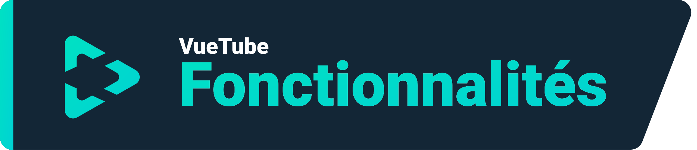
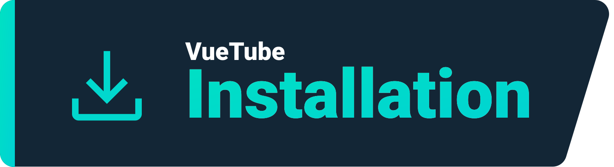

    <a href="https://vuetube.app/">
    <picture>
      <source 
        srcset="https://raw.githubusercontent.com/VueTubeApp/.github/main/readme_assets/dark/VueTube.svg"
        media="(prefers-color-scheme: dark)"
      />
      
    </picture>
  </a>
   
  Logo par <a href="https://github.com/afnzmn">@afnzmn</a> 
  Traduction française par <a href="https://github.com/afnzmn">@afnzmn</a> et éditée par <a href="https://github.com/FAKlR">@FAKlR</a>, <a href="https://github.com/Robotition">@Robotition</a>, <a href="https://github.com/404-Program-not-found">@404-Program-not-found</a> et <a href="https://github.com/Zyborg777">@Zyborg777</a>
   
   
<strong>Un simple client vidéo Open Source destiné à recréer TOUTES les fonctionnalités de leurs applications respectives (et plus).
</strong>
 
Prononcé «View Tube»  (<code>/ˈvjuːˌtjuːb/</code>)

  <a href="https://github.com/VueTubeApp/VueTube/blob/main/LICENSE" alt="License"></img></a>
  <a href="https://github.com/VueTubeApp/VueTube/actions/workflows/ci.yml" alt="CI"></img></a>
  <a href="https://reddit.com/r/vuetube" alt="Reddit"></img></a>
  <a href="https://t.me/VueTube" alt="Telegram"></img></a>
  <a href="https://discord.gg/7P8KJrdd5W" alt="Discord"></img></a>
  <a href="https://twitter.com/VueTubeApp" alt="Twitter"></img></a>

Lire cette page dans d’autres langues : [English,](../readme.md) [Español,](/readme/readme.es.md) [简体中文,](/readme/readme.zh-hans.md) [繁體中文,](/readme/readme.zh-hant.md) [日本語,](/readme/readme.ja.md) [עִברִית,](/readme/readme.he.md) [Nederlands,](/readme/readme.nl.md) [தமிழ்,](/readme/readme.ta.md) [Bahasa Melayu,](/readme/readme.ms.md) [Македонски,](/readme/readme.mk.md) [Français,](/readme/readme.fr.md) [Português Brasileiro,](/readme/readme.pt-br.md) [Bahasa Indonesia,](/readme/readme.id.md) [Polski,](/readme/readme.pl.md) [Български,](/readme/readme.bg.md) [Italiano,](/readme/readme.it.md) [Magyar,](/readme/readme.hu.md) [한국어,](/readme/readme.kr.md) [Tiếng Việt,](/readme/readme.vi.md) [Română,](/readme/readme.ro.md) [Українська,](/readme/readme.ua.md) [Türkçe](/readme/readme.tr.md/)

## Fonctionnalités

- 🎨 Thèmes : Clair, sombre, noir et toutes les couleurs de l'arc-en-ciel !
- 🖌️ Interface personnalisable : Personnalisez la couleur des thèmes, ou désactivez d'autres parties de l’interface que vous n'utilisez pas
- ⬆️ Mises à jour automatiques : Recevez une notification quand une mise à jour est disponible, et revenez à des versions antérieures si vous le souhaitez !
- 👁️ Protection de suivi : Aucune donnée de télémétrie n'est envoyée depuis votre appareil par défaut
- 📺 Lecteur vidéo personnalisé
- 👎 Return YouTube Dislike (Retourner les Dislikes de YouTube) - [_Plus d'information_](https://returnyoutubedislike.com)
- 💰 SponsorBlock - [_Plus d'information_](https://sponsor.ajay.app)

## Installation

Pour installer l'application, veuillez visiter [vuetube.app/install](https://www.vuetube.app/install)

  
Ou cliquez ici pour voir toutes les versions disponibles

 

### Android

|  |  |  |
| -------------------------------------------------------------------------------------------------------------------------------------------- | ---------------------------------------------------------------------------------------------------------------------------------------------------------------- | ------------------------------------------------------------------------------------------------ |
| Beaucoup de bugs, mais vous avez accès anticipé aux nouvelles fonctionnalités                                                                | Moins de bugs que l'instable, tout en ayant plus de fonctionnalités que la stable                                                                                | Indisponible pour l'instant                                                                      |

### iOS

|  |  |  |
| ---------------------------------------------------------------------------------------------------------------------------------------- | ------------------------------------------------------------------------------------------------------------------------------------------------------------------------------- | ------------------------------------------------------------------------------------------------ |
| Beaucoup de bugs, mais vous avez accès anticipé aux nouvelles fonctionnalités                                                            | Moins de bugs que l'instable, tout en ayant plus de fonctionnalités que la stable                                                                                               | Indisponible pour l'instant                                                                      |

## Projets

- 🔍 Recherche avancée
- 🗞️ Historique de visionnage local
- ✂️ YouTube Shorts (Courts)
- 🧑 Connexion avec votre compte Google
- 🖼️ Mode Image-dans-l'image (PiP)
- Et plus !

## Captures d’écran

A voir sur notre site web : [vuetube.app/info/screenshots](https://www.vuetube.app/info/screenshots)

  
 Ou cliquez ici pour voir des captures d’écran 

 
  

     

### Technologies utilisées

       

### Pourquoi fais-je ceci ?

Ce projet avait été discuté sur le serveur Discord de Return YouTube Dislike pendant quelque temps, alors j'ai pensé que je devrais le lancer !

### Souhaitez-vous contribuer ?

S'il vous plaît, rendez-vous sur notre site web pour savoir comment le faire : [vuetube.app/contributing](https://www.vuetube.app/contributing)

Si vous voulez traduire l'application, [veuillez cliquer ici](/NUXT/plugins/languages) et lisez les instructions

## Contributeurs

Créer par [contrib.rocks](https://contrib.rocks). 

## Remerciements

- Émojis par l'équipe [Twemoji](https://twemoji.twitter.com/), autorisé par [CC-BY 4.0](https://creativecommons.org/licenses/by/4.0/)
- Logo de VueTube par [@afnzmn](https://github.com/afnzmn)
- Données YouTube dislike publiques fournies par [Return Youtube Dislike](https://returnyoutubedislike.com)
- Ajay et la communauté pour fournir le [Sponsorblock API](https://sponsor.ajay.app), autorisé par [CC-BY 4.0](https://creativecommons.org/licenses/by/4.0/)

## Avis juridique

Le projet VueTube et son contenu ne sont pas affiliés, financés, autorisés, soutenus par, ou associés avec YouTube, Google LLC ou l'un de ses affiliés et subsidiaires. Le site web officiel YouTube peut être consulté sur [youtube.com](https://www.youtube.com).

Toute marque déposée, marque services, nom commercial, ou autre droits de propriété intellectuelle utilisés dans le projet VueTube sont la propriété de leurs propriétaire respectifs.
