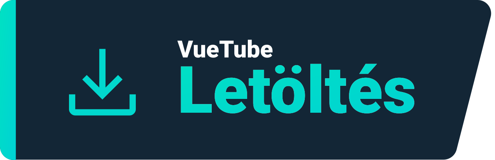
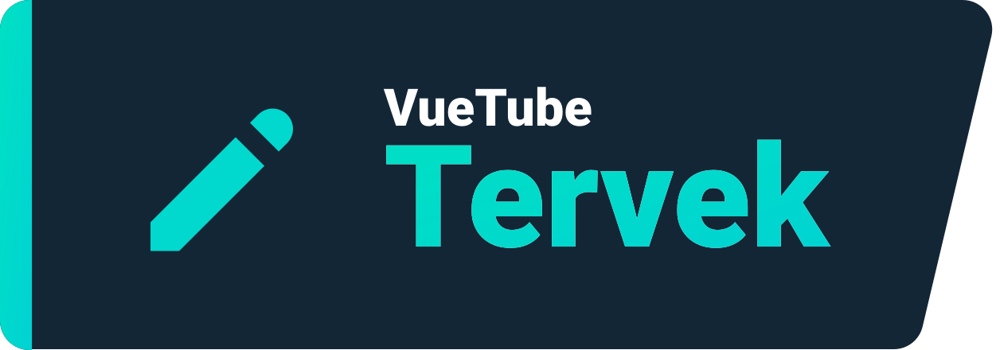
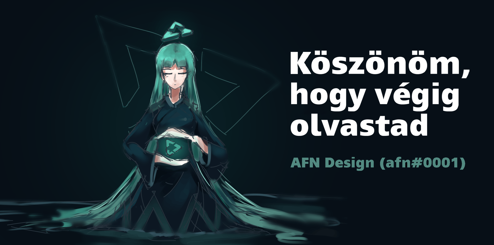

    <a href="https://vuetube.app/">
    <picture>
      <source 
        srcset="https://raw.githubusercontent.com/VueTubeApp/.github/main/readme_assets/dark/VueTube.svg"
        media="(prefers-color-scheme: dark)"
      />
      
    </picture>
  </a>
   
  

  
Mutasd a Readme készítőjit

  
   A VueTube Logóját <a href="https://github.com/afnzmn">@afnzmn</a> készítette  
  Az angol Readme készítőji: <a href="https://github.com/404-Program-not-found">@404-Program-not-found</a>, <a href="https://github.com/Frontesque">@Frontesque</a>, <a href="https://github.com/gayolGate">@gayolGate</a>, <a href="https://github.com/ThatOneCalculator">@ThatOneCalculator</a>, <a href="https://github.com/afnzmn">@afnzmn</a>, <a href="https://github.com/tired6488">@tired6488</a>, <a href="https://github.com/DARKDRAGON532">@DARKDRAGON532</a>, <a href="https://github.com/PickleNik">@PickleNik</a> és <a href="https://github.com/Zyborg777">@Zyborg777</a>

<strong>Egy egyszerű és nyílt forráskódú videó streaming kliens, amelynek célja az ÖSSZES Youtube funkció újbóli létrehozása (és még sok más!)</strong>
 
Kiejtése View Tube (<code>/ˈvjuːˌtjuːb/</code>)

  <a href="https://github.com/VueTubeApp/VueTube/blob/main/LICENSE" alt="License"></img></a>
  <a href="https://github.com/VueTubeApp/VueTube/actions/workflows/ci.yml" alt="CI"></img></a>
  <a href="https://reddit.com/r/vuetube" alt="Reddit"></img></a>
  <a href="https://t.me/VueTube" alt="Telegram"></img></a>
  <a href="https://discord.gg/7P8KJrdd5W" alt="Discord"></img></a>
  <a href="https://twitter.com/VueTubeApp" alt="Twitter"></img></a>

**Olvasd el ezt az oldalt más nyelveken is**: [English,](../readme.md) [Español,](/readme/readme.es.md) [简体中文,](/readme/readme.zh-hans.md) [繁體中文,](/readme/readme.zh-hant.md) [日本語,](/readme/readme.ja.md) [עִברִית,](/readme/readme.he.md) [Nederlands,](/readme/readme.nl.md) [தமிழ்,](/readme/readme.ta.md) [Bahasa Melayu,](/readme/readme.ms.md) [Македонски,](/readme/readme.mk.md) [Français,](/readme/readme.fr.md) [Português Brasileiro,](/readme/readme.pt-br.md) [Bahasa Indonesia,](/readme/readme.id.md) [Polski,](/readme/readme.pl.md) [Български,](/readme/readme.bg.md) [Italiano,](/readme/readme.it.md) [Magyar,](/readme/readme.hu.md) [한국어,](/readme/readme.kr.md) [Tiếng Việt,](/readme/readme.vi.md) [Română,](/readme/readme.ro.md) [Українська,](/readme/readme.ua.md) [Türkçe](/readme/readme.tr.md/)

<h2 align="left">

Funkciók
</h2>

- 🎨 **Témák:** Világos, sötét, OLED és az összes színe a szivárványnak! Állítsa be az árnyalatot és a háttérszínt ízlésének megfelelően.
- 🖌️ **Testreszabható UI:** Gombok testreszabása, sarkok és kapcsolja ki a felhasználói felület azon részeit, amelyeket nem használ az optimális élmény érdekében.
- ⬆️ **Autómatikus frissítések:** Értesítést kap, ha elérhető egy frissítés, töltse le az alkalmazáson keresztül őket, és ha nem tetszik, váltson alacsonyabb verziókra!
- 👁️ **Nyomon követés elleni védelem:** Nem küldünk el telemetriai adatokat az eszközéről, és nem használunk külső API-kat. Az adatvédelem elengedhetetlen!
- 📺 **Egyedi videolejátszó:** Az alkalmazásba bele integrált lejátszó rendelkezik, mindennel, ami a boldogsághoz kell, például 16-szoros video gyorsítási sebességgel.
- 🌍 **Fordítások:** Az alkalmazás több mint 25 nyelven elérhető! Az alapértelmezett nyelvet az eszköz konfigurációja határozza meg.
- 👎 **Return YouTube Dislike** - Engedélyezze újra a dislike számláló mutatását. [_További információk_](https://returnyoutubedislike.com)
- 💰 **SponsorBlock** - Az automatikus szponzorok és bosszantó jelenetek átugrása a videókban. [_További információk_](https://sponsor.ajay.app)

<h2 align="left">

Letöltés
</h2>

Az alkalmazás telepítéséhez látogasson el erre az oldalra [vuetube.app/install](https://www.vuetube.app/install) vagy nézze meg lent az összes elérhető verziót :

  
🖱️ Kattintson ide a verziók megjelenítéséhez 

 

### Android

|  |  |  |
| --------------------------------------------------------------------------------------------------------------------------------------------------------------------------------------------------- | ------------------------------------------------------------------------------------------------------------------------------------------------------------------------------------ | ------------------------------------------------------------------------------------------------------------------------------------------------------- |
| Eléggé unstabil, de előre megkapod a legújabb funkciókat.                                                                                                                                           | Kevesebb hiba van benne mint a Unstable-ben, de mégis több a funkció benne mint a Stable-ben.                                                                                        | Még nem elérhető.                                                                                                                                       |

### iOS

|  |  |  |
| ----------------------------------------------------------------------------------------------------------------------------------------------------------------------------------------------- | -------------------------------------------------------------------------------------------------------------------------------------------------------------------------------------------------------------------------------------- | ------------------------------------------------------------------------------------------------------------------------------------------------------- |
| Eléggé unstabil, de előre megkapod a legújabb funkciókat.                                                                                                                                       | Kevesebb hiba van benne mint a Unstable-ben, de mégis több a funkció benne mint a Stable-ben.                                                                                                                                          | Még nem elérhető.                                                                                                                                       |

(Az Apple hivatalosan nem támogatja a sideloading-ot, vagyis nem lehet az alkalmazások telepítését csak a fájllal tenni anélkül, hogy azokat feltöltenék a cég hivatalos boltjába. A VueTube iPhone / iPad eszközökre történő telepítéséhez speciális módszereket kell használod)

<h2 align="left">

Tervek
</h2>

- 🔍 **Részletes keresés:** Az keresési eredményeket dátum, időtartalom, kedvelések vagy bármely más tényező szerint rendezheti.
- 🗞️ **Lokális megtekintési előzmények:** Megtekintheti az utoljára megtekintett videóit egy fiokba való bejelentkezés nélkül.
- ✂️ **YouTube Shorts:** Mini függőleges videók, amelyek 15-60 másodpercig tartanak.
- 🧑 **Bejelentkezés a saját Google fiókjával:** Jelentkezzen be, hogy teljes élményben lehessen része, szavazzon és kommentáljon a videókhoz, és iratkozzon fel youtube csatornákra.
- 🖼️ **Kép-a-Képben mód (PiP):** Lehetővé teszi, hogy a videókat egy lebegő ablakban nézze meg egy másik alkalmazás használata közben.
- 🧩 **Pluginok:** Telepítsen a közösség által készített beépülő modulokat nagyon hasznos funkciókkal!
- És több!

Tudsz ajánlani funkciókat egy funkció kérés issue-val a projekt repository-ával.

<h2 align="left">

Képernyőképek
</h2>

[Nézze meg őket a weboldalunkon](https://www.vuetube.app/info/screenshots) vagy nyomjon rá a lenti szövegre.

  
 🖱️ Kattintson ide a képernyőképek megtekintéséhez 

 
  

     

<h2 align="left">

Közösség
</h2>

Számos különböző platformot használunk a közösségünkkel való kapcsolattartásra. Aktívan részt vehet a VueTube fejlesztésében, vagy egyszerűen csak értesülhet az összes hírről az alábbi csoportokhoz csatlakozva:

- Discord szerver (https://vuetube.app/discord)
- Telegram group (https://t.me/vuetube)
- Subreddit (https://www.reddit.com/r/vuetube)

<h2 align="left">

Folyamat
</h2>

  
 🖱️ Kattintson ide a folyamat megjelenítéséhez 

  
 
**General** | **Player** | [**Extractor**](https://github.com/VueTubeApp/VueTube-Extractor) |
:-: | :-: | :-: |
🟢 Comments (100%) | 🟢 Play / Pause (100%) | 🟢 Search Autocomplete (100%) |
🟢 Description (100%) | 🟢 Tap to show / hide controls (100%) | 🟢 Home page (100%) |
🟢 Home Page (100%) | 🟠 Seekbar / Scrubber (80%) | 🟢 Search (100%)
🟢 RYD Integration (100%) | 🟠 Fullscreen (80%) | 🟠 Video Information (60%) |
🟢 Themes (100%) | 🟠 Resolution Picker (50%) | 🔴 Channels (0%) |
🟢 Watch Page (100%) | 🔴 Miniplayer (0%) | 🔴 Comments (0%) |
🟠 Sponsorblock Integration (95%) | 🔴 Background Play (0%) | 🔴 Live Chat (0%) |
🟠 Auto Update (50%) | 🔴 Picture in Picture (0%) | 🔴 Trending content (0%)
🟠 Channel Page (50%) |  🔴 Captions (0%) | 🔴 Interactions (0%) |
🟠 Community Posts (10%) | 🔴 Cards (0%) | 🔴 Playlists (0%) |
🟠 Customizable Shorts UI (10%) |  | 🔴 Notifications (0%)
🟠 Customizable YT Music UI (10%) |  | 🔴 Login (0%)
🟠 Customizable UI (30%) |  |  |
🟠 Libraries Page (10%) |  |  |
🟠 Replies (50%) |  |  |
🟠 Third Party Plugins (40%) |  |  |
🟠 VueTube Player (See progress to the right) |  |  |
🟠 VueTube Extractor (See progress to the right) |  |  |
🔴 Local Watch History (0%) |  |  |
🔴 Subscriptions Page (0%) |  |  |
🔴 Other Platform Support (0%) |  |  |
  

### Alkalmazott technológiák

       

### Miért csináljuk ezt?

A VueTube azzal a céllal készült, hogy az internet számára egy ingyenes, nyílt forráskódú és egy teljes körü alternatívát biztosítson a Youtube applikáció felhasználóinak, nagymértékben testreszabható opciókkal és bejelentkezési lehetőséggel. A projekt folyamatosan bővült, felhasználók és közreműködők ezreit vonzotta magához szerte a világon. Bármilyen módon csatlakozhat hozzánk, és hozzájárulhat ehhez a projekthez...

### Szeretnél hozzájárulni a projekthez?

Köszönjük, hogy érdeklődik a közreműködés iránt! Kérjük, olvassa el weboldalunkat ennek módjáról: [vuetube.app/contributing](https://www.vuetube.app/contributing).

Ha le szeretné fordítani az alkalmazást, [nyomjon ide](/NUXT/plugins/languages) és olvassa el az instrukciókat. Ha a GitHub használata nehéz vagy kényelmetlen számára, a mezőket szöveges fájlban is elküldheti a mi [Discordunkon](https://vuetube.app/discord) és mi megvalósítjuk őket. Ne aggódj!

<h2 align="left">

Github Contributorok
</h2>

A műszerfal automatikusan készült ezzel: [contrib.rocks](https://contrib.rocks). 

<h2 align="left">

Köszönetnyilvánítás
</h2>

- Emojik [Twemoji team](https://twemoji.twitter.com/) által, [CC-BY 4.0](https://creativecommons.org/licenses/by/4.0/) alatt engedélyezett.
- VueTube Logo [@afnzmn](https://github.com/afnzmn) által.
- Publikus YouTube dislike adat [Return Youtube Dislike](https://returnyoutubedislike.com) által.
- Ajay & közzössége által [Sponsorblock API](https://sponsor.ajay.app), [CC BY-NC-SA 4.0](https://creativecommons.org/licenses/by-nc-sa/4.0/) alatt engedélyezett.

<h2 align="left">

Támogatás
</h2>

A VueTube ingyenes és nyílt forráskódú lesz örökké, de ez nem azt jelenti, hogy nem támogathatsz minket egy adománnyal amely segít fenntartani a projektet és új funkciókat fejleszteni. Mindenféle segítséget szívesen fogadunk! Ezek az adományozási lehetőségek:

[Donate a Ko-Fi.com oldalán](https://ko-fi.com/vuetube) (Hivatalos)

[Donate PickleNik-nek GitHub-on](https://github.com/sponsors/PickleNik) (Karbantartó)

<h2 align="left">

Figyelmeztető
</h2>

A VueTube projekt és annak tartalma nem kapcsolódik a YouTube-hoz, a Google LLC-hez vagy annak leányvállalataihoz, nem finanszírozza, nem engedélyezi, nem támogatja, illetve semmilyen módon nem kapcsolódik azokhoz. A hivatalos YouTube webhely a [youtube.com](https://www.youtube.com) címen található.

A VueTube projektben használt bármely védjegy, szolgáltatási védjegy, kereskedelmi név vagy egyéb szellemi tulajdonjog a megfelelő tulajdonosok tulajdonában van.

<h2 align="left">

Egyéb VueTube repók
</h2>

  
 🖱️ Kattintson a repók megjelenítéséhez 

 

**VueTube Extractor** egy olyan könyvtár, amely adatok kinyerésére szolgál a streaming szolgáltatásokból, és a VueTube alkalmazásban használható.

**VueTube Translator** egy eszköz a Github-fájlok (például JSON vagy JS) mezőinek lefordításához, és az eredmény exportálásához a megfelelő szerkezettel. A VueTube fordítók segítésére hozták létre, de bármilyen más célra is használható.

**VueTube HTTP** egy beépülő modul natív HTTP-kérésekhez, fájlletöltésekhez/-feltöltésekhez és cookie-kezeléshez. Ez a Capacitor Community [eredeti HTTP-projektjének](https://github.com/capacitor-community/http) elágazása, a VueTube csapatának kiegészítésével.

