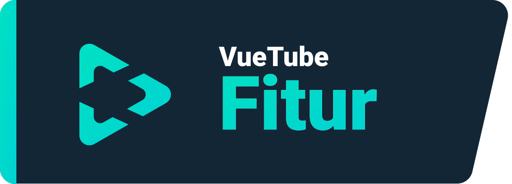
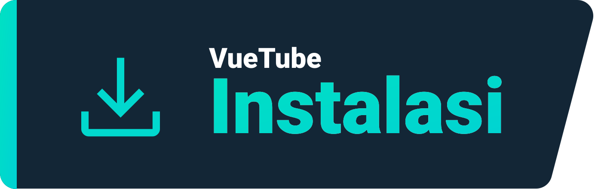
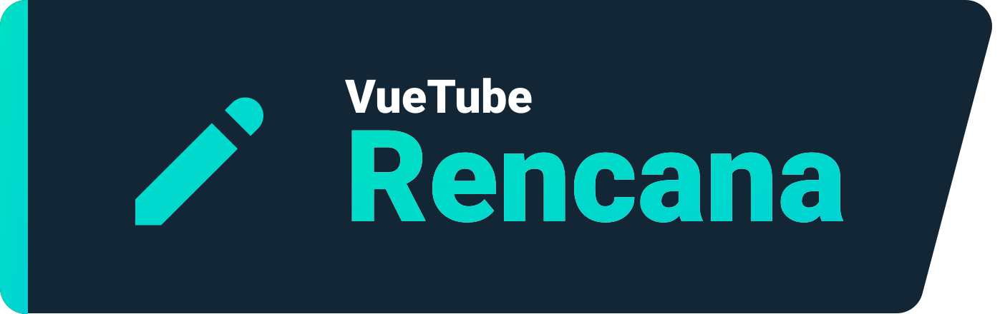

    <a href="https://vuetube.app/">
    <picture>
      <source 
        srcset="https://raw.githubusercontent.com/VueTubeApp/.github/main/readme_assets/dark/VueTube.svg"
        media="(prefers-color-scheme: dark)"
      />
      
    </picture>
  </a>
   
  Logo oleh <a href="https://github.com/afnzmn">@afnzmn</a> 
  Terjemahan oleh <a href="https://github.com/QuickValve">@QuickValve</a>
   
   
<strong>Sebuah klien streaming video sederhana dan sumber terbuka yang bertujuan untuk membuat ulang SEMUA fitur dari aplikasi yang berhubung (dan banyak lagi!)</strong>
 
Dilafalkan View Tube (<code>/ˈvjuːˌtjuːb/</code>)

  <a href="https://github.com/VueTubeApp/VueTube/blob/main/LICENSE" alt="License"></img></a>
  <a href="https://github.com/VueTubeApp/VueTube/actions/workflows/ci.yml" alt="CI"></img></a>
  <a href="https://reddit.com/r/vuetube" alt="Reddit"></img></a>
  <a href="https://t.me/VueTube" alt="Telegram"></img></a>
  <a href="https://discord.gg/7P8KJrdd5W" alt="Discord"></img></a>
  <a href="https://twitter.com/VueTubeApp" alt="Twitter"></img></a>

**Baca halaman ini di bahasa lain**: [English,](../readme.md) [Español,](/readme/readme.es.md) [简体中文,](/readme/readme.zh-hans.md) [繁體中文,](/readme/readme.zh-hant.md) [日本語,](/readme/readme.ja.md) [עִברִית,](/readme/readme.he.md) [Nederlands,](/readme/readme.nl.md) [தமிழ்,](/readme/readme.ta.md) [Bahasa Melayu,](/readme/readme.ms.md) [Македонски,](/readme/readme.mk.md) [Français,](/readme/readme.fr.md) [Português Brasileiro,](/readme/readme.pt-br.md) [Bahasa Indonesia,](/readme/readme.id.md) [Polski,](/readme/readme.pl.md) [Български,](/readme/readme.bg.md) [Italiano,](/readme/readme.it.md) [Magyar,](/readme/readme.hu.md) [한국어,](/readme/readme.kr.md) [Tiếng Việt,](/readme/readme.vi.md) [Română,](/readme/readme.ro.md) [Українська,](/readme/readme.ua.md) [Türkçe](/readme/readme.tr.md/)

## Fitur

- 🎨 **Tema**: Terang, gelap, OLED, dan semua warna pelangi! Atur aksen dan warna latar belakang sesuai dengan preferensi kamu.
- 🖌️ **UI yang bisa disesuaikan**: Sesuaikan tombol, sudut, dan nonaktifkan bagian UI yang tidak kamu butuhkan agar mendapat pengalaman yang optimal.
- ⬆️ **Pembaruan otomatis**: Kamu akan diberitahu saat pembaruan tersedia, unduh melalui aplikasi dan kembali ke versi lama jika kamu tidak menyukainya!
- 👁️ **Perlindungan dari pelacakan**: Tidak ada data telemetri (informasi pribadi) yang dikirim dari perangkatmu secara bawaan dan kami tidak menggunakan API eksternal. Privasi dibutuhkan!
- 📺 **Pemutar video khusus**: Ada pemutar yang terintegrasi dalam aplikasi dengan semua yang kamu butuhkan, seperti kecepatan 16x.
- 🌍 **Terjemahan**: Aplikasi tersedia lebih dari 25 bahasa! Bahasa bawaan ditentukan sesuai dengan konfigurasi perangkat kamu.
- 👎 **Mengembalikan dislike YouTube**: Aktifkan penghitung dislike di video. [_Info lebih lanjut_](https://returnyoutubedislike.com)
- 💰 **SponsorBlock**: Lewati secara otomatis sponsor dan segmen yang mengganggu dalam video. [_Info lebih lanjut_](https://sponsor.ajay.app)

## Instalasi

Untuk menginstal aplikasi, silakan kunjungi [vuetube.app/install](https://www.vuetube.app/install) atau periksa semua versi yang tersedia di bawah:

  
🖱️ Klik untuk menampilkan versi

 

### Android

|  |  |  |
| -------------------------------------------------------------------------------------------------------------------------------------------- | ----------------------------------------------------------------------------------------------------------------------------- | ------------------------------------------------------------------------------------------------ |
| Banyak bug, tapi kamu mendapatkan akses awal ke fitur baru.                                                                                  | Lebih sedikit bug dari unstable, sedikit lebih banyak fitur dari stable.                                                      | Belum tersedia.                                                                                  |

### iOS

|  |  |  |
| ---------------------------------------------------------------------------------------------------------------------------------------- | ------------------------------------------------------------------------------------------------------------------------------------------------------------------------------- | ------------------------------------------------------------------------------------------------ |
| Banyak bug, tapi kamu mendapatkan akses awal ke fitur baru.                                                                              | Lebih sedikit bug dari unstable, sedikit lebih banyak fitur dari stable.                                                                                                        | Belum tersedia.                                                                                  |

## Rencana

- 🔍 **Pencarian lanjutan**: Urutkan hasil berdasarkan tanggal, durasi, dan like atau faktor lainnya.
- 🗞️ **Riwayat history lokal**: Dapatkan video terakhir yang kamu lihat tanpa login.
- ✂️ **YouTube Shorts**: Video vertikal kecil yang berdurasi antara 15 hingga 60 detik.
- 🖼️ **Mode picture-in-picture**: Memungkinkan kamu menonton video di jendela mengambang saat menggunakan aplikasi lain.
- 🧩 **Plugin**: Instal plugin pihak ketiga yang dibuat oleh komunitas dengan berbagai fitur yang bermanfaat!
- Dan masih banyak lagi!

Kamu dapat menyarankan fitur kamu sendiri dengan membuka _issues_ di repositori ini.

## Tangkapan layar

[Lihat di situs web kami](https://www.vuetube.app/info/screenshots) atau klik di bawah ini untuk menampilkannya.

  
 🖱️ Klik untuk menampilkan tangkapan layar 

 
  

     

### Teknologi yang digunakan

       

### Kenapa kami melakukan ini?

VueTube dibuat dengan tujuan menyediakan alternatif lintas platform gratis, sumber terbuka, dan lengkap dengan opsi yang dapat disesuaikan. Proyek ini berkembang, menarik ribuan pengguna dan kontributor di seluruh dunia. Kamu dapat bergabung dengan kami dan berkontribusi pada proyek ini dengan cara apa pun.

### Ingin berkontribusi?

Terima kasih telah tertarik untuk berkontribusi! Silakan baca situs web kami tentang cara melakukannya: [vuetube.app/contributing](https://www.vuetube.app/contributing).

Jika kamu ingin menerjemahkan aplikasi ini, [klik disini](/NUXT/plugins/languages) dan baca petunjuknya. Jika GitHub sulit atau tidak nyaman bagi kamu, kamu juga dapat mengirim terjemahan dalam file teks di [Discord](https://vuetube.app/discord) kami, dan kami akan menerapkannya. Jangan khawatir!

## Kontributor GitHub

Dasbor dibuat secara otomatis dengan [contrib.rocks](https://contrib.rocks). 

## Ucapan Terima Kasih

- Emoji oleh [tim Twemoji](https://twemoji.twitter.com/), Dilisensikan dibawah [CC-BY 4.0](https://creativecommons.org/licenses/by/4.0/).
- Logo VueTube oleh [@afnzmn](https://github.com/afnzmn).
- Data publik dislike YouTube disediakan oleh [Return Youtube Dislike](https://returnyoutubedislike.com).
- Ajay & komunitas untuk menyediakan [API Sponsorblock](https://sponsor.ajay.app), Dilisensikan dibawah [CC BY-NC-SA 4.0](https://creativecommons.org/licenses/by-nc-sa/4.0/).

## Donasi

VueTube akan selalu gratis dan sumber terbuka, tapi kamu dapat mendukung pengembang kami dengan donasi yang akan membantu memelihara proyek dan mengembangkan fitur baru. Setiap jenis bantuan diterima! Berikut opsi donasi yang tersedia:

[Donasi di Ko-Fi.com](https://ko-fi.com/vuetube) (Resmi)

[Donasi ke PickleNik di GitHub](https://github.com/sponsors/PickleNik) (Pengelola)

## Peringatan

Proyek VueTube dan kontennya tidak berafiliasi dengan didanai, disahkan, didukung, atau dengan cara apa pun berafiliasi dengan YouTube, Google LLC atau afiliasi dan anak perusahaannya. Situs web resmi YouTube dapat ditemukan di [youtube.com](https://www.youtube.com).

Setiap merek dagang, merek layanan, nama dagang, atau hak kekayaan intelektual lainnya yang digunakan dalam proyek VueTube dimiliki oleh masing-masing pemilik.

VueTube, membuat orang bahagia dan menginspirasi hati mereka sejak 2022.

