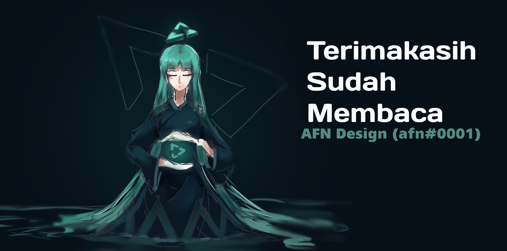

    <a href="https://vuetube.app/">
    <picture>
      <source 
        srcset="https://raw.githubusercontent.com/VueTubeApp/.github/main/readme_assets/dark/VueTube.svg"
        media="(prefers-color-scheme: dark)"
      />
      
    </picture>
  </a>
   
  Logo oleh <a href="https://github.com/afnzmn">@afnzmn</a> 
  Terjemahan oleh <a href="https://github.com/QuickValve">@QuickValve</a>
   
   
<strong>Sebuah klien streaming video sederhana dengan sumber terbuka yang bertujuan untuk membuat ulang SEMUA fitur dari aplikasi yang terhubung (dan masih banyak lagi!)</strong>
 
Dilafalkan View Tube (<code>/ˈvjuːˌtjuːb/</code>)

  <a href="https://github.com/VueTubeApp/VueTube/blob/main/LICENSE" alt="License"></img></a>
  <a href="https://github.com/VueTubeApp/VueTube/actions/workflows/ci.yml" alt="CI"></img></a>
  <a href="https://reddit.com/r/vuetube" alt="Reddit"></img></a>
  <a href="https://t.me/VueTube" alt="Telegram"></img></a>
  <a href="https://discord.gg/7P8KJrdd5W" alt="Discord"></img></a>
  <a href="https://twitter.com/VueTubeApp" alt="Twitter"></img></a>

**Baca halaman ini dalam bahasa lain**: [English,](../readme.md) [Español,](/readme/readme.es.md) [简体中文,](/readme/readme.zh-hans.md) [繁體中文,](/readme/readme.zh-hant.md) [日本語,](/readme/readme.ja.md) [עִברִית,](/readme/readme.he.md) [Nederlands,](/readme/readme.nl.md) [தமிழ்,](/readme/readme.ta.md) [Bahasa Melayu,](/readme/readme.ms.md) [Македонски,](/readme/readme.mk.md) [Français,](/readme/readme.fr.md) [Português Brasileiro,](/readme/readme.pt-br.md) [Bahasa Indonesia,](/readme/readme.id.md) [Polski,](/readme/readme.pl.md) [Български,](/readme/readme.bg.md) [Italiano,](/readme/readme.it.md) [Magyar,](/readme/readme.hu.md) [한국어,](/readme/readme.kr.md) [Tiếng Việt,](/readme/readme.vi.md) [Română,](/readme/readme.ro.md) [Українська,](/readme/readme.ua.md) [Türkçe](/readme/readme.tr.md/)

<h2 align="left">

Fitur
</h2>

- 🎨 **Tema**: Terang, gelap, OLED, dan semua warna dari pelangi! Mengatur aksen dan warna latar belakang sesuai dengan preferensi kamu.
- 🖌️ **UI yang bisa disesuaikan**: Kostumisasi tombol, sudut, dan nonaktifkan bagian UI yang tidak kamu butuhkan agar mendapat pengalaman yang optimal.
- ⬆️ **Pembaruan otomatis**: Kamu akan diberitahu saat pembaruan tersedia, unduh versi terbaru atau beralih ke-versi lama jika kamu tidak menyukainya!
- 👁️ **Perlindungan dari pelacakan**: Tidak ada data telemetri (informasi pribadi) yang dikirim dari perangkatmu secara bawaan dan kami tidak menggunakan API eksternal. Privasi itu sangat PENTING!
- 📺 **Pemutar video khusus**: Ada pemutar yang terintegrasi dalam aplikasi dengan semua yang kamu butuhkan, seperti kecepatan 16x.
- 🌍 **Terjemahan**: Aplikasi tersedia lebih dari 25 bahasa! Bahasa bawaan ditentukan sesuai dengan konfigurasi perangkat kamu.
- 👎 **Mengembalikan dislike YouTube**: Aktifkan penghitung tidak suka di video. [_Info lebih lanjut_](https://returnyoutubedislike.com)
- 💰 **SponsorBlock**: Lewati secara otomatis sponsor dan segmen yang mengganggu dalam video. [_Info lebih lanjut_](https://sponsor.ajay.app)

<h2 align="left">

Instalasi
</h2>

Untuk menginstal aplikasi, silakan kunjungi [vuetube.app/install](https://www.vuetube.app/install) atau periksa semua versi yang tersedia di bawah:

  
🖱️ Klik untuk menampilkan versi

 

<h3 align="left">

Android
</h3>

|  |  |  |
| -------------------------------------------------------------------------------------------------------------------------------------------- | ----------------------------------------------------------------------------------------------------------------------------- | ------------------------------------------------------------------------------------------------ |
| Masih banyak bug, tapi kamu mendapatkan akses lebih awal ke fitur fitur baru.                                                                                  | Lebih sedikit bug dari unstable, sedikit lebih banyak fitur baru dari stable.                                                      | Belum tersedia.                                                                                  |

<h3 align="left">

iOS
</h3>

|  |  |  |
| ---------------------------------------------------------------------------------------------------------------------------------------- | ------------------------------------------------------------------------------------------------------------------------------------------------------------------------------- | ------------------------------------------------------------------------------------------------ |
| Masih banyak bug, tapi kamu mendapatkan akses lebih awal ke fitur fitur baru.                                                                                  | Lebih sedikit bug dari unstable, sedikit lebih banyak fitur baru dari stable.                                                                                                        | Belum tersedia.                                                                                  |

(Apple tidak secara resmi mendukung sideloading, yaitu penginstalan aplikasi hanya dengan file tanpa mengunggahnya ke official store nya. Perlu menggunakan metode lanjutan untuk menginstal VueTube di perangkat iPhone / iPad kamu)

<h2 align="left">

Perencanaan
</h2>

- 🔍 **Pencarian lanjutan:** Urutkan hasil berdasarkan tanggal, durasi, suka, atau faktor lainnya.
- 🗞️ **Riwayat tontonan lokal:** Dapatkan video yang terakhir dilihat tanpa masuk.
- ✂️ **YouTube Shorts:** Video vertikal kecil yang berdurasi antara 15 hingga 60 detik.
- 🧑 **Masuk dengan akun Google kamu**: Masuk untuk mendapatkan pengalaman penuh dengan memilih dan mengomentari video dan
   berlangganan saluran.
- 🖼️ **Mode Gambar-dalam-Gambar (PiP):** Memungkinkan kamu menonton video di jendela mengambang saat menggunakan aplikasi lain.
- 🧩 **Plugin:** Instal plugin pihak ketiga yang dibuat oleh komunitas dengan fitur yang bermanfaat!
- Dan banyak lagi!

Kamu dapat menyarankan fitur fitur baru dengan membuka tab _issu_ dalam respository ini.

<h2 align="left">

Tangkapan Layar
</h2>

[Lihat di web kami](https://www.vuetube.app/info/screenshots) atau klik dibawah ini untuk menampilkannya.

  
 🖱️ Klik untuk menampilkan tangkapan layar 

 

<h2 align="left">

Komunitas
</h2>

Kami menggunakan beberapa platform yang berbeda untuk berhubungan dengan komunitas kami. Kamu dapat secara aktif berpartisipasi dalam pengembangan
VueTube atau tetap ikuti semua berita terbaru yang bergabung dengan grup ini:

- Discord server (https://vuetube.app/discord)
- Grup Telegram (https://t.me/vuetube)
- Halaman Reddit (https://www.reddit.com/r/vuetube)

<h2 align="left">

Perkembangan
</h2>

  
 🖱️ Click to menampilkan Perkembangan 

  

|                   **General**                    |              **Player**               | [**Extractor**](https://github.com/VueTubeApp/VueTube-Extractor) |
| :----------------------------------------------: | :-----------------------------------: | :--------------------------------------------------------------: |
|                🟢 Komentar (100%)                |        🟢 Putar/Jeda (100%)         |                  🟢 Telusuri Pelengkapan Otomatis (100%)                   |
|              🟢 Deskripsi (100%)               | 🟢 Ketuk untuk menampilkan/menyembunyikan kontrol (100%) |                       🟢 Halaman Awal (100%)                        |
|               🟢 Halaman Awal (100%)                |      🟠 Seekbar / Scrubber (80%)      |                         🟢 Search (100%)                         |
|            🟢 Integrasi RYD (100%)             |          🟠 Layar Penuh (80%)          |                    🟠 Informasi Video (60%)                    |
|                 🟢 Tema (100%)                 |      🟠 Pemilih Resolusi (50%)       |                         🔴 Saluran (0%)                         |
|               🟢 Halaman Tonton (100%)               |          🔴 Miniplayer (0%)           |                         🔴 Komentar (0%)                         |
|        🟠 Integrasi Sponsorblock (95%)         |        🔴 Putar Latar Belakang (0%)        |                        🔴 Obrolan Langsung (0%)                         |
|               🟠 Pembaruan Otomatis (50%)               |      🔴 Gambar di dalam gambar(0%)       |                     🔴 Konten yang sedang tren (0%)                     |
|              🟠 Halaman Channel (50%)               |           🔴 Teks (0%)            |                       🔴 Interaksi (0%)                       |
|             🟠 Postingan Komunitas (10%)             |             🔴 Kartu (0%)             |                        🔴 Daftar putar (0%)                         |
|         🟠 Kostumisasi Tampilan Shorts  (10%)          |                                       |                      🔴 Notifikasi (0%)                       |
|        🟠 Kostumisasi Tampilan YT Music (10%)         |                                       |                          🔴 Gabung (0%)                           |
|             🟠 Kostumisasi UI (30%)             |                                       |                                                                  |
|             🟠 Page Perpusatkaan (10%)              |                                       |                                                                  |
|                 🟠 Balasan (50%)                 |                                       |                                                                  |
|           🟠 Plugin Pihak Ke-tiga (40%)           |                                       |                                                                  |
|  🟠 Pemutar VueTube (lihat Perkembangan dikanan)   |                                       |                                                                  |
| 🟠 Pengekstrak VueTube (lihat Perkembangan dikanan) |                                       |                                                                  |
|           🔴 Riwayat Tontonan Lokal (0%)            |                                       |                                                                  |
|            🔴 Halaman Berlangganan (0%)            |                                       |                                                                  |
|          🔴 Mendukung platform yang lain (0%)          |                                       |                                                                  |

### Teknologi yang digunakan

       

### Kenapa kami melakukan ini?

VueTube dibuat dengan tujuan menyediakan alternatif lintas platform gratis, sumber terbuka, dan lengkap dengan opsi yang dapat disesuaikan. Proyek ini berkembang, menarik ribuan pengguna dan kontributor di seluruh dunia. Kamu dapat bergabung dengan kami dan berkontribusi pada proyek ini dengan cara apa pun.

### Ingin berkontribusi?

Terima kasih telah tertarik untuk berkontribusi! Silakan baca situs web kami tentang cara melakukannya: [vuetube.app/contributing](https://www.vuetube.app/contributing).

Jika kamu ingin menerjemahkan aplikasi ini, [klik disini](/NUXT/plugins/languages) dan baca petunjuknya. Jika GitHub sulit atau tidak nyaman bagi kamu, kamu juga dapat mengirim terjemahan dalam file teks di [Discord](https://vuetube.app/discord) kami, dan kami akan menerapkannya. Jangan khawatir!

<h2 align="left">

Kontributor GitHub
</h2>

Dasbor dibuat otomatis dengan [contrib.rocks](https://contrib.rocks).

<h2 align="left">

Ucapan terima kasih
</h2>

- Emoji oleh [tim Twemoji](https://twemoji.twitter.com/), Dilisensikan
   di bawah [CC-BY 4.0](https://creativecommons.org/licenses/by/4.0/).
- Logo VueTube oleh [@afnzmn](https://github.com/afnzmn).
- Data tidak suka YouTube publik yang disediakan oleh [Return Youtube Dislike](https://returnyoutubedislike.com).
- Ajay & Komunitas untuk menyediakan [API Blok Sponsor] (https://sponsor.ajay.app), Berlisensi
   berdasarkan [CC BY-NC-SA 4.0](https://creativecommons.org/licenses/by-nc-sa/4.0/).

<h2 align="left">

Donasi
</h2>

VueTube akan selalu gratis dan open source, tetapi kamu dapat mendukung pengembang kami dengan donasi yang akan membantu
mempertahankan proyek dan mengembangkan fitur baru. Setiap jenis bantuan dipersilahkan! Berikut adalah pilihan donasi yang tersedia:

[Donate on Ko-Fi.com](https://ko-fi.com/vuetube) (Official)

[Donate to PickleNik on GitHub](https://github.com/sponsors/PickleNik) (Maintainer)

<h2 align="left">

Sangkalan
</h2>

Proyek VueTube dan kontennya tidak berafiliasi dengan, didanai, disahkan, didukung oleh, atau dengan cara apa pun terkait
dengan YouTube, Google LLC atau afiliasi dan anak perusahaannya. Situs web YouTube resmi dapat ditemukan
di [www.youtube.com](https://www.youtube.com).

Setiap merek dagang, merek layanan, nama dagang, atau hak kekayaan intelektual lainnya yang digunakan dalam proyek VueTube adalah milik
masing-masing pemiliknya.

<h2 align="left">

Repo VueTube lainnya
</h2>

  
 🖱️ Klik untuk menampilkan repo 

 

<a href="https://github.com/VueTubeApp/VueTube-Extractor">
    <picture>
      <source 
        srcset="https://github-readme-stats.vercel.app/api/pin/?username=VueTubeApp&repo=VueTube-Extractor&theme=dark"
        media="(prefers-color-scheme: dark)"
      />
      <source 
        srcset="https://github-readme-stats.vercel.app/api/pin/?username=VueTubeApp&repo=VueTube-Extractor&theme=highcontrast"
        media="(prefers-color-scheme: dark_colorblind)"
      />
      
    </picture>
</a>

**VueTube Extractor** adalah pustaka yang dirancang untuk mengekstrak data dari layanan streaming, dirancang untuk digunakan di Aplikasi VueTube.

<a href="https://github.com/VueTubeApp/VueTube-Translator">
    <picture>
      <source 
        srcset="https://github-readme-stats.vercel.app/api/pin/?username=VueTubeApp&repo=VueTube-Translator&theme=dark"
        media="(prefers-color-scheme: dark)"
      />
      <source 
        srcset="https://github-readme-stats.vercel.app/api/pin/?username=VueTubeApp&repo=VueTube-Translator&theme=highcontrast"
        media="(prefers-color-scheme: dark_colorblind)"
      />
      
    </picture>
</a>

**VueTube Translator** adalah sebuah alat untuk menerjemahkan bidang file GitHub seperti JSON atau JS dan mengekspor hasilnya dengan
struktur yang benar. Itu dibuat untuk membantu penerjemah VueTube, tetapi bisa digunakan untuk tujuan lain.

<a href="https://github.com/VueTubeApp/vuetube-http">
    <picture>
      <source 
        srcset="https://github-readme-stats.vercel.app/api/pin/?username=VueTubeApp&repo=vuetube-http&theme=dark"
        media="(prefers-color-scheme: dark)"
      />
      <source 
        srcset="https://github-readme-stats.vercel.app/api/pin/?username=VueTubeApp&repo=vuetube-http&theme=highcontrast"
        media="(prefers-color-scheme: dark_colorblind)"
      />
      
    </picture>
</a>

**VueTube HTTP** adalah plugin untuk permintaan HTTP bawaan, pengunduhan/pengunggahan file, dan pengelolaan cookie. Ini fork dari 
[proyek HTTP asli](https://github.com/capacitor-community/http) dari Capacitor Community, dengan tambahan oleh
Tim VueTube.
    

