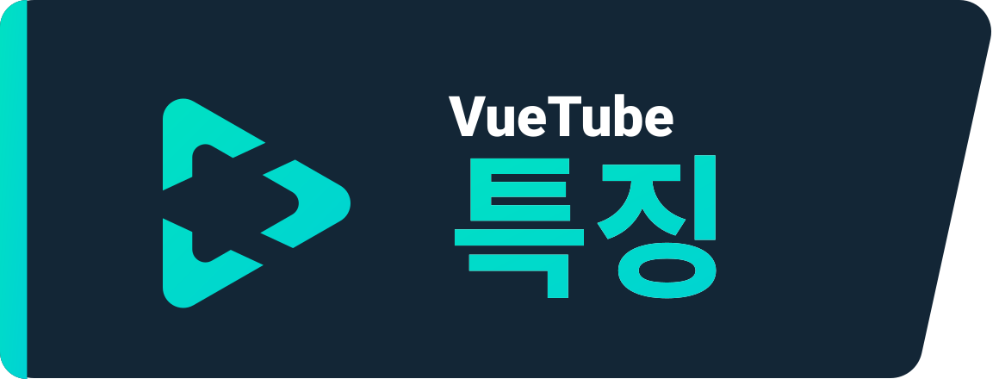
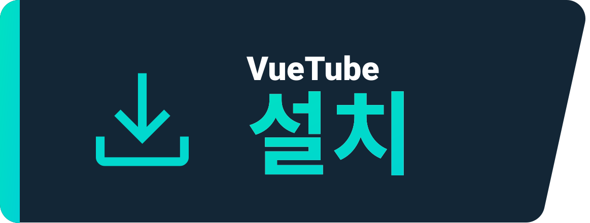
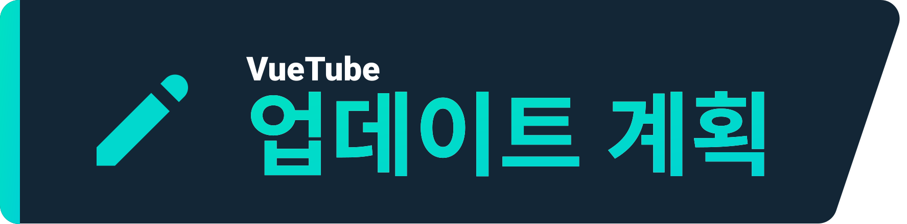

    <a href="https://vuetube.app/">
    <picture>
      <source 
        srcset="https://raw.githubusercontent.com/VueTubeApp/.github/main/readme_assets/dark/VueTube.svg"
        media="(prefers-color-scheme: dark)"
      />
      
    </picture>
  </a>
   
  로고 제작자: <a href="https://github.com/afnzmn">@afnzmn</a>  
  영문 Readme 기여자: <a href="https://github.com/404-Program-not-found">@404-Program-not-found</a>, <a href="https://github.com/Frontesque">@Frontesque</a>, <a href="https://github.com/gayolGate">@gayolGate</a>, <a href="https://github.com/ThatOneCalculator">@ThatOneCalculator</a>, <a href="https://github.com/afnzmn">@afnzmn</a>, <a href="https://github.com/tired6488">@tired6488</a>, <a href="https://github.com/DARKDRAGON532">@DARKDRAGON532</a>, <a href="https://github.com/PickleNik">@PickleNik</a> & <a href="https://github.com/Zyborg777">@Zyborg777</a>
   
   
<strong>모든 기능을 새롭게 구현하기 위해 제작된 심플한 오픈 소스 비디오 스트리밍 클라이언트</strong>
 
 
View Tube 발음 기호 (<code>/ˈvjuːˌtjuːb/</code>)

  <a href="https://github.com/VueTubeApp/VueTube/blob/main/LICENSE" alt="License"></img></a>
  <a href="https://github.com/VueTubeApp/VueTube/actions/workflows/ci.yml" alt="CI"></img></a>
  <a href="https://reddit.com/r/vuetube" alt="Reddit"></img></a>
  <a href="https://t.me/VueTube" alt="Telegram"></img></a>
  <a href="https://discord.gg/7P8KJrdd5W" alt="Discord"></img></a>
  <a href="https://twitter.com/VueTubeApp" alt="Twitter"></img></a>

다른 언어로 이 페이지 보기: [English,](../readme.md) [Español,](/readme/readme.es.md) [简体中文,](/readme/readme.zh-hans.md) [繁體中文,](/readme/readme.zh-hant.md) [日本語,](/readme/readme.ja.md) [עִברִית,](/readme/readme.he.md) [Nederlands,](/readme/readme.nl.md) [தமிழ்,](/readme/readme.ta.md) [Bahasa Melayu,](/readme/readme.ms.md) [Македонски,](/readme/readme.mk.md) [Français,](/readme/readme.fr.md) [Português Brasileiro,](/readme/readme.pt-br.md) [Bahasa Indonesia,](/readme/readme.id.md) [Polski,](/readme/readme.pl.md) [Български,](/readme/readme.bg.md) [Italiano,](/readme/readme.it.md) [Magyar,](/readme/readme.hu.md) [한국어,](/readme/readme.kr.md) [Tiếng Việt,](/readme/readme.vi.md) [Română,](/readme/readme.ro.md) [Українська,](/readme/readme.ua.md) [Türkçe](/readme/readme.tr.md/)

## 특징

- 🎨 테마: 라이트, 다크, OLED 및 무지개의 모든 색상!
- 🖌️ 커스텀 가능한 UI: 테마를 커스텀하거나 사용하지 않는 UI의 일부를 비활성화할 수도 있어요
- ⬆️ 자동 업데이트: 업데이트가 있을 때 알림을 받고 마음에 들지 않으면 다운그레이드하세요!
- 👁️ 추적 방지(보호): 추적 가능한 데이터를 전송하지 않아요!
- 📺 커스텀 비디오 플레이어
- 👎 Return YouTube Dislike(유튜브 싫어요 숫자 표시) - [_추가 정보_](https://returnyoutubedislike.com)
- 💰 SponsorBlock(스폰서, 간접광고 차단) - [_추가 정보_](https://sponsor.ajay.app)

## 설치

[vuetube.app/install](https://www.vuetube.app/install) 에서 다운로드할 수 있습니다

  
또는 여기를 클릭해서 사용 가능한 모든 버전을 확인하세요 

 

### 안드로이드

|  |  |  |
| -------------------------------------------------------------------------------------------------------------------------------------------- | ---------------------------------------------------------------------------------------------------------------------------------------------------------------- | ------------------------------------------------------------------------------------------------ |
| 상당히 불안정합니다, 하지만 더 많은 기능을 먼저 사용할 수 있습니다                                                                           | unstable(불안정) 버전보다 버그가 적습니다, 하지만 stable(안정) 버전보다 많은 기능을 사용할 수 있습니다                                                           | 아직 사용할 수 없습니다                                                                          |

### iOS

|  |  |  |
| ---------------------------------------------------------------------------------------------------------------------------------------- | ------------------------------------------------------------------------------------------------------------------------------------------------------------------------------- | ------------------------------------------------------------------------------------------------ |
| 상당히 불안정합니다, 하지만 더 많은 기능을 먼저 사용할 수 있습니다                                                                       | unstable(불안정) 버전보다 버그가 적습니다, 하지만 stable(안정) 버전보다 많은 기능을 사용할 수 있습니다                                                                          | 아직 사용할 수 없습니다                                                                          |

## 업데이트 계획

- 🔍 고급 검색 지원
- 🗞️ 로컬 시청 기록 지원
- ✂️ 유튜브 쇼츠 (15초에서 60초 사이의 짧은 동영상) 지원
- 🧑 Google 계정으로 로그인 지원
- 🖼️ Picture-in-Picture 모드 (PiP) 지원
- 그리고 더!

## 스크린샷

[웹사이트에서 보기](https://www.vuetube.app/info/screenshots)

  
 또는 여기를 클릭하여 스크린샷을 확인하세요 

 
  

     

### 사용된 기술들

       

### 이 프로그램을 만든 이유?

Return YouTube Dislike 디스코드 서버에서 꽤 오랜 기간 동안 화재되었던 기능들이 있었어요,
 
저는.. 그 기능들로 한번 도전해 봐야겠다고 생각했어요, 그게 시작이였죠!

### 기여하고 싶으신가요?

[vuetube.app/contributing](https://www.vuetube.app/contributing) 에서 방법을 참고하세요

Vuetube를 번역하고 싶으신가요?, [여기를 클릭](/NUXT/plugins/languages) 하여 해당 사항을 읽어보세요

## 기여자 목록

[contrib.rocks](https://contrib.rocks) 를 사용하여 제작되었습니다. 

## 감사의 말

- 이모티콘 제작자 [Twemoji team](https://twemoji.twitter.com/), [CC-BY 4.0](https://creativecommons.org/licenses/by/4.0/) 라이선스
- VueTube 로고 제작자 [@afnzmn](https://github.com/afnzmn)
- 오픈소스 YouTube 싫어요 데이터 제공자 [Return Youtube Dislike](https://returnyoutubedislike.com)
- Ajay & [Sponsorblock API](https://sponsor.ajay.app) 커뮤니티, [CC BY-NC-SA 4.0](https://creativecommons.org/licenses/by-nc-sa/4.0/) 라이선스

## 후원

VueTube는 항상 무료이며 오픈소스입니다, 도네이션으로 개발자를 지원할 수 있어요!
 
프로젝트를 유지하는데 많은 도움이 됩니다 정말 감사합니다!

[Ko-Fi.com에서 후원](https://ko-fi.com/vuetube) (공식)

[GitHub의 PickleNik에서 후원](https://github.com/sponsors/PickleNik) (관리자)

## 면책 조항

VueTube 프로젝트 및 해당 콘텐츠는 YouTube, Google LLC 또는 그 계열사 및 자회사와 제휴, 자금 지원, 승인, 보증 또는 어떤 식으로든 관련되지 않습니다. YouTube 공식 웹사이트는 [youtube.com](https://www.youtube.com) 입니다.

VueTube 프로젝트에 사용된 모든 상표, 서비스마크, 상호 또는 기타 지적 재산권은 해당 소유자의 소유입니다.
