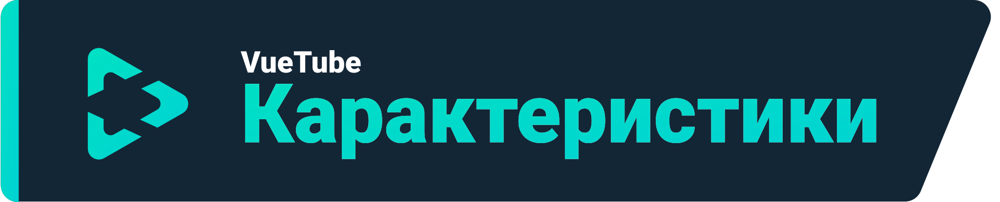
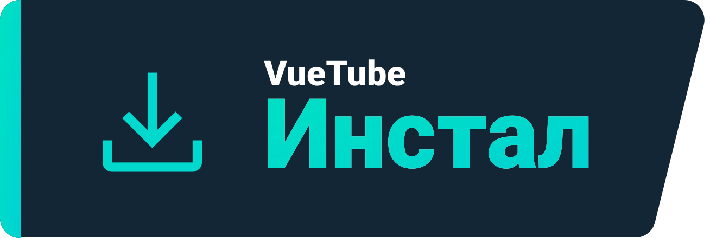
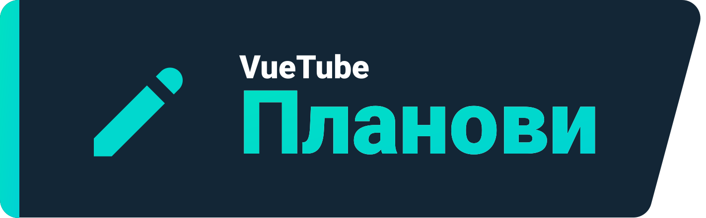

    <a href="https://vuetube.app/">
    <picture>
      <source 
        srcset="https://raw.githubusercontent.com/VueTubeApp/.github/main/readme_assets/dark/VueTube.svg"
        media="(prefers-color-scheme: dark)"
      />
      
    </picture>
  </a>
   
  Лого од <a href="https://github.com/afnzmn">@afnzmn</a> 
  Македонски превод од <a href="https://github.com/Robotition">@Robotition</a>
   
   
<strong>Едноставна FOSS видео стриминг апликација со цел да ги рекреира сите карактеристики од соодветните апликации (и повеќе).</strong>
 
Се изговара Вју-Туб (<code>/ˈvjuːˌtjuːb/</code>)

  <a href="https://github.com/VueTubeApp/VueTube/blob/main/LICENSE" alt="License"></img></a>
  <a href="https://github.com/VueTubeApp/VueTube/actions/workflows/ci.yml" alt="CI"></img></a>
  <a href="https://reddit.com/r/vuetube" alt="Reddit"></img></a>
  <a href="https://t.me/VueTube" alt="Telegram"></img></a>
  <a href="https://discord.gg/7P8KJrdd5W" alt="Discord"></img></a>
  <a href="https://twitter.com/VueTubeApp" alt="Twitter"></img></a>

Прочитајте го ова на други јазици: [English,](../readme.md) [Español,](/readme/readme.es.md) [简体中文,](/readme/readme.zh-hans.md) [繁體中文,](/readme/readme.zh-hant.md) [日本語,](/readme/readme.ja.md) [עִברִית,](/readme/readme.he.md) [Nederlands,](/readme/readme.nl.md) [தமிழ்,](/readme/readme.ta.md) [Bahasa Melayu,](/readme/readme.ms.md) [Македонски,](/readme/readme.mk.md) [Français,](/readme/readme.fr.md) [Português Brasileiro,](/readme/readme.pt-br.md) [Bahasa Indonesia,](/readme/readme.id.md) [Polski,](/readme/readme.pl.md) [Български,](/readme/readme.bg.md) [Italiano,](/readme/readme.it.md) [Magyar,](/readme/readme.hu.md) [한국어,](/readme/readme.kr.md) [Tiếng Việt,](/readme/readme.vi.md) [Română,](/readme/readme.ro.md) [Українська,](/readme/readme.ua.md) [Türkçe](/readme/readme.tr.md/)

## Карактеристики

- 🎨 Изглед: Светло, темно, OLED, сите бои на виножитото.
- 🖌️ Приспособлив интерфејс: Можете целосно да ја приспособите акцентната боја и другите делови од интерфејсот за да ги отстраните функциите што не ги користите!
- ⬆️ Автоматско ажурирање: Бидете известени кога нов апдејт е достапен и деградирајте го ако не ви се допаѓа!
- 👁️ Заштита од следење: Стандардно не се испраќа телеметрија од вашиот уред.
- 📺 Прилагоден видео плеер
- 👎 Враќање на YouTube дислајк

## Инстал

За да инсталирате, посетете: www.vuetube.app/install

  
Или кликнете овде за да се прикажат сите достапни верзии.

 

### Android

|  |  |  |
| -------------------------------------------------------------------------------------------------------------------------------------------- | ---------------------------------------------------------------------------------------------------------------------------------------------------------------- | ------------------------------------------------------------------------------------------------ |
| Многу грешки, но ран пристап до функциите.                                                                                                   | Помалку грешки од нестабилна, малку повеќе функции од стабилна.                                                                                                  | Не е достапна додека апликацијата не стане поразвиена.                                           |

### iOS

|  |  |  |
| ---------------------------------------------------------------------------------------------------------------------------------------- | ------------------------------------------------------------------------------------------------------------------------------------------------------------------------------- | ------------------------------------------------------------------------------------------------ |
| Многу грешки, но ран пристап до функциите.                                                                                               | Помалку грешки од нестабилна, малку повеќе функции од стабилна.                                                                                                                 | Не е достапна додека апликацијата не стане поразвиена.                                           |

## Планови

- 🔍 Напредно пребарување
- 🗞️ Локално складирајте ја историјата на гледани видеа.
- ✂️ Кратки Видеа
- 🧑 Google акаунт пријавување
- 🖼️ Picture in picture mode
- и побеќе!

## Слики од апликацијата

Посетете ја нашата веб-страница: www.vuetube.app/info/screenshots

  
 Или кикнете тука за да се прикажат сликите од апликацијата. 

 
  

     

### Користени технологии

       

### Зошто го правам ова?

Па, ова веќе долго време беше фрлено на Discord серверот Return Youtube Dislike, па затоа си помислив дека веројатно треба да пробам!

### Сакате да соработите?

Ве молиме прочитајте ја нашата веб-страница за како да соработите: www.vuetube.app/contributing

## Соработници

Направено со [contrib.rocks](https://contrib.rocks). 

## Признанија

- Emojis од [Twemoji тимот](https://twemoji.twitter.com/), Лиценцирано под [CC-BY 4.0](https://creativecommons.org/licenses/by/4.0/)
- VueTube лого од [@afnzmn](https://github.com/afnzmn)

## Легално предупредување

Проектот VueTube и неговите содржини не се финансирани, овластени, одобрени или на кој било начин поврзани со YouTube, Google LLC или било која од нивните филијали и подружници. Официјалната веб-страница на YouTube може да се најде на [www.youtube.com](https://www.youtube.com).

Секоја трговска марка, услужна марка, трговско име или други права на интелектуална сопственост што се користат во проектот VueTube се во сопственост на соодветните сопственици.

Во случај на недоразбирање помеѓу преводите на легалното предупредување, предност има англиската верзија.
