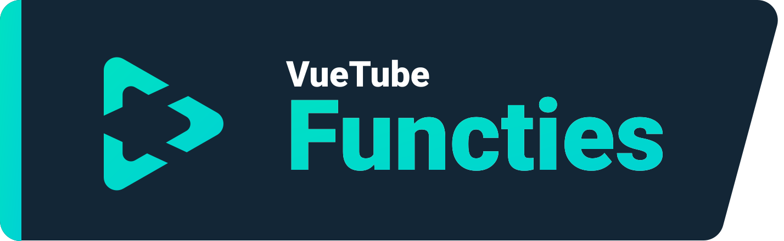
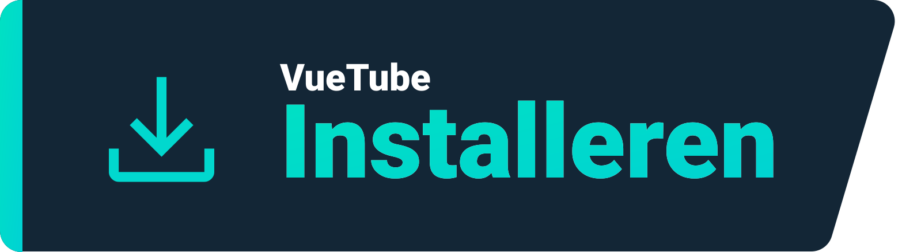
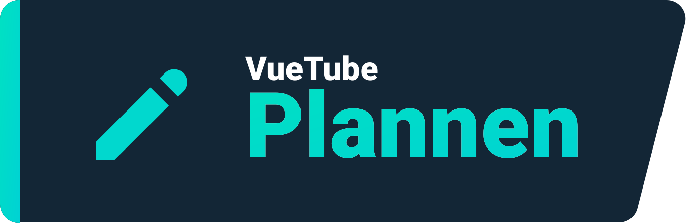

    <a href="https://vuetube.app/">
    <picture>
      <source 
        srcset="https://raw.githubusercontent.com/VueTubeApp/.github/main/readme_assets/dark/VueTube.svg"
        media="(prefers-color-scheme: dark)"
      />
      
    </picture>
  </a>
   
  Logo gemaakt door <a href="https://github.com/afnzmn">@afnzmn</a>
  Translation by: <a href="https://github.com/Mcfly2340">@Mcfly2340></a>
   
   
<strong>Een Simpele FOSS video streaming client gericht op het recreëren van ALLE functies van hun respectievelijke apps (en meer)</strong>
 
Uitgesproken als: Vju - Tjube  (<code>/ˈvjuːˌtjuːb/</code>)

  <a href="https://github.com/VueTubeApp/VueTube/blob/main/LICENSE" alt="License"></img></a>
  <a href="https://github.com/VueTubeApp/VueTube/actions/workflows/ci.yml" alt="CI"></img></a>
  <a href="https://reddit.com/r/vuetube" alt="Reddit"></img></a>
  <a href="https://t.me/VueTube" alt="Telegram"></img></a>
  <a href="https://discord.gg/7P8KJrdd5W" alt="Discord"></img></a>
  <a href="https://twitter.com/VueTubeApp" alt="Twitter"></img></a>

Lees dit in andere talen: [English,](../readme.md) [Español,](/readme/readme.es.md) [简体中文,](/readme/readme.zh-hans.md) [繁體中文,](/readme/readme.zh-hant.md) [日本語,](/readme/readme.ja.md) [עִברִית,](/readme/readme.he.md) [Nederlands,](/readme/readme.nl.md) [தமிழ்,](/readme/readme.ta.md) [Bahasa Melayu,](/readme/readme.ms.md) [Македонски,](/readme/readme.mk.md) [Français,](/readme/readme.fr.md) [Português Brasileiro,](/readme/readme.pt-br.md) [Bahasa Indonesia,](/readme/readme.id.md) [Polski,](/readme/readme.pl.md) [Български,](/readme/readme.bg.md) [Italiano,](/readme/readme.it.md) [Magyar,](/readme/readme.hu.md) [한국어,](/readme/readme.kr.md) [Tiếng Việt,](/readme/readme.vi.md) [Română,](/readme/readme.ro.md) [Українська,](/readme/readme.ua.md) [Türkçe](/readme/readme.tr.md/)

## Functies

- 🎨 Thema's: Licht, Donker, OLED (Helemaal Zwart), Alle kleuren van de regenboog
- 🖌️ Aanpasbare User Interface: Je kan de accentkleur volledig aanpassen, en andere delen van het UI om de dingen te verwijderen die je niet gebruikt!
- ⬆️ Automatische Updates: Krijg een bericht wanneer er een update beschikbaar is & downgrade als je de versie niet leuk vind!
- 👁️ Traceerbeveiliging: Er wordt standaard geen telemetrie/data verzonden vanaf uw toestel
- 📺 Aanpasbare video player
- 👎 De terugkeer van Youtube Dislike

## Installeren

Om te installeren, ga naar www.vuetube.app/install

  
Of klik hier om alle beschikbare versies te zien

 

### Android

|  |  |  |
| -------------------------------------------------------------------------------------------------------------------------------------------- | ---------------------------------------------------------------------------------------------------------------------------------------------------------------- | ------------------------------------------------------------------------------------------------ |
| Heel veel bugs, maar vroegtijdige toegang tot de nieuwste functies                                                                           | Minder bugs dan de onstabiele versie, net iets meer functies dan de stabiele versie                                                                              | Niet beschikbaar totdat de app meer is ontwikkeld                                                |

### iOS

|  |  |  |
| ---------------------------------------------------------------------------------------------------------------------------------------- | ------------------------------------------------------------------------------------------------------------------------------------------------------------------------------- | ------------------------------------------------------------------------------------------------ |
| Heel veel bugs, maar vroegtijdige toegang tot de nieuwste functies                                                                       | Minder bugs dan de onstabiele versie, net iets meer functies dan de stabiele versie                                                                                             | Niet beschikbaar totdat de app meer is ontwikkeld                                                |

## Plannen

- 🔍 Geavanceerd zoeken
- 🗞️ Bewaar de gekeken video geschiedenis op je apparaat
- ✂️ Shorts
- 🧑 Log-in met je Google account
- 🖼️ Picture in picture modus
- en meer!

## Screenshots

Bekijk ze op de website: www.vuetube.app/info/screenshots

  
 Of klik hier om screenshots te bekijken 

 
  

     

### Gebruikte Software

       

### Waarom doe ik dit?

Nou, dit wordt al een tijdje rondgeslingerd op de Return Youtube Dislike discord server, dus ik dacht dat ik het maar eens moest proberen!

### Wil je bijdragen?

Lees op onze website hoe je dit kunt doen: www.vuetube.app/contributing

## Bijdragers

Gemaakt met [contrib.rocks](https://contrib.rocks). 

## Erkenningen

- Emojis door het [Twemoji team](https://twemoji.twitter.com/), Licentie onder [CC-BY 4.0](https://creativecommons.org/licenses/by/4.0/)
- VueTube Logo gemaakt door [@afnzmn](https://github.com/afnzmn)
- Openbare YouTube dislike gegevens verstrekt door [Return Youtube Dislike](https://returnyoutubedislike.com)

## Disclamer

Het VueTube project en de inhoud ervan zijn niet verbonden met, gefinancierd door, geautoriseerd door, of op enige wijze geassocieerd met YouTube, Google LLC of een van de gelieerde bedrijven of dochterondernemingen. De officiële YouTube website kan worden gevonden op [www.youtube.com](https://www.youtube.com).

Alle handelsmerken, dienstmerken, handelsnamen of andere intellectuele eigendomsrechten die in het VueTube-project worden gebruikt, zijn eigendom van de respectieve eigenaars.
