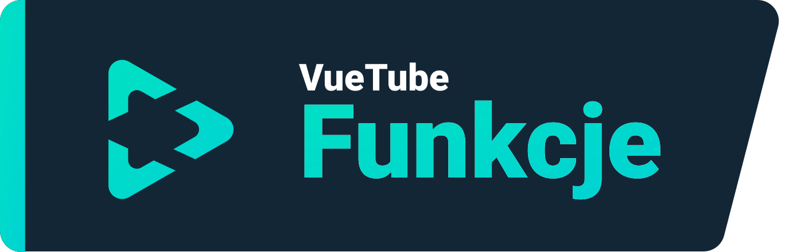
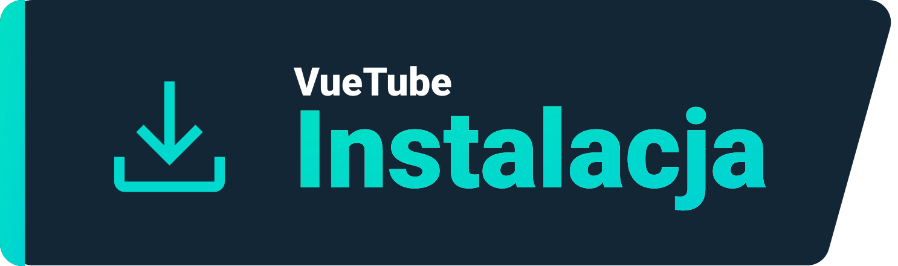
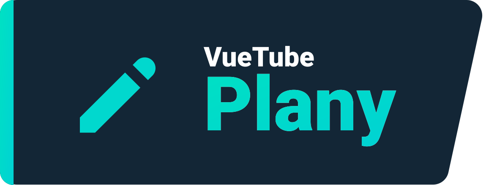

    <a href="https://vuetube.app/">
    <picture>
      <source 
        srcset="https://raw.githubusercontent.com/VueTubeApp/.github/main/readme_assets/dark/VueTube.svg"
        media="(prefers-color-scheme: dark)"
      />
      
    </picture>
  </a>
   
  Logo autorstwa <a href="https://github.com/afnzmn">@afnzmn</a>
  Polskie tłumaczenie <a href="https://github.com/Spiryt7">@Spiryt7</a>
   
   
<strong>Prosty klient FOSS strumieniowego przesyłania wideo, którego celem jest odtworzenie WSZYSTKICH funkcji z odpowiednich aplikacji (i znacznie więcej)</strong>
 
Wymawia się: View Tube (<code>/ˈvjuːˌtjuːb/</code>)

  <a href="https://github.com/VueTubeApp/VueTube/blob/main/LICENSE" alt="License"></img></a>
  <a href="https://github.com/VueTubeApp/VueTube/actions/workflows/ci.yml" alt="CI"></img></a>
  <a href="https://reddit.com/r/vuetube" alt="Reddit"></img></a>
  <a href="https://t.me/VueTube" alt="Telegram"></img></a>
  <a href="https://discord.gg/7P8KJrdd5W" alt="Discord"></img></a>
  <a href="https://twitter.com/VueTubeApp" alt="Twitter"></img></a>

Przeczytaj to w innych językach: [English,](../readme.md) [Español,](/readme/readme.es.md) [简体中文,](/readme/readme.zh-hans.md) [繁體中文,](/readme/readme.zh-hant.md) [日本語,](/readme/readme.ja.md) [עִברִית,](/readme/readme.he.md) [Nederlands,](/readme/readme.nl.md) [தமிழ்,](/readme/readme.ta.md) [Bahasa Melayu,](/readme/readme.ms.md) [Македонски,](/readme/readme.mk.md) [Français,](/readme/readme.fr.md) [Português Brasileiro,](/readme/readme.pt-br.md) [Bahasa Indonesia,](/readme/readme.id.md) [Polski,](/readme/readme.pl.md) [Български,](/readme/readme.bg.md) [Italiano,](/readme/readme.it.md) [Magyar,](/readme/readme.hu.md) [한국어,](/readme/readme.kr.md) [Tiếng Việt,](/readme/readme.vi.md) [Română,](/readme/readme.ro.md) [Українська,](/readme/readme.ua.md) [Türkçe](/readme/readme.tr.md/)

## Funkcje

- 🎨 Motywy: Jasny, Ciemny, OLED, Wszystkie kolory tęczy
- 🖌️ Personalizacja interfejsu: Możesz w pełni dostosować kolor akcentu oraz inne części interfejsu użytkownika i usunąć funkcje, których nie używasz!
- ⬆️ Automatyczne aktualizacje: Otrzymuj powiadomienia o dostępności aktualizacji oraz odinstaluj aktualizację, jeśli Ci się nie podoba!
- 👁️ Ochrona przed śledzeniem: Domyślnie przez aplikację nie są wysyłane żadne dane telemetryczne
- 📺 Własny odtwarzacz wideo
- 👎 Przywrócony licznik łapek w dół

## Instalacja

Aby zainstalować aplikację, odwiedź www.vuetube.app/install

  
Lub kliknij tutaj, aby wyświetlić wszystkie dostępne wersje

 

### Android

|  |  |  |
| -------------------------------------------------------------------------------------------------------------------------------------------- | ---------------------------------------------------------------------------------------------------------------------------------------------------------------- | ------------------------------------------------------------------------------------------------ |
| Dużo błędów oraz wczesny dostęp do najnowszych funkcji                                                                                       | Mniej błędów niż w wersji niestabilnej, nieco więcej funkcji niż w wersji stabilnej                                                                              | Niedostępna, dopóki aplikacja nie będzie bardziej rozwinięta                                     |

### iOS

|  |  |  |
| ---------------------------------------------------------------------------------------------------------------------------------------- | ------------------------------------------------------------------------------------------------------------------------------------------------------------------------------- | ------------------------------------------------------------------------------------------------ |
| Dużo błędów oraz wczesny dostęp do najnowszych funkcji                                                                                   | Mniej błędów niż w wersji niestabilnej, nieco więcej funkcji niż w wersji stabilnej                                                                                             | Niedostępna, dopóki aplikacja nie będzie bardziej rozwinięta                                     |

## Plany

- 🔍 Wyszukiwanie zaawansowane
- 🗞️ Lokalna historia oglądania
- ✂️ Shorts
- 🧑 Logowanie przez konto Google
- 🖼️ Tryb "obraz w obrazie"
- i wiele więcej!

## Zrzuty ekranu

Zobacz na naszej stronie internetowej: www.vuetube.app/info/screenshots

  
 Lub kliknij tutaj, aby wyświetlić zrzuty ekranu 

 
  

     

### Użyte technologie

       

### Dlaczego to robię?

Od dłuższego czasu był to temat poruszany na serwerze discord Return Youtube Dislike, więc uznałem, że powinienem się za to zabrać!

### Chcesz pomóc?

Zapoznaj się z naszą stroną internetową, aby dowiedzieć się, jak to zrobić: www.vuetube.app/contributing

## Współautorzy

Wykonane przy użyciu [contrib.rocks](https://contrib.rocks). 

## Podziękowania

- Emotikony [Twemoji team](https://twemoji.twitter.com/), Licencjonowane w ramach [CC-BY 4.0](https://creativecommons.org/licenses/by/4.0/)
- VueTube Logo autorstwa [@afnzmn](https://github.com/afnzmn)
- Publiczne dane liczby łapek w dół dostarczane przez [Return YouTube Dislike](https://returnyoutubedislike.com).

## Zastrzeżenie

Projekt VueTube oraz jego zawartość nie są związane, finansowane, autoryzowane, popierane ani w żaden sposób kojarzone z YouTube, Google LLC ani żadną z jej spółek zależnych. Oficjalna strona YouTube znajduje się pod adresem [www.youtube.com](https://www.youtube.com).

Wszelkie znaki towarowe, znaki usługowe, nazwy handlowe oraz inne prawa własności intelektualnej wykorzystane w projekcie VueTube należą do odpowiednich właścicieli.
