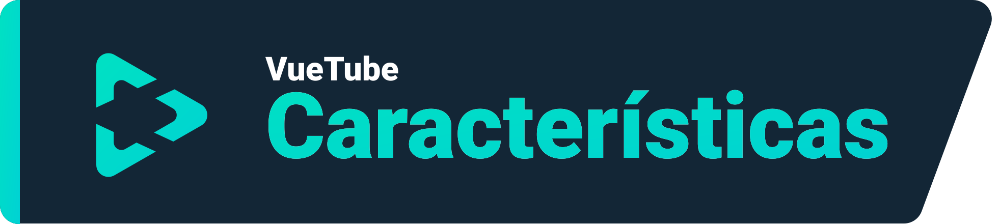
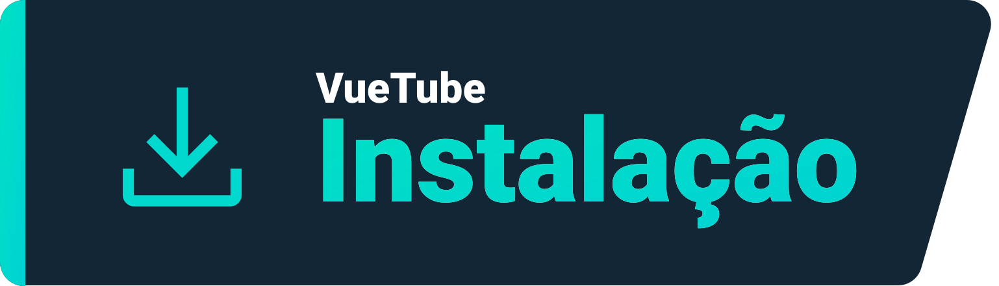
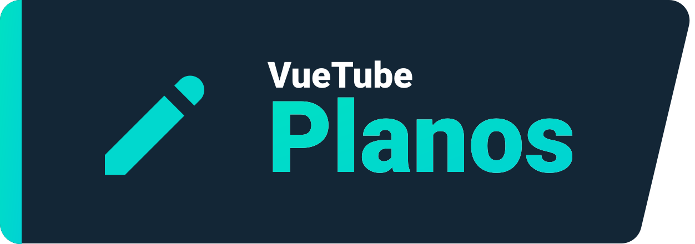

    <a href="https://vuetube.app/">
    <picture>
      <source 
        srcset="https://raw.githubusercontent.com/VueTubeApp/.github/main/readme_assets/dark/VueTube.svg"
        media="(prefers-color-scheme: dark)"
      />
      
    </picture>
  </a>
   
  Logo por <a href="https://github.com/afnzmn">@afnzmn</a> 
  tradução por <a href="https://github.com/LuanRT">@LuanRT</a>
   
   
<strong>Um simples cliente de streaming FOSS com o objetivo de recriar TODAS as funções de seus aplicativos respectivos (e mais).</strong>
 
Se pronuncia View Tube (<code>/ˈvjuːˌtjuːb/</code>)

  <a href="https://github.com/VueTubeApp/VueTube/blob/main/LICENSE" alt="License"></img></a>
  <a href="https://github.com/VueTubeApp/VueTube/actions/workflows/ci.yml" alt="CI"></img></a>
  <a href="https://reddit.com/r/vuetube" alt="Reddit"></img></a>
  <a href="https://t.me/VueTube" alt="Telegram"></img></a>
  <a href="https://discord.gg/7P8KJrdd5W" alt="Discord"></img></a>
  <a href="https://twitter.com/VueTubeApp" alt="Twitter"></img></a>

Leia isso em outras línguas: [English,](../readme.md) [Español,](/readme/readme.es.md) [简体中文,](/readme/readme.zh-hans.md) [繁體中文,](/readme/readme.zh-hant.md) [日本語,](/readme/readme.ja.md) [עִברִית,](/readme/readme.he.md) [Nederlands,](/readme/readme.nl.md) [தமிழ்,](/readme/readme.ta.md) [Bahasa Melayu,](/readme/readme.ms.md) [Македонски,](/readme/readme.mk.md) [Français,](/readme/readme.fr.md) [Português Brasileiro,](/readme/readme.pt-br.md) [Bahasa Indonesia,](/readme/readme.id.md) [Polski,](/readme/readme.pl.md) [Български,](/readme/readme.bg.md) [Italiano,](/readme/readme.it.md) [Magyar,](/readme/readme.hu.md) [한국어,](/readme/readme.kr.md) [Tiếng Việt,](/readme/readme.vi.md) [Română,](/readme/readme.ro.md) [Українська,](/readme/readme.ua.md) [Türkçe](/readme/readme.tr.md/)

## Características

- 🎨 Temas: Claro, Escuro, OLED, Todas as cores do arco-íris
- 🖌️ Interface Customizável: Te permite customizar cor de realce e outras partes da interface para remover funções que você não usa!
- ⬆️ Atualização Automática: Seja notificado quando alguma atualização estiver disponível ou faça um downgrade se não gostar!
- 👁️ Sem Telemetria: Telemetria é desativada por padrão
- 📺 Reprodutor Customizado
- 👎 Suporta Return YouTube Dislike

## Instalação

Para instalar visite www.vuetube.app/install

  
Ou clique aqui para ver todas as versões disponíveis

 

### Android

|  |  |  |
| -------------------------------------------------------------------------------------------------------------------------------------------- | ---------------------------------------------------------------------------------------------------------------------------------------------------------------- | ------------------------------------------------------------------------------------------------ |
| Muitos bugs, mas acesso antecipado a novas funções                                                                                           | Menos bugs, pode ter um pouco mais de funções do que a estável                                                                                                   | Não disponível até que o app esteja mais maduro                                                  |

### iOS

|  |  |  |
| ---------------------------------------------------------------------------------------------------------------------------------------- | ------------------------------------------------------------------------------------------------------------------------------------------------------------------------------- | ------------------------------------------------------------------------------------------------ |
| Muitos bugs, mas acesso antecipado a novas funções                                                                                       | Menos bugs, pode ter um pouco mais de funções do que a estável                                                                                                                  | Não disponível até que o app esteja mais maduro                                                  |

## Planos

- 🔍 Procura Avançada
- 🗞️ Guardar histórico localmente
- ✂️ Shorts
- 🧑 Login com conta do Google
- 🖼️ Modo janela flutuante
- e muito mais!

## Capturas de tela

Veja no nosso website: www.vuetube.app/info/screenshots

  
 Ou clique aqui para vê-las 

 
  

     

### Tecnologias usadas

       

### Por que está fazendo isso?

Bem, o projeto tava jogado no servidor do Return YouTube Dislike por bastante tempo, então resolvi dar um basta nisso!

### Quer contribuir?

Por favor leia as instruções no nosso website: www.vuetube.app/contributing

## Contribuidores

Feito com [contrib.rocks](https://contrib.rocks). 

## Agradecimentos

- Emojis por [Twemoji team](https://twemoji.twitter.com/), Licenciado com [CC-BY 4.0](https://creativecommons.org/licenses/by/4.0/)
- Logo VueTube por [@afnzmn](https://github.com/afnzmn)
- Dados públicos de dislike são fornecidos por [Return Youtube Dislike](https://returnyoutubedislike.com)

## Aviso legal

O projeto VueTube e seus conteúdos não são afiliados, patrocinados, apoiados ou associados de forma alguma com YouTube, Google LLC ou qualquer de suas afiliadas ou subsidiárias. O site oficial do YouTube pode ser encontrado em [www.youtube.com](https://www.youtube.com).

Qualquer serviço, marca registrada, ou propriedade intelectual usada no projeto VueTube são propriedade de seus respectivos donos.
