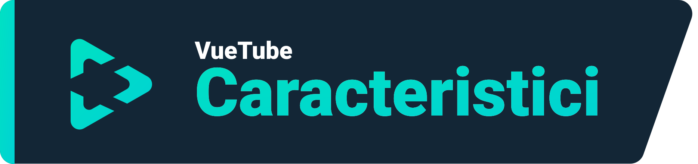
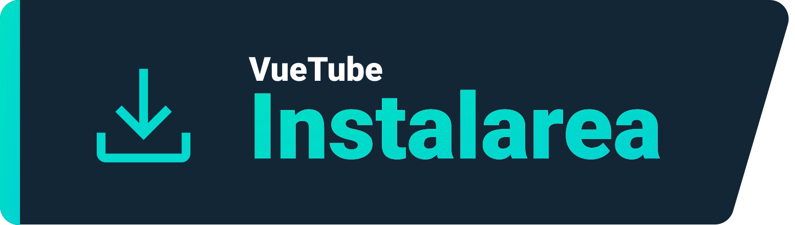
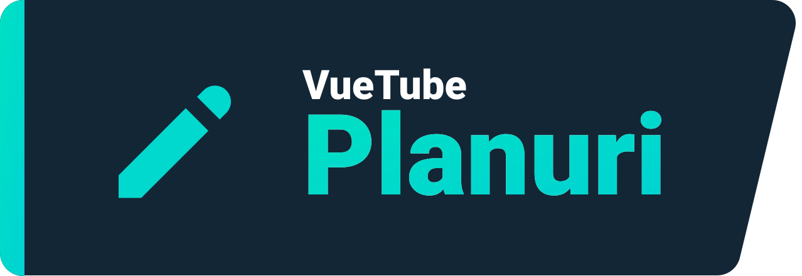

    <a href="https://vuetube.app/">
    <picture>
      <source 
        srcset="https://raw.githubusercontent.com/VueTubeApp/.github/main/readme_assets/dark/VueTube.svg"
        media="(prefers-color-scheme: dark)"
      />
      
    </picture>
  </a>
   
  Logo de la <a href="https://github.com/afnzmn">@afnzmn</a>  
  Contributorii README în limba engleză: <a href="https://github.com/404-Program-not-found">@404-Program-not-found</a>, <a href="https://github.com/Frontesque">@Frontesque</a>, <a href="https://github.com/gayolGate">@gayolGate</a>, <a href="https://github.com/ThatOneCalculator">@ThatOneCalculator</a>, <a href="https://github.com/afnzmn">@afnzmn</a>, <a href="https://github.com/tired6488">@tired6488</a>, <a href="https://github.com/DARKDRAGON532">@DARKDRAGON532</a>, <a href="https://github.com/PickleNik">@PickleNik</a> and <a href="https://github.com/Zyborg777">@Zyborg777</a>
   
   
<strong>Un client FOSS de streaming video simplu menit să recreeze TOATE caracteristicile din aplicațiile lor respective (și multe altele!).</strong>
 
Pronunțat View Tube (<code>/ˈvjuːˌtjuːb/</code>)

  <a href="https://github.com/VueTubeApp/VueTube/blob/main/LICENSE" alt="License"></img></a>
  <a href="https://github.com/VueTubeApp/VueTube/actions/workflows/ci.yml" alt="CI"></img></a>
  <a href="https://reddit.com/r/vuetube" alt="Reddit"></img></a>
  <a href="https://t.me/VueTube" alt="Telegram"></img></a>
  <a href="https://discord.gg/7P8KJrdd5W" alt="Discord"></img></a>
  <a href="https://twitter.com/VueTubeApp" alt="Twitter"></img></a>

Citește aceastea în alte limbii: [English,](../readme.md) [Español,](/readme/readme.es.md) [简体中文,](/readme/readme.zh-hans.md) [繁體中文,](/readme/readme.zh-hant.md) [日本語,](/readme/readme.ja.md) [עִברִית,](/readme/readme.he.md) [Nederlands,](/readme/readme.nl.md) [தமிழ்,](/readme/readme.ta.md) [Bahasa Melayu,](/readme/readme.ms.md) [Македонски,](/readme/readme.mk.md) [Français,](/readme/readme.fr.md) [Português Brasileiro,](/readme/readme.pt-br.md) [Bahasa Indonesia,](/readme/readme.id.md) [Polski,](/readme/readme.pl.md) [Български,](/readme/readme.bg.md) [Italiano,](/readme/readme.it.md) [Magyar,](/readme/readme.hu.md) [한국어,](/readme/readme.kr.md) [Tiếng Việt,](/readme/readme.vi.md) [Română,](/readme/readme.ro.md) [Українська,](/readme/readme.ua.md) [Türkçe](/readme/readme.tr.md/)

## Caracteristici

- 🎨 Tema: Lumina, Întuneric, OLED, Toate culorile curcubeului
- 🖌️ UI personalizat: Poți personaliza complet culoarea accentul și alte părți ale UI pentru a elimina caracteristică pe care nu le utilizați!
- ⬆️ Actualizare automată: Fiți anunțat când este disponibila o actualizare și faceți downgrade dacă nu vă place!
- 👁️ Protecția de urmărire: În mod implicit,nu este trimisă nicio telemetry de pe dispozitiv.
- 📺 Player video personalizat
- 👎 Return YouTube Dislike - [_Mai multe informații_](https://returnyoutubedislike.com)
- 💰 SponsorBlock - [_Mai multe informații_](https://sponsor.ajay.app)

## Instalarea

Pentru a instala vă rugam sa vizitați [vuetube.app/install](https://www.vuetube.app/install)

  
Sau apasă aici pentru a afișa toate versiunile disponibile

 

### Android

|  |  |  |
| -------------------------------------------------------------------------------------------------------------------------------------------- | ---------------------------------------------------------------------------------------------------------------------------------------------------------------- | ------------------------------------------------------------------------------------------------ |
| Destul de instabil, dar vei avea acess din timp la caracteristicii noi                                                                       | Mai puțin bug-uri decât instabil, având mai multe caracteristici decât stabile                                                                                   | Nu este disponibil încă                                                                          |

### iOS

|  |  |  |
| ---------------------------------------------------------------------------------------------------------------------------------------- | ------------------------------------------------------------------------------------------------------------------------------------------------------------------------------- | ------------------------------------------------------------------------------------------------ |
| Destul de instabil, dar vei avea acess din timp la caracteristicii noi                                                                   | Mai puțin bug-uri decât instabil, având mai multe caracteristici decât stabile                                                                                                  | Nu este disponibil încă                                                                          |

## Planuri

- 🔍 Căutarea avansat
- 🗞️ Istoricul vizionărilor local
- ✂️ YouTube Shorts (videoclip-uri mici care dureaza între 15 și 60 de secunde)
- 🧑 Conectarea cu contul Google
- 🖼️ Picture in picture mode (PiP)
- Și altele!

## Screenshot-uri

[Vizualizați-le pe site-ul nostru](https://www.vuetube.app/info/screenshots)

  
 Sau apasă aici pentru a afișa screenshot-uri 

 
  

     

### Technologii folosite

       

### De ce fac asta?

Ei bine, acest lucru a fost aruncat pe server-ul de Discord Return YouTube Dislike de ceva timp, așa că m-am gândit că probabil că ar trebui să iau o problemă!

### Doriți să contribui?

Vă rugam să citiți site-ul nostru despre cum să faceți acest lucru: [vuetube.app/contributing](https://www.vuetube.app/contributing)

Dacă doriți să traduceți aplicația, [apăsa aici](/NUXT/plugins/languages) și citește instructiunile

## Contributorii

Facut cu [contrib.rocks](https://contrib.rocks). 

## Mulțumirii

- Emoji-uri de la [echipa Twemoji](https://twemoji.twitter.com/), Licența sub [CC-BY 4.0](https://creativecommons.org/licenses/by/4.0/)
- Logo-ul VueTube de la [@afnzmn](https://github.com/afnzmn)
- Datele publice YouTube dislike furnizat de [Return Youtube Dislike](https://returnyoutubedislike.com)
- Ajay & Comunitatea pentru furnizarea [Sponsorblock API](https://sponsor.ajay.app), Licența sub [CC BY-NC-SA 4.0](https://creativecommons.org/licenses/by-nc-sa/4.0/)

## Donează

VueTube este și va fi întoteauna gratuit și sursă deschisă, dar puteți susține dezvoltatorii noștri cu o donație care va ajuta la menținerea proiectului.

[Donează pe Ko-Fi.com](https://ko-fi.com/vuetube) (Oficial)

[Donează la PickleNik pe GitHub](https://github.com/sponsors/PickleNik) (Întreținător)

## Disclaimer

Proiectul VueTube și conținutul său nu sunt afiliate, finanțate, autorizate, aprobate de sau în niciun fel acceptate cu YouTube, Google LLC sau oricare dintre afiliații și filialele sale. Site-ul oficial YouTube poate fi găsit la [youtube.com](https://www.youtube.com).

Orice marcă comercială, marcă de serviciu, denumire comercială sau alte drepturi de proprietate intelectuală utilizate în proiectul VueTube sunt deținute de proprietarii respectivi.
