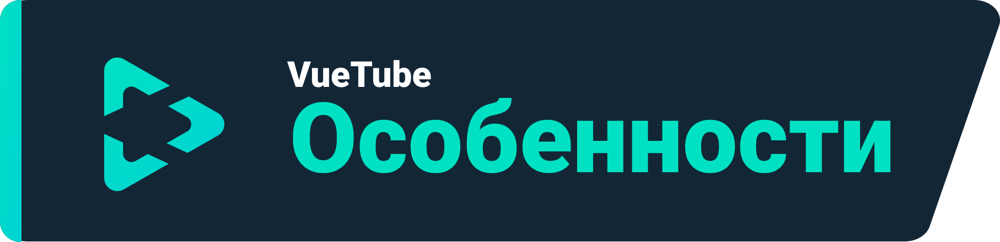
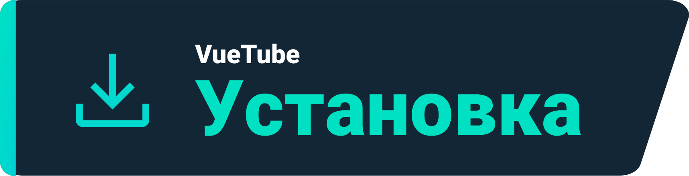
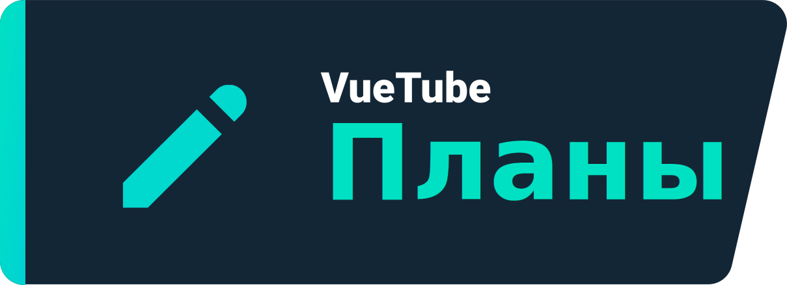

    <a href="https://vuetube.app/">
    <picture>
      <source 
        srcset="https://raw.githubusercontent.com/VueTubeApp/.github/main/readme_assets/dark/VueTube.svg"
        media="(prefers-color-scheme: dark)"
      />
      
    </picture>
  </a>
   
  

  
Show Readme credits

VueTube Logo by <a href="https://github.com/afnzmn">@afnzmn</a>  
English Readme contributors: <a href="https://github.com/404-Program-not-found">@404-Program-not-found</a>
, <a href="https://github.com/Frontesque">@Frontesque</a>, <a href="https://github.com/gayolGate">@gayolGate</a>
, <a href="https://github.com/ThatOneCalculator">@ThatOneCalculator</a>, <a href="https://github.com/afnzmn">@afnzmn</a>
, <a href="https://github.com/tired6488">@tired6488</a>, <a href="https://github.com/DARKDRAGON532">@DARKDRAGON532</a>
, <a href="https://github.com/PickleNik">@PickleNik</a> and <a href="https://github.com/Zyborg777">@Zyborg777</a>

  

  <strong>Простой клиент потокового видео, нацеленный на воссоздание ВСЕХ функций из других популярных приложений (и многое другое!)</strong>
   
  Произносится как View Tube (<code>/ˈvjuːˌtjuːb/</code>)

  <a href="https://github.com/VueTubeApp/VueTube/blob/main/LICENSE" alt="License"></img></a>
  <a href="https://github.com/VueTubeApp/VueTube/actions/workflows/ci.yml" alt="CI"></img></a>
  <a href="https://reddit.com/r/vuetube" alt="Reddit"></img></a>
  <a href="https://t.me/VueTube" alt="Telegram"></img></a>
  <a href="https://discord.gg/7P8KJrdd5W" alt="Discord"></img></a>
  <a href="https://twitter.com/VueTubeApp" alt="Twitter"></img></a>

**Доступные языки**: [English,](readme.md) [Español,](/readme/readme.es.md) [简体中文,](/readme/readme.zh-hans.md) [繁體中文,](/readme/readme.zh-hant.md) [日本語,](/readme/readme.ja.md) [עִברִית,](/readme/readme.he.md) [Nederlands,](/readme/readme.nl.md) [தமிழ்,](/readme/readme.ta.md) [Bahasa Melayu,](/readme/readme.ms.md) [Македонски,](/readme/readme.mk.md) [Français,](/readme/readme.fr.md) [Português Brasileiro,](/readme/readme.pt-br.md) [Bahasa Indonesia,](/readme/readme.id.md) [Polski,](/readme/readme.pl.md) [Български,](/readme/readme.bg.md) [Italiano,](/readme/readme.it.md) [Magyar,](/readme/readme.hu.md) [한국어,](/readme/readme.kr.md) [Tiếng Việt,](/readme/readme.vi.md) [Română,](/readme/readme.ro.md) [Українська](/readme/readme.ua.md), [Türkçe,](/readme/readme.tr.md/) [Русский](/readme/readme.ru.md)

<h2 align="left">

Особенности
</h2>

- 🎨 **Темы:** Светлая, темная, OLED и все цвета радуги! Настраивайте главные цвета и цвет заднего фона в соответствии с вашими предпочтениями.
- 🖌️ **Настройка UI:** Настраивайте кнопки, углы и отключайте части интерфейса, которые вы не используете, для комфортного использования.
- ⬆️ **Автообновления:** Будьте в курсе новых обновлений, скачивайте их прямиком в приложении или же откатывайтесь к более ранней версии, если они вам не понравились!
- 👁️ **Защита от телеметрии:** Никаких данных телеметрии не отправляется с вашего устройства и мы не используем внешние API. Конфиденциальность под большим приоритетом!
- 📺 **Собственный видеоплеер:** Встроенный видеоплеер со всем необходимым, включая 16х скорость.
- 🌍 **Языки:** Приложение доступно на более чем 25 языках! Язык по умолчанию определяется настройками вашего телефона.
- 👎 **Возвращение дизлайков** - Сделайте счетчик видимым снова. [_Подробнее_](https://returnyoutubedislike.com)
- 💰 **SponsorBlock** - Автоматически пропускайте рекламные и раздражающие сегменты в видео. [_Подробнее_](https://sponsor.ajay.app)

<h2 align="left">

Установка
</h2>

Для установки перейдите на [vuetube.app/install](https://www.vuetube.app/install) или просмотрите ниже список доступных версий:

  
🖱️ Нажмите, чтобы показать доступные версии 

 

<h3 align="left">

Android
</h3>

|  |  |  |
| ------------------------------------------------------------------------------------------------------------------------------------------- | ---------------------------------------------------------------------------------------------------------------------------- | ----------------------------------------------------------------------------------------------- |
| Нестабильная, но имеет ранний доступ к новым возможностям.                                                                                  | Меньше ошибок, чем в Unstable, но больше возможностей чем в Stable.                                                              | Пока не доступна.                                                                              |

<h3 align="left">

iOS
</h3>

|  |  |  |
| --------------------------------------------------------------------------------------------------------------------------------------- | ------------------------------------------------------------------------------------------------------------------------------------------------------------------------------ | ----------------------------------------------------------------------------------------------- |
| Нестабильная, но имеет ранний доступ к новым возможностям.                                                                              | Меньше ошибок, чем в Unstable, но больше возможностей чем в Stable.                                                                                                            | Пока не доступна.                                                                             |

(Apple официально не поддерживает sideloading, т.е. установку приложения с файла без загрузки их в официальный магазин приложений компании. Необходимо использовать продвинутые методы установки VueTube на iPhone / iPad устройствах)

<h2 align="left">

Планы
</h2>

- 🔍 **Продвинутый поиск:** Сортируйте результаты по дате, длительности, лайках или по любому другому параметру.
- 🗞️ **Локальная история просмотров:** Получите доступ к истории просмотров без необходимости авторизации в аккаунт.
- ✂️ **YouTube Shorts:** Небольшие вертикальные ролики с длительностью от 15 до 60 секунд.
- 🧑 **Вход с вашим аккаунтом Google**: Войдите, чтобы получить возможности комментировать, оценивать видео и подписываться на каналы.
- 🖼️ **Режим Picture-in-Picture (PiP):** Смотрите видео в плавающем окне, пока пользуетесь другими приложениями.
- 🧩 **Плагины:** Устанавливайте пользовательские плагины, созданные сообществом, с полезными функциями!
- И многое другое!

Вы можете поделиться своими предложениями, открывая issue в этом репозитории.

<h2 align="left">

Скриншоты
</h2>

[Смотрите их на нашем вебсайте](https://www.vuetube.app/info/screenshots) или нажмите ниже, чтобы показать их.

  
 🖱️ Нажмите, чтобы показать скриншоты 

 

<h2 align="left">

Сообщество
</h2>

Мы используем несколько разных платформ для связи с нашим сообществом. Вы можете активно принять участие в разработке
VueTube или просто быть в курсе всех новостей, присоединившись к этим группам:

- Discord сервер (https://vuetube.app/discord)
- Группа в Telegram (https://t.me/vuetube)
- Страница на Reddit (https://www.reddit.com/r/vuetube)

<h2 align="left">

Прогресс разработки
</h2>

  
 🖱️ Нажмите, чтобы показать карту 

  

|                   **Общие**                    |              **Проигрыватель**               | [**Extractor**](https://github.com/VueTubeApp/VueTube-Extractor) |
| :----------------------------------------------: | :-----------------------------------: | :--------------------------------------------------------------: |
|             🟢 Комментарии (100%)                |        🟢 Возобновить / Пауза (100%)   |                🟢 Автозаполнение поиска (100%)                   |
|              🟢 Описание (100%)               | 🟢 Показать / спрятать эл. управления (100%) |                       🟢 Начальная страница (100%)                        |
|               🟢 Начальная страница (100%)                |      🟠 Seekbar / Scrubber (80%)      |                         🟢 Поиск (100%)                         |
|            🟢 Интеграция с RYD (100%)             |          🟠 Полноэкранный режим (80%)          |                    🟠 Информация о видео (60%)                    |
|                 🟢 Темы (100%)                 |      🟠 Выбор разрешения (50%)       |                         🔴 Каналы (0%)                         |
|               🟢 Страница просмотра (100%)               |          🔴 Мини проигрыватель (0%)           |                         🔴 Комментарии (0%)                         |
|        🟠 Интеграция Sponsorblock (95%)         |        🔴 Фоновое воспроиведение (0%)        |                        🔴 Live чат (0%)                         |
|               🟠 Автообновления (50%)               |      🔴 Picture in Picture (0%)       |                     🔴 Видео в тренде (0%)                     |
|              🟠 Страница канала (50%)               |           🔴 Субтитры (0%)            |                       🔴 Взаимодействия (0%)                       |
|             🟠 Страница сообщества (10%)             |             🔴 Cards (0%)             |                       🔴 Плейлисты (0%)                         |
|         🟠 Настраиваемый UI Shorts (10%)          |                                       |                      🔴 Уведомления (0%)                       |
|        🟠 Настраиваемый UI YT Music (10%)         |                                       |                          🔴 Аккаунт (0%)                           |
|             🟠 Настраиваемый UI (30%)             |                                       |                                                                  |
|             🟠 Страница библиотеки (10%)              |                                       |                                                                  |
|                 🟠 Ответы (50%)                 |                                       |                                                                  |
|           🟠 Сторонние плагины (40%)           |                                       |                                                                  |
|  🟠 Проигрыватель VueTube (См. центральную колонку)   |                                       |                                                                  |
| 🟠 VueTube Extractor (См. правую колонку) |                                       |                                                                  |
|           🔴 Локальная история просмотров (0%)            |                                       |                                                                  |
|            🔴 Страница подписок (0%)            |                                       |                                                                  |
|          🔴 Поддержка других платформ (0%)          |                                       |                                                                  |

### Используемые технологии

       

### В чем цель проекта?

VueTube был создан с целью предоставить бесплатную кроссплатформенную open source альтернативу приложениям крупных компаний, с большими возможностями тонкой настройки и взаимодействий с аккаунтом. Проект рос, привлекая тысячи пользователей и участников со всего мира. Вы можете присоединиться и поддержать проект любыми способами...

### Хотите помочь развитию проекта?

Спасибо за проявленный интерес! Пожалуйста, посетите наш сайт с информацией о том, как это сделать
: [vuetube.app/contributing](https://www.vuetube.app/contributing).

Если вы хотите помочь с переводом, [нажмите тут](/NUXT/plugins/languages) и прочтите инструкцию. Если GitHub сложен и неудобен для вас, вы так же можете поделиться переведенными полями в текстовом файле в нашем [Discord](https://vuetube.app/discord) и мы их добавим.

<h2 align="left">

Участники проекта
</h2>

Панель создана автоматически с помощью [contrib.rocks](https://contrib.rocks). 

<h2 align="left">

Благодарность
</h2>

- Emojis от [Twemoji team](https://twemoji.twitter.com/) по лицензии [CC-BY 4.0](https://creativecommons.org/licenses/by/4.0/).
- VueTube Лого от [@afnzmn](https://github.com/afnzmn).
- Публичные данные о дизлайках на YouTube предоставлены [Return Youtube Dislike](https://returnyoutubedislike.com).
- Ajay & Community за [Sponsorblock API](https://sponsor.ajay.app), доступный по лицензии [CC BY-NC-SA 4.0](https://creativecommons.org/licenses/by-nc-sa/4.0/).

<h2 align="left">

Пожертвования
</h2>

VueTube всегда будет бесплатным проектом с открытым исходным кодом, но вы можете помочь материально, что позволит дальше улучшать проект и разрабатывать новые функции. Приветствуется любая помощь! Ниже доступные варианты пожертвований:

[Поддержите нас на Ko-Fi.com](https://ko-fi.com/vuetube) (Официальный)

[Поддержите PickleNik на GitHub](https://github.com/sponsors/PickleNik) (Глава проекта)

<h2 align="left">

Дисклеймер
</h2>

Проект VueTube и его содержимое не связаны, не финансируются, не санкционированы, не одобрены или каким-либо образом связаны с YouTube, Google LLC или любыми их филиалами и дочерними компаниями. Официальный веб-сайт YouTube можно найти по адресу [www.youtube.com](https://www.youtube.com).

Любые товарные знаки, знаки обслуживания, коммерческие названия или другие права интеллектуальной собственности, используемые в проекте VueTube, принадлежат соответствующим владельцам.

<h2 align="left">

Другие репозитории VueTube
</h2>

  
 🖱️ Нажмите, чтобы показать репозитории 

 

<a href="https://github.com/VueTubeApp/VueTube-Extractor">
    <picture>
      <source 
        srcset="https://github-readme-stats.vercel.app/api/pin/?username=VueTubeApp&repo=VueTube-Extractor&theme=dark"
        media="(prefers-color-scheme: dark)"
      />
      <source 
        srcset="https://github-readme-stats.vercel.app/api/pin/?username=VueTubeApp&repo=VueTube-Extractor&theme=highcontrast"
        media="(prefers-color-scheme: dark_colorblind)"
      />
      
    </picture>
</a>

**VueTube Extractor** библиотека для получения данных со стриминговых сервисов, разработанный специально для VueTube App.

<a href="https://github.com/VueTubeApp/VueTube-Translator">
    <picture>
      <source 
        srcset="https://github-readme-stats.vercel.app/api/pin/?username=VueTubeApp&repo=VueTube-Translator&theme=dark"
        media="(prefers-color-scheme: dark)"
      />
      <source 
        srcset="https://github-readme-stats.vercel.app/api/pin/?username=VueTubeApp&repo=VueTube-Translator&theme=highcontrast"
        media="(prefers-color-scheme: dark_colorblind)"
      />
      
    </picture>
</a>

**VueTube Translator** инструмент для перевода полей файлов JSON или JS на GitHub и их экспорта в нужном формате. Он создан, чтобы помочь переводчикам VueTube, но он может быть использован для других целей.

<a href="https://github.com/VueTubeApp/vuetube-http">
    <picture>
      <source 
        srcset="https://github-readme-stats.vercel.app/api/pin/?username=VueTubeApp&repo=vuetube-http&theme=dark"
        media="(prefers-color-scheme: dark)"
      />
      <source 
        srcset="https://github-readme-stats.vercel.app/api/pin/?username=VueTubeApp&repo=vuetube-http&theme=highcontrast"
        media="(prefers-color-scheme: dark_colorblind)"
      />
      
    </picture>
</a>

**VueTube HTTP** плагин для нативных запросов HTTP, скачивания/загрузки файлов, и работы с куки. Это форк 
[оригинального HTTP проекта](https://github.com/capacitor-community/http) от сообщества Capacitor с доработками от команды VueTube.

