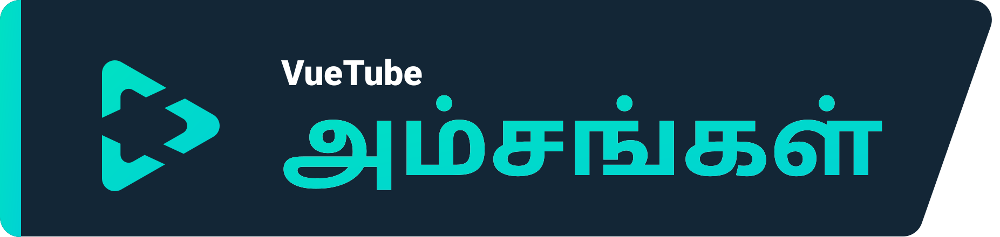
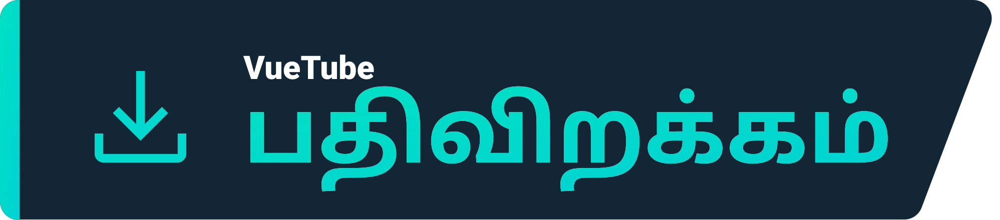
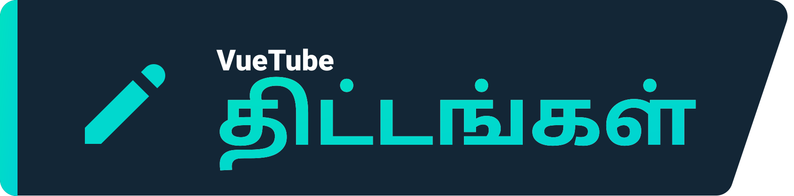

    <a href="https://vuetube.app/">
    <picture>
      <source 
        srcset="https://raw.githubusercontent.com/VueTubeApp/.github/main/readme_assets/dark/VueTube.svg"
        media="(prefers-color-scheme: dark)"
      />
      
    </picture>
  </a>
   
  <a href="https://github.com/afnzmn">@afnzmn</a> இன் லோகோ 
  Tamil translation by <a href="https://github.com/debuo">@debuo</a>
   
   
<strong>ஒரு எளிய FOSS வீடியோ ஸ்ட்ரீமிங் கிளையண்ட் அனைத்து அம்சங்களையும் அந்தந்த பயன்பாடுகளிலிருந்து (மேலும் பல) மீண்டும் உருவாக்குவதை நோக்கமாகக் கொ</strong>
 
வியூட்யூப் என சொல்லுங்கள்

  <a href="https://github.com/VueTubeApp/VueTube/blob/main/LICENSE" alt="License"></img></a>
  <a href="https://github.com/VueTubeApp/VueTube/actions/workflows/ci.yml" alt="CI"></img></a>
  <a href="https://reddit.com/r/vuetube" alt="Reddit"></img></a>
  <a href="https://t.me/VueTube" alt="Telegram"></img></a>
  <a href="https://discord.gg/7P8KJrdd5W" alt="Discord"></img></a>
  <a href="https://twitter.com/VueTubeApp" alt="Twitter"></img></a>

நீங்கள் இதை மற்ற மொழிகளில் பார்க்கலாம்: [English,](../readme.md) [Español,](/readme/readme.es.md) [简体中文,](/readme/readme.zh-hans.md) [繁體中文,](/readme/readme.zh-hant.md) [日本語,](/readme/readme.ja.md) [עִברִית,](/readme/readme.he.md) [Nederlands,](/readme/readme.nl.md) [தமிழ்,](/readme/readme.ta.md) [Bahasa Melayu,](/readme/readme.ms.md) [Македонски,](/readme/readme.mk.md) [Français,](/readme/readme.fr.md) [Português Brasileiro,](/readme/readme.pt-br.md) [Bahasa Indonesia,](/readme/readme.id.md) [Polski,](/readme/readme.pl.md) [Български,](/readme/readme.bg.md) [Italiano,](/readme/readme.it.md) [Magyar,](/readme/readme.hu.md) [한국어,](/readme/readme.kr.md) [Tiếng Việt,](/readme/readme.vi.md) [Română,](/readme/readme.ro.md) [Українська,](/readme/readme.ua.md) [Türkçe](/readme/readme.tr.md/)

## அம்சங்கள்

- 🎨 தீம்கள்: ஒளி, இருள், OLED, வானவில்லின் அனைத்து வண்ணங்களும்
- 🖌️ தனிப்பயனாக்கக்கூடிய UI: நீங்கள் பயன்படுத்தாத அம்சங்களை அகற்ற, உச்சரிப்பு நிறத்தையும் UI இன் பிற பகுதிகளையும் முழுமையாகத் தனிப்பயனாக்கலாம்!
- ⬆️ தானியங்கு புதுப்பிப்பு: புதுப்பிப்பு கிடைக்கும் போது அறிவிக்கப்படும் & நீங்கள் விரும்பவில்லை என்றால் தரமிறக்கி விடுங்கள்!
- 👁️ கண்காணிப்பு பாதுகாப்பு: உங்கள் ஃபோனிலிருந்து எந்த தகவலும் இயல்பாக அனுப்பப்படாது
- 📺 VueTube காணொளி பிளேயர்
- 👎 ரிட்டர்ன் Youtube டிஸ்லைக்

## பதிவிறக்கம்

பதிவிறக்க, www.vuetube.app/install க்குச் செல்லவும்

  
அல்லது கிடைக்கக்கூடிய அனைத்து பதிப்புகளையும் காட்ட இங்கே கிளிக் செய்யவும்

 

### Android

|  |  |  |
| -------------------------------------------------------------------------------------------------------------------------------------------- | ---------------------------------------------------------------------------------------------------------------------------------------------------------------- | ------------------------------------------------------------------------------------------------ |
| நிறைய பிழைகள் உள்ளன, ஆனால் அம்சங்களுக்கான ஆரம்ப அணுகல்                                                                                       | நிலையற்றதை விட குறைவான பிழைகள், நிலையானதை விட சற்று கூடுதல் அம்சங்கள்                                                                                            | பயன்பாடு இன்னும் மேம்படுத்தப்படும் வரை கிடைக்காது                                                |

### iOS

|  |  |  |
| ---------------------------------------------------------------------------------------------------------------------------------------- | ------------------------------------------------------------------------------------------------------------------------------------------------------------------------------- | ------------------------------------------------------------------------------------------------ |
| நிறைய பிழைகள் உள்ளன, ஆனால் அம்சங்களுக்கான ஆரம்ப அணுகல்                                                                                   | நிலையற்றதை விட குறைவான பிழைகள், நிலையானதை விட சற்று கூடுதல் அம்சங்கள்                                                                                                           | பயன்பாடு இன்னும் மேம்படுத்தப்படும் வரை கிடைக்காது                                                |

## திட்டங்கள்

- 🔍 மேம்பட்ட தேடல்
- 🗞️ உள்ளூர் ஸ்டோர் கண்காணிப்பு வரலாறு
- ✂️ Youtube குறும்படங்கள்
- 🧑 Google கணக்கு உள்நுழைவு
- 🖼️ Youtube PIP
- மேலும் உள்ளது!

## ஸ்கிரீன்ஷாட்கள்

எங்கள் இணையதளத்தில் பார்க்கவும்: www.vuetube.app/info/screenshots

  
 அல்லது ஸ்கிரீன் ஷாட்களைக் காட்ட இங்கே கிளிக் செய்யவும் 

 
  

     

### பயன்படுத்தப்படும் தொழில்நுட்பங்கள்

       

### நான் ஏன் இதைச் செய்கிறேன்?

ரிட்டர்ன் யூடியூப் டிஸ்கார்ட் சர்வரில் இது சில காலமாக வீசப்பட்டு வருகிறது, அதனால்தான் இதை முயற்சிக்க வேண்டும் என்று நினைத்தேன்!

### உதவ வேண்டுமா?

அதை எப்படி செய்வது என்று எங்கள் இணையதளத்தைப் படிக்கவும்: www.vuetube.app/contributing

## பங்களிப்பாளர்கள்

[contrib.rocks](https://contrib.rocks) மூலம் உருவாக்கப்பட்டது 

## அங்கீகாரங்கள்

- [Twemoji team](https://twemoji.twitter.com/) குழுவின் ஈமோஜிகள், [CC-BY 4.0](https://creativecommons.org/licenses/by/4.0/) இன் கீழ் உரிமம் பெற்றவை
- [@afnzmn](https://github.com/afnzmn) வழங்கிய VueTube லோகோ

## அறிவிப்பு

VueTube திட்டமும் அதன் உள்ளடக்கங்களும் YouTube, Google LLC அல்லது அதன் துணை நிறுவனங்கள் மற்றும் துணை நிறுவனங்களுடன் இணைக்கப்படவில்லை, நிதியளிக்கப்படவில்லை, அங்கீகரிக்கப்படவில்லை, அங்கீகரிக்கப்படவில்லை அல்லது எந்த வகையிலும் இணைக்கப்படவில்லை. அதிகாரப்பூர்வ YouTube வலைத்தளத்தை [www.youtube.com](https://www.youtube.com) இல் காணலாம்.

VueTube திட்டத்தில் பயன்படுத்தப்படும் வர்த்தக முத்திரை, சேவை முத்திரை, வர்த்தகப் பெயர் அல்லது பிற அறிவுசார் சொத்துரிமைகள் அந்தந்த உரிமையாளர்களுக்குச் சொந்தமானது.
