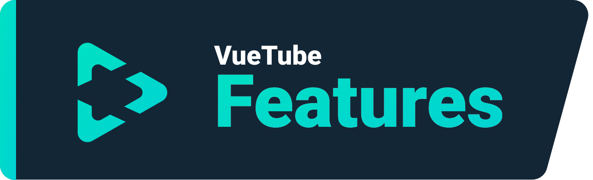
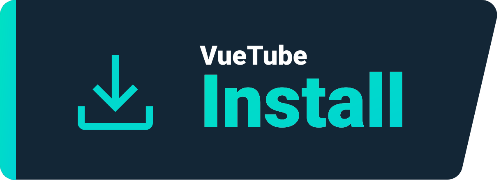
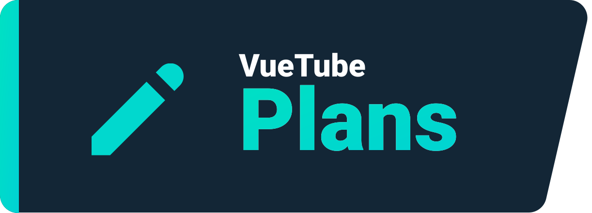

    <a href="https://vuetube.app/">
    <picture>
      <source 
        srcset="https://raw.githubusercontent.com/VueTubeApp/.github/main/readme_assets/dark/VueTube.svg"
        media="(prefers-color-scheme: dark)"
      />
      
    </picture>
  </a>
   
  

  
Readme'ye katkıda bulunanları göster

  
   VueTube Logosu <a href="https://github.com/afnzmn">@afnzmn</a> tarafından yapılmıştır  
  Türkçe Readme'ye katkı sağlayan kişiler: <a href="https://github.com/kyoyacchi">@kyoyacchi

<strong>
Onların saygıdeğer uygulamalarından tüm özellikleri yeniden oluşturmayı amaçlayan basit ve açık kaynaklı video yayın istemcesi (ve daha fazlası!)
</strong>
 
Telaffuzu View Tube'dur.(<code>/ˈvjuːˌtjuːb/</code>)

  <a href="https://github.com/VueTubeApp/VueTube/blob/main/LICENSE" alt="License"></img></a>
  <a href="https://github.com/VueTubeApp/VueTube/actions/workflows/ci.yml" alt="CI"></img></a>
  <a href="https://reddit.com/r/vuetube" alt="Reddit"></img></a>
  <a href="https://t.me/VueTube" alt="Telegram"></img></a>
  <a href="https://discord.gg/7P8KJrdd5W" alt="Discord"></img></a>
  <a href="https://twitter.com/VueTubeApp" alt="Twitter"></img></a>

**Bu yazıyı farklı dillerde okuyun**: [English,](../readme.md) [Español,](/readme/readme.es.md) [简体中文,](/readme/readme.zh-hans.md) [繁體中文,](/readme/readme.zh-hant.md) [日本語,](/readme/readme.ja.md) [עִברִית,](/readme/readme.he.md) [Nederlands,](/readme/readme.nl.md) [தமிழ்,](/readme/readme.ta.md) [Bahasa Melayu,](/readme/readme.ms.md) [Македонски,](/readme/readme.mk.md) [Français,](/readme/readme.fr.md) [Português Brasileiro,](/readme/readme.pt-br.md) [Bahasa Indonesia,](/readme/readme.id.md) [Polski,](/readme/readme.pl.md) [Български,](/readme/readme.bg.md) [Italiano,](/readme/readme.it.md) [Magyar,](/readme/readme.hu.md) [한국어,](/readme/readme.kr.md) [Tiếng Việt,](/readme/readme.vi.md) [Română,](/readme/readme.ro.md) [Українська,](/readme/readme.ua.md) [Türkçe](/readme/readme.tr.md/)

## Özellikler

- 🎨 **Temalar:** Aydınlık, Karanlık, OLED ve gökkuşağının tüm renkleri!
- 🖌️ **Özelleştirilebilir UI:** Temaları özelleştirin veya kullanmadığınız UI kısımlarını devre dışı bırakın!
- ⬆️ **Otomatik güncelleme:** Bir güncelleme mevcut olduğunda bildirim alın ve hoşunuza gitmezse eski bir sürümünü yükleyin!
- 👁️ **İzleme koruması:** Varsayılan olarak hiçbir telemetre verisi gönderilmez. Gizlilik gereklidir!
- 📺 **Özel video oynatıcısı:** Mutlu olacağınız
  bir oynatıcı uygulamaya entegre edilmiştir, 16x hız gibi.
- 👎 **Return YouTube Dislike** - [_Daha fazla bilgi için tıklayın_](https://returnyoutubedislike.com)
- 💰 **SponsorBlock** - [_Daha fazla bilgi için tıklayın_](https://sponsor.ajay.app)

## Yükleme

Uygulamayı yüklemek için lütfen [vuetube.app/install](https://www.vuetube.app/install) adresini ziyaret edin.

  
Ya da mevcut olan tüm sürümleri görmek için buraya tıklayın

 

### Android

|  |  |  |
| ------------------------------------------------------------------------------------------------------------------------------------------- | --------------------------------------------------------------------------------------------------------------------------------------------------------------- | ----------------------------------------------------------------------------------------------- |
| Oldukça kararsız, ama yeni özelliklere daha erken erişirsiniz.                                                                              | Kararlı olandan daha fazla özellikleri olmasına rağmen daha az bug içerir ve kararsızdır.                                                                       | Henüz mevcut değil.                                                                             |

### iOS

|  |  |  |
| --------------------------------------------------------------------------------------------------------------------------------------- | ------------------------------------------------------------------------------------------------------------------------------------------------------------------------------ | ----------------------------------------------------------------------------------------------- |
| Oldukça kararsız, ama yeni özelliklere daha erken erişirsiniz.                                                                          | Kararlı olandan daha fazla özellikleri olmasına rağmen daha az bug içerir ve kararsızdır.                                                                                      | Henüz mevcut değil.                                                                             |

## Planlanan Özellikler

- 🔍 **Gelişmiş arama:** Sonuçları tarih , süre, beğeni ile sıralama veya daha başka özellik.
- 🗞️ **Yerel izleme geçmişi:** Giriş yapmadan son izlediğiniz videolara erişin.
- ✂️ **YouTube Shorts:** 15 saniyeden 60 saniyeye kadar olan kısa videolar.
- 🧑 **Google hesabınızla giriş yapma**: Videolara beğeni ve beğenmeme atarak ve yorum yaparak ve kanallara abone olarak eksiksiz bir deneyim yaşamak için giriş yapın.
- 🖼️ **Resim içinde resim modu (PiP):** Başka bir uygulama kullandığınız sırada yüzen pencere video izlemenize izin verir.
- 🧩 **Eklentiler:** Topluluk tarafından kullanışlı özellikleriyle yapılmış üçüncü parti eklentileri yükleyin!
- Ve daha fazlası!

## Ekran Görüntüleri

[Web sitemizde görüntüleyin](https://www.vuetube.app/info/screenshots)

  
 Ya da ekran görüntülerini görüntülemek için buraya basın 

 
  

     

## İlerleme

  
 İlerlemeyi görmek için buraya tıklayın 

  
 
**Genel** | **Oynatıcı** | [**Extractor**](https://github.com/VueTubeApp/VueTube-Extractor) |
:-: | :-: | :-: |
🟢 Yorumlar (100%) | 🟢 Oynatma / Durdurma (100%) | 🟢 Arama Otomatik Tamamlama (100%) |
🟢 Açıklama (100%) | 🟢 Göstermek için bas / kontrolleri gizle (100%) | 🟢 Ana sayfa (100%) |
🟢 Ana Sayfa (100%) | 🟠 Arama Çubuğu / Scrubber (80%) | 🟢 Arama (100%)
🟢 RYD Entegresi (100%) | 🟠 Tam Ekran (80%) | 🟠 Video Bilgisi (60%) |
🟢 Temalar (100%) | 🟠 Çözünürlük Seçici (50%) | 🔴 Kanallar (0%) |
🟢 İzleme Sayfası (100%) | 🔴 Mini oynatıcı (0%) | 🔴 Yorumlar (0%) |
🟠 Sponsorblock Entegresi (95%) | 🔴 Arkaplanda Oynatma (0%) | 🔴 Canlı Sohbet (0%) |
🟠 Otomatik Güncelleme (50%) | 🔴 Resim içinde Resim (0%) | 🔴 Trend İçerikler (0%)
🟠 Kanal Sayfası (50%) |  🔴 Altyazılar (0%) | 🔴 Etkileşim (0%) |
🟠 Topluluk Gönderileri (10%) | 🔴 Kartlar (0%) | 🔴 Oynatma Listeleri (0%) |
🟠 Özelleştirilebilir Shorts UI (10%) |  | 🔴 Bildirimler (0%)
🟠 Özelleştirilebilir YT Music UI (10%) |  | 🔴 Giriş (0%)
🟠 Özelleştirilebilir UI (30%) |  |  |
🟠 Kitaplık Sayfası (10%) |  |  |
🟠 Yanıtlar (50%) |  |  |
🟠 Üçüncü Taraf Eklentiler (40%) |  |  |
🟠 VueTube Player (Sağdaki ilerlemeye bakın) |  |  |
🟠 VueTube Extractor (Sağdaki ilerlemeye bakın) |  |  |
🔴 Yerel İzleme Geçmişi (0%) |  |  |
🔴 Abonelikler Sayfası (0%) |  |  |
🔴 Başka Platform Desteği (0%) |  |  |
  

### Kullanılan teknolojiler

       

### Neden bunu yapıyoruz?

Big Tech'e (Google, Meta v.b) alternatif olan, ücretsiz, açık kaynaklı ve birden fazla platformlarda kullanılabilen bir projeyi sizlere sunmak istedik!

### Katkıda bulunmak ister misiniz?

Lütfen nasıl yapılacağını sitemizde okuyun: [vuetube.app/contributing](https://www.vuetube.app/contributing)

Uygulamayı çevirmek istiyorsanız, [buraya tıklayın](/NUXT/plugins/languages) ve talimatları okuyun.

## Katkıda Bulunanlar

[contrib.rocks](https://contrib.rocks) ile yapılmıştır.

## Teşekkürler

- [Twemoji team](https://twemoji.twitter.com/), [CC-BY 4.0](https://creativecommons.org/licenses/by/4.0/) Lisansı altındadır.
- VueTube Logosu için [@afnzmn](https://github.com/afnzmn)'e
- Herkese açık YouTube dislike verisini sağlayan [Return Youtube Dislike](https://returnyoutubedislike.com)'a
- Ajay & Community [Sponsorblock API](https://sponsor.ajay.app), [CC BY-NC-SA 4.0](https://creativecommons.org/licenses/by-nc-sa/4.0/) Lisansı altındadır.

## Bağış

VueTube her zaman ücretsiz ve açık kaynaklı olacaktır. Geliştiricilerimizi projeyi geliştirmeleri adına bağış yaparak destekleyebilirsiniz.

[Ko-Fi.com üzerinden bağış yapın](https://ko-fi.com/vuetube) (Resmi)

[PickleNik'e GitHub üzerinden bağış yapın](https://github.com/sponsors/PickleNik) (Geliştirici)

## Sorumluluk Reddi (Disclaimer)

VueTube projesi ve içeriği; YouTube, Google LLC veya bağlı kuruluşlara ve iştiraklere ile bağlantılı, finanse edilmiş, yetkilendirilmiş, onaylanmış veya herhangi bir şekilde ilişkili değildir. Resmi YouTube web sitesi [youtube.com](https://www.youtube.com) adresinde bulunabilir.

VueTube projesinde kullanılan her türlü ticari marka, hizmet markası, ticari ad veya diğer fikri mülkiyet hakları ilgili sahiplerine aittir.
