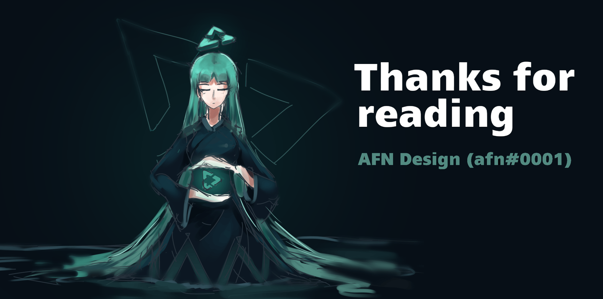

    <a href="https://vuetube.app/">
    <picture>
      <source 
        srcset="https://raw.githubusercontent.com/VueTubeApp/.github/main/readme_assets/dark/VueTube.svg"
        media="(prefers-color-scheme: dark)"
      />
      
    </picture>
  </a>
   
  

  
Show Readme credits

  
   VueTube Logo by <a href="https://github.com/afnzmn">@afnzmn</a>  
  English Readme contributors: <a href="https://github.com/404-Program-not-found">@404-Program-not-found</a>, <a href="https://github.com/Frontesque">@Frontesque</a>, <a href="https://github.com/gayolGate">@gayolGate</a>, <a href="https://github.com/ThatOneCalculator">@ThatOneCalculator</a>, <a href="https://github.com/afnzmn">@afnzmn</a>, <a href="https://github.com/tired6488">@tired6488</a>, <a href="https://github.com/DARKDRAGON532">@DARKDRAGON532</a>, <a href="https://github.com/PickleNik">@PickleNik</a> and <a href="https://github.com/Zyborg777">@Zyborg777</a>

<strong>Простий клієнт потокового відео з відкритим вихідним кодом, спрямований на відтворення ВСІХ функцій із відповідних програм (і багато іншого!)</strong>
 
Вимовляється як View Tube (<code>/ˈvjuːˌtjuːb/</code>)

  <a href="https://github.com/VueTubeApp/VueTube/blob/main/LICENSE" alt="License"></img></a>
  <a href="https://github.com/VueTubeApp/VueTube/actions/workflows/ci.yml" alt="CI"></img></a>
  <a href="https://reddit.com/r/vuetube" alt="Reddit"></img></a>
  <a href="https://t.me/VueTube" alt="Telegram"></img></a>
  <a href="https://discord.gg/7P8KJrdd5W" alt="Discord"></img></a>
  <a href="https://twitter.com/VueTubeApp" alt="Twitter"></img></a>

**Read this page in other languages**: [English,](../readme.md) [Español,](/readme/readme.es.md) [简体中文,](/readme/readme.zh-hans.md) [繁體中文,](/readme/readme.zh-hant.md) [日本語,](/readme/readme.ja.md) [עִברִית,](/readme/readme.he.md) [Nederlands,](/readme/readme.nl.md) [தமிழ்,](/readme/readme.ta.md) [Bahasa Melayu,](/readme/readme.ms.md) [Македонски,](/readme/readme.mk.md) [Français,](/readme/readme.fr.md) [Português Brasileiro,](/readme/readme.pt-br.md) [Bahasa Indonesia,](/readme/readme.id.md) [Polski,](/readme/readme.pl.md) [Български,](/readme/readme.bg.md) [Italiano,](/readme/readme.it.md) [Magyar,](/readme/readme.hu.md) [한국어,](/readme/readme.kr.md) [Tiếng Việt,](/readme/readme.vi.md) [Română,](/readme/readme.ro.md) [Українська,](/readme/readme.ua.md) [Türkçe](/readme/readme.tr.md/)

<h2 align="left">

Особливості
</h2>

- 🎨 **Теми:** Світла, темна, OLED і всі кольори веселки! Встановіть колір акценту та фону відповідно до ваших уподобань.
- 🖌️ **Персоналізація інтерфейсу:** Налаштуйте кнопки, кути та вимкніть частини інтерфейсу, які ви не використовуєте.
- ⬆️ **Автоматичні оновлення:** Отримуйте сповіщення, про нові оновлення, завантажуйте через додаток і повертайтеся до минулих версій, якщо апдейт вам не подобається!
- 👁️ **Захист від слідкування за користувачами:** Дані телеметрії не надсилаються з вашого пристрою за умовчанням, і ми не використовуємо зовнішні API. Конфіденційність є найбільшим пріорітетом!
- 📺 **Власний відео плеєр:** У програму є інтегрований програвач із усім необхідним, щоб бути щасливими, наприклад, швидкість 16x.
- 🌍 **Переклади:** Додаток має більш ніж 25 мов! Мова за умовчанням визначається відповідно до конфігурації вашого пристрою.
- 👎 **Перегляд кількості дизлайків** - Кількість дизлайків знову доступна. [_Більше інформації_](https://returnyoutubedislike.com)
- 💰 **Відсутність реклами** - Автоматично пропускайте спонсорів і дратівливі сегменти у відео. [_Більше інформації_](https://sponsor.ajay.app)

<h2 align="left">

Інсталяція
</h2>

Щоб інсталювати програму, перейдіть на сторінку [vuetube.app/install](https://www.vuetube.app/install) або перегляньте нижче доступні версії:

  
🖱️ Клацніть, щоб показати доступні версії 

 

<h3 align="left">

Android
</h3>

|  |  |  |
| ---------------------------------------------------------------------------------------------------------------------------------------------- | ------------------------------------------------------------------------------------------------------------------------------- | -------------------------------------------------------------------------------------------------- |
| Досить нестабільна, але ви отримуєте ранній доступ до нових функцій.                                                                           | Менше помилок, ніж нестабільний білд, але має більше функцій, ніж стабільний.                                                   | Ще не доступний.                                                                                   |

<h3 align="left">

iOS
</h3>

|  |  |  |
| ------------------------------------------------------------------------------------------------------------------------------------------ | --------------------------------------------------------------------------------------------------------------------------------------------------------------------------------- | -------------------------------------------------------------------------------------------------- |
| Досить нестабільна, але ви отримуєте ранній доступ до нових функцій.                                                                       | Менше помилок, ніж нестабільний білд, але має більше функцій, ніж стабільний.                                                                                                     | Ще не доступний.                                                                                   |

(Apple офіційно не підтримує sideloading, тобто установку додатків лише з файлом без їх завантаження в офіційний магазин компанії. Для встановлення VueTube на пристроях iPhone / iPad необхідно використовувати розширені методи)

<h2 align="left">

Майбутні плани
</h2>

- 🔍 **Розширений пошук:** Сортування результатів за датою, тривалістю, уподобаннями або будь-яким іншим критерієм.
- 🗞️ **Історія переглядів:** Використовуйте останні переглянуті відео без входу.
- ✂️ **YouTube Shorts:** Невеликі вертикальні відеоролики тривалістю від 15 до 60 секунд.
- 🧑 **Вхід за допомогою облікового запису Google**: Увійдіть, щоб отримати всі функції, а саме: голосування, коментування відео та підписки на канали.
- 🖼️ **Picture-in-Picture режим (PiP):** Дозволяє переглядати відео у плаваючому вікні під час використання іншої програми.
- 🧩 **Плагіни:** Встановлюйте сторонні плагіни, створені спільнотою з корисними функціями!
- І багато іншого!

Ви можете запропонувати власну функцію, відкривши запит на функцію в цьому репозиторії.

<h2 align="left">

Скріншоти
</h2>

[Перегляньте їх на нашому сайті](https://www.vuetube.app/info/screenshots) або натисніть нижче, щоб показати їх.

  
 🖱️ Натисніть, щоб показати знімки екрана 

 
  

     

<h2 align="left">

Спільнота
</h2>

Ми використовуємо кілька різних платформ для зв’язку з нашою спільнотою. Ви можете брати активну участь у розробці VueTube або просто бути в курсі всіх новин, приєднавшись до цих груп:

- Discord сервер (https://vuetube.app/discord)
- Telegram група (https://t.me/vuetube)
- Reddit сторінка (https://www.reddit.com/r/vuetube)

<h2 align="left">

Прогрес
</h2>

  
 🖱️ Натисніть, щоб показати прогрес 

  
 
**General** | **Player** | [**Extractor**](https://github.com/VueTubeApp/VueTube-Extractor) |
:-: | :-: | :-: |
🟢 Коментарі (100%) | 🟢 Відтворення / Пауза (100%) | 🟢 Автозаповнення пошуку (100%) |
🟢 Опис (100%) | 🟢 Tap to show / hide controls (100%) | 🟢 Домашня сторінка (100%) |
🟢 Домашня сторінка (100%) | 🟠 Seekbar / Scrubber (80%) | 🟢 Пошук (100%)
🟢 RYD Integration (100%) | 🟠 Повноекранне відображення (80%) | 🟠 Інформація про відео (60%) |
🟢 Теми (100%) | 🟠 Вибір роздільної здатності (50%) | 🔴 Канали (0%) |
🟢 Сторінка перегляду (100%) | 🔴 Мініплеєр (0%) | 🔴 Коментарі (0%) |
🟠 Інтеграція Sponsorblock (95%) | 🔴 Фонове відтворення (0%) | 🔴 Живий чат (0%) |
🟠 Автоматичне оновлення (50%) | 🔴 Picture in Picture (0%) | 🔴 Трендовий контент (0%)
🟠 Сторінка каналу (50%) |  🔴 Субтитри (0%) | 🔴 Взаємодії (0%) |
🟠 Публікації спільноти (10%) | 🔴 Cards (0%) | 🔴 Списки відтворення (0%) |
🟠 Настроюваний інтерфейс Shorts (10%) |  | 🔴 Сповіщення (0%)
🟠 Настроюваний інтерфейс YT Music (10%) |  | 🔴 Логін (0%)
🟠 Настроюваний інтерфейс (30%) |  |  |
🟠 Сторінка бібліотек (10%) |  |  |
🟠 Відповіді (50%) |  |  |
🟠 Сторонні плагіни (40%) |  |  |
🟠 Програвач VueTube (див. прогрес праворуч) |  |  |
🟠 VueTube Extractor (див. прогрес праворуч) |  |  |
🔴 Local Watch History (0%) |  |  |
🔴 Сторінка підписки (0%) |  |  |
🔴 Підтримка інших платформ (0%) |  |  |
  

### Використовувані технології

       

### Чому ми це робимо?

VueTube було створено з метою надати Інтернету безкоштовну повну кросплатформенну альтернативу великим технологіям із відкритим вихідним кодом із параметрами, які можна налаштувати, і доступними для входу. Проект розвивався, залучаючи тисячі користувачів і учасників по всьому світу. Ви можете приєднатися до нас і зробити свій внесок у цей проект будь-яким способом...

### Хочете зробити внесок?

Дякуємо за зацікавленість! Про те, як це зробити, читайте на нашому веб-сайті: [vuetube.app/contributing](https://www.vuetube.app/contributing).

Якщо ви хочете перекласти програму, [натисніть тут](/NUXT/plugins/languages/readme.md) і прочитайте інструкції. Якщо GitHub для вас важкий або незручний, ви також можете надіслати перекладені поля в текстовий файл на наш [Discord](https://vuetube.app/discord), і ми їх додамо.

<h2 align="left">

Учасники проекту
</h2>

Інформаційна панель була створена автоматично за допомогою [contrib.rocks](https://contrib.rocks). 

<h2 align="left">

Подяки
</h2>

- Емоджі від [команди Twemoji](https://twemoji.twitter.com/), Ліцензія [CC-BY 4.0](https://creativecommons.org/licenses/by/4.0/).
- VueTube лого від [@afnzmn](https://github.com/afnzmn).
- Загальнодоступні дані про дизлайки YouTube, надані службою [Return Youtube Dislike](https://returnyoutubedislike.com).
- Ajay та спільноті за надання [Sponsorblock API](https://sponsor.ajay.app), Licensed under [CC BY-NC-SA 4.0](https://creativecommons.org/licenses/by-nc-sa/4.0/).

<h2 align="left">

Пожертви
</h2>

VueTube є і завжди буде безкоштовним і відкритим кодом, але ви можете підтримати наших розробників пожертвою, яка допоможе підтримувати проект і розробляти нові функції. Будь-яка допомога вітається! Нижче доступні варіанти пожертвувань:

[Donate on Ko-Fi.com](https://ko-fi.com/vuetube) (Official)

[Donate to PickleNik on GitHub](https://github.com/sponsors/PickleNik) (Maintainer)

<h2 align="left">

Відмова від відповідальності
</h2>

Проект VueTube та його вміст не пов’язані, не фінансуються, не санкціоновані, не схвалені або будь-яким чином пов’язані з YouTube, Google LLC або будь-якими їхніми філіями та дочірніми компаніями. Офіційний веб-сайт YouTube можна знайти за адресою [youtube.com](https://www.youtube.com).

Будь-які торгові марки, знаки обслуговування, комерційні назви чи інші права інтелектуальної власності, що використовуються в проекті VueTube, належать відповідним власникам.

<h2 align="left">

Інші репозиторії VueTube
</h2>

  
 🖱️ Натисніть, щоб показати репозиторії 

 

**VueTube Extractor** це бібліотека, розроблена для отримання даних зі стрімінгових служб, розроблена для використання в додатку VueTube.

**VueTube Translator** це інструмент для перекладу полів файлів GitHub, таких як JSON або JS, і експорту результату з правильною структурою. Він був створений, щоб допомогти перекладачам VueTube, але його можна використовувати для будь-яких інших цілей.

**VueTube HTTP** це плагін для власних HTTP-запитів, завантаження файлів і керування файлами cookie. Це форк [оригінального HTTP-проекту](https://github.com/capacitor-community/http) від Capacitor Community з доповненнями від команди VueTube.

