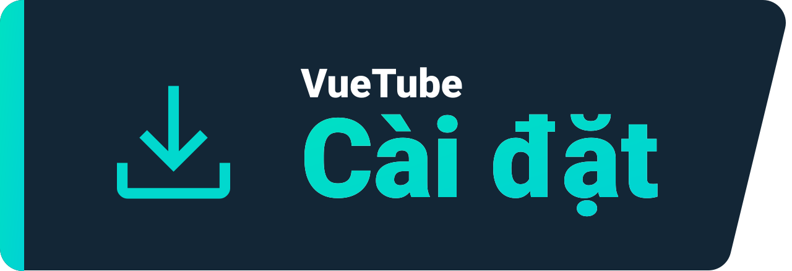
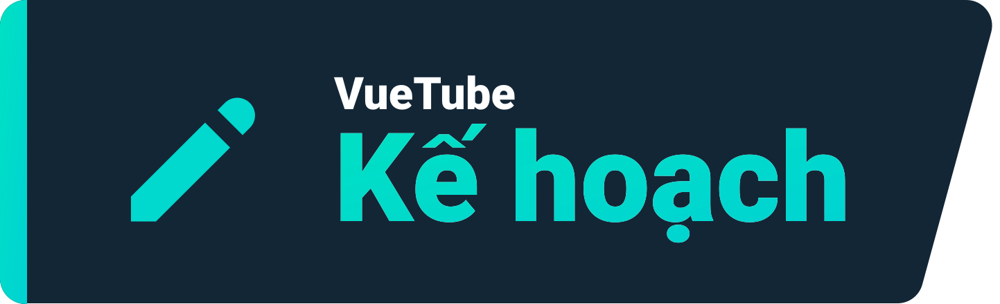

    <a href="https://vuetube.app/">
    <picture>
      <source 
        srcset="https://raw.githubusercontent.com/VueTubeApp/.github/main/readme_assets/dark/VueTube.svg"
        media="(prefers-color-scheme: dark)"
      />
      
    </picture>
  </a>
   
  Logo by <a href="https://github.com/afnzmn">@afnzmn</a>  
  English Readme contributors: <a href="https://github.com/404-Program-not-found">@404-Program-not-found</a>, <a href="https://github.com/Frontesque">@Frontesque</a>, <a href="https://github.com/gayolGate">@gayolGate</a>, <a href="https://github.com/ThatOneCalculator">@ThatOneCalculator</a>, <a href="https://github.com/afnzmn">@afnzmn</a>, <a href="https://github.com/tired6488">@tired6488</a>, <a href="https://github.com/DARKDRAGON532">@DARKDRAGON532</a>, <a href="https://github.com/PickleNik">@PickleNik</a> and <a href="https://github.com/Zyborg777">@Zyborg777</a>
   
   
<strong>Một ứng dụng phát trực tuyến video mã nguồn mở và đơn giản nhằm tạo lại TẤT CẢ các tính năng từ các ứng dụng tương ứng (và nhiều hơn nữa!)</strong>
 
Phát âm View Tube (<code>/ˈvjuːˌtjuːb/</code>)

  <a href="https://github.com/VueTubeApp/VueTube/blob/main/LICENSE" alt="License"></img></a>
  <a href="https://github.com/VueTubeApp/VueTube/actions/workflows/ci.yml" alt="CI"></img></a>
  <a href="https://reddit.com/r/vuetube" alt="Reddit"></img></a>
  <a href="https://t.me/VueTube" alt="Telegram"></img></a>
  <a href="https://discord.gg/7P8KJrdd5W" alt="Discord"></img></a>
  <a href="https://twitter.com/VueTubeApp" alt="Twitter"></img></a>

Đọc trang này trong các ngôn ngữ khác: [English,](../readme.md) [Español,](/readme/readme.es.md) [简体中文,](/readme/readme.zh-hans.md) [繁體中文,](/readme/readme.zh-hant.md) [日本語,](/readme/readme.ja.md) [עִברִית,](/readme/readme.he.md) [Nederlands,](/readme/readme.nl.md) [தமிழ்,](/readme/readme.ta.md) [Bahasa Melayu,](/readme/readme.ms.md) [Македонски,](/readme/readme.mk.md) [Français,](/readme/readme.fr.md) [Português Brasileiro,](/readme/readme.pt-br.md) [Bahasa Indonesia,](/readme/readme.id.md) [Polski,](/readme/readme.pl.md) [Български,](/readme/readme.bg.md) [Italiano,](/readme/readme.it.md) [Magyar,](/readme/readme.hu.md) [한국어,](/readme/readme.kr.md) [Tiếng Việt,](/readme/readme.vi.md) [Română,](/readme/readme.ro.md) [Українська,](/readme/readme.ua.md) [Türkçe](/readme/readme.tr.md/)

## Tính năng

- 🎨 Chủ đề: Sáng, tối và nhứng màu sắc của cầu vồng!
- 🖌️ Tùy chinht UI: Tùy chỉnh giao diện, kể cả tắt những phần bạn hổng có dùng
- ⬆️ Tự động cập nhật: Nhận thông báo khi cập nhật hoặc hạ cấp nếu bận hổng có thích!
- 👁️ Bảo vệ khỏi theo dõi: Không có dữ liệu nào từ thiết bị của bạn gửi đến máy chủ từ xa!
- 📺 Trình phát tùy chỉnh
- 👎 Return YouTube Dislike - [_More info_](https://returnyoutubedislike.com)
- 💰 SponsorBlock - [_More info_](https://sponsor.ajay.app)

## Cài đặt

Để cài đặt hãy ghé thăm [vuetube.app/install](https://www.vuetube.app/install)

  
Hay nhấn vào đây để xem những phiên bản có sẵn

 

### Android

|  |  |  |
| -------------------------------------------------------------------------------------------------------------------------------------------- | ---------------------------------------------------------------------------------------------------------------------------------------------------------------- | ------------------------------------------------------------------------------------------------ |
| Hơi bất ổn định xíu nhưng được tận hưởng tính năng mới                                                                                       | Ít lỗi hơn bản unstable nhưng có nhiều tính năng hơn bản stable                                                                                                  | Chưa có sẵn đâu nha                                                                              |

### iOS

|  |  |  |
| ---------------------------------------------------------------------------------------------------------------------------------------- | ------------------------------------------------------------------------------------------------------------------------------------------------------------------------------- | ------------------------------------------------------------------------------------------------ |
| Hơi bất ổn định xíu nhưng được tận hưởng tính năng mới                                                                                   | Ít lỗi hơn bản unstable nhưng có nhiều tính năng hơn bản stable                                                                                                                 | Chưa có sẵn đâu nha                                                                              |

## Kế hoạch

- 🔍 Tìm kiếm nâng cao
- 🗞️ Lịch sử xem nội bộ
- ✂️ YouTube Shorts (video ngắn từ 15 đến 60 giây)
- 🧑 Đăng nhập với tài khoản Google của bạn
- 🖼️ Chế độ Picture-in-Picture (PiP)
- Và nhiều hơn nữa!

## Ảnh chụp màn hình

[Xem trên website của chúng tôi](https://www.vuetube.app/info/screenshots)

  
 Hoặc nhấn vào đây để xem ảnh chụp màn hình 

 
  

     

### Công nghệ đã được sử dụng

       

### Tại sao tôi lại làm cái này?

Chà, điều này đã xuất hiện trên Discord Server Return YouTube Dislike trong một thời gian khá dài, vì vậy tôi nghĩ rằng tôi có thể nên thử nó!

### Bạn muốn đóng góp không?

Đọc trên website của chúng tôi để xem: [vuetube.app/contributing](https://www.vuetube.app/contributing)

Nếu bạn muốn dịch ứng dụng, [nhấn vào đây](/NUXT/plugins/languages) và đọc hướng dẫn

## Những người đóng góp

Được thực hiện với [contrib.rocks](https://contrib.rocks). 

## Sự nhìn nhận

- Emojis bởi [Twemoji team](https://twemoji.twitter.com/), Giấy phép [CC-BY 4.0](https://creativecommons.org/licenses/by/4.0/)
- Logo của VueTube bởi [@afnzmn](https://github.com/afnzmn)
- Dữ liệu Dislike của Youtube bởi [Return Youtube Dislike](https://returnyoutubedislike.com)
- [Sponsorblock API](https://sponsor.ajay.app) bởi Ajay & Cộng đồng, Giấy phép [CC BY-NC-SA 4.0](https://creativecommons.org/licenses/by-nc-sa/4.0/)

## Ủng hộ

VueTube sẽ mãi miễn phí và mã nguồn mở, nhưng bạn có thể ủng hộ nhà phát triển để giúp duy trì dự án này.

[Ủng hộ trên Ko-Fi.com](https://ko-fi.com/vuetube) (Official)

[Donate cho PickleNik trên GitHub](https://github.com/sponsors/PickleNik) (Người duy trì)

## Miễn trừ trách nhiệm

Dự án VueTube và nội dung của nó không liên quan, được tài trờ, được ủy quyền, xác nhận bởi hay liên quan gì đến YouTube, Google LLC hay bất cứ thứ gì liên quan. Trang web chính thức của Youtube là [youtube.com](https://www.youtube.com).

Mọi nhãn hiệu, nhãn hiệu dịch vụ, tên thương mại hoặc các quyền sở hữu trí tuệ khác được sử dụng trong dự án VueTube đều thuộc sở hữu của các chủ sở hữu tương ứng.
