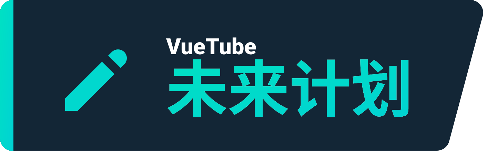

    <a href="https://vuetube.app/">
    <picture>
      <source 
        srcset="https://raw.githubusercontent.com/VueTubeApp/.github/main/readme_assets/dark/VueTube.svg"
        media="(prefers-color-scheme: dark)"
      />
      
    </picture>
  </a>
   
  

  
显示 Readme 贡献名单

标志：<a href="https://github.com/afnzmn">@afnzmn</a>  
简体中文 Readme 贡献者：<a href="https://github.com/404-Program-not-found">@404-Program-not-found</a> 和 <a href="https://github.com/nokanol45">@nokanol45</a>

  

  

<strong>轻巧的开放源代码流媒体客户端，旨在再造不同流媒体应用程序的所有功能（以及更多！）</strong>
 
读音是 View Tube (<code>/ˈvjuːˌtjuːb/</code>)

  <a href="https://github.com/VueTubeApp/VueTube/blob/main/LICENSE" alt="License"></img></a>
  <a href="https://github.com/VueTubeApp/VueTube/actions/workflows/ci.yml" alt="CI"></img></a>
  <a href="https://reddit.com/r/vuetube" alt="Reddit"></img></a>
  <a href="https://t.me/VueTube" alt="Telegram"></img></a>
  <a href="https://discord.gg/7P8KJrdd5W" alt="Discord"></img></a>
  <a href="https://twitter.com/VueTubeApp" alt="Twitter"></img></a>

其他语言版本：[English,](../readme.md) [Español,](/readme/readme.es.md) [简体中文,](/readme/readme.zh-hans.md) [繁體中文,](/readme/readme.zh-hant.md) [日本語,](/readme/readme.ja.md) [עִברִית,](/readme/readme.he.md) [Nederlands,](/readme/readme.nl.md) [தமிழ்,](/readme/readme.ta.md) [Bahasa Melayu,](/readme/readme.ms.md) [Македонски,](/readme/readme.mk.md) [Français,](/readme/readme.fr.md) [Português Brasileiro,](/readme/readme.pt-br.md) [Bahasa Indonesia,](/readme/readme.id.md) [Polski,](/readme/readme.pl.md) [Български,](/readme/readme.bg.md) [Italiano,](/readme/readme.it.md) [Magyar,](/readme/readme.hu.md) [한국어,](/readme/readme.kr.md) [Tiếng Việt,](/readme/readme.vi.md) [Română,](/readme/readme.ro.md) [Українська,](/readme/readme.ua.md) [Türkçe](/readme/readme.tr.md/)

<h2 align="left">

功能
</h2>

- 🎨 **主题**：明亮、黑暗、OLED，以及彩虹中的任何颜色！您可根据您的喜好选择强调色和背景色。
- 🖌️ **自定义使用者界面**：自定义主题，甚至停用您不使用的一些界面，以获得最佳体验。
- ⬆️ **自动更新**：有新版本可用时接收通知，如果您不喜欢也可以撤销更新！
- 👁️ **追踪阻断**：VueTube 默认不会发送任何跟踪数据，亦不使用任何外部 API。隐私是必要的！
- 📺 **自家制的 HTML5 视频播放器**：内置在应用程序的播放器，拥有您所需的任何功能，例如 16 倍速。
- 🌍 **翻译**： 本应用程序支持超过 25 种语言！默认语言因您的设备配置而定。
- 👎 **Return YouTube Dislike** - 带回视频的「踩一下」指标。[_更多资讯_](https://returnyoutubedislike.com)
- 💰 **SponsorBlock** - 自动跳过视频中的赞助广告和烦人的片段。[_更多信息_](https://sponsor.ajay.app)

<h2 align="left">

下载
</h2>

请访问 [vuetube.app/install](https://www.vuetube.app/install) 来下载 VueTube，或在下面查看所有可用的版本：

  
🖱️ 点击这里显示版本

 

### 安卓/Android

|  |  |  |
| -------------------------------------------------------------------------------------------------------------------------------------------- | ----------------------------------------------------------------------------------------------------------------------------- | ------------------------------------------------------------------------------------------------ |
| 有最新的功能，并且经常有更新，但 bug 也最常见。                                                                                              | bug 比 unstable 较少，功能也比 stable 稍新。                                                                                  | 暂时未有 Stable 版本可用。                                                                       |

### iOS

|  |  |  |
| ---------------------------------------------------------------------------------------------------------------------------------------- | ------------------------------------------------------------------------------------------------------------------------------------------------------------------------------- | ------------------------------------------------------------------------------------------------ |
| 有最新的功能，并且经常有更新，但 bug 也最常见。                                                                                          | bug 比 unstable 较少，功能也比 stable 稍新。                                                                                                                                    | 暂时未有 Stable 版本可用。                                                                       |

<h2 align="left">

未来计划
</h2>

- 🔍 **进阶搜索**：以日期、时长、「顶一下」数目等项目筛选搜索结果。
- 🗞️ **本地存储观看记录**：不用登录也可以查阅先前观看过的视频。
- ✂️ **YouTube Shorts**：大概 15 至 60 秒长的垂直短视频。
- 🧑 **谷歌帐号登录**：登录以订阅频道、在视频下留下评论和参与投票，获得最全面的体验。
- 🖼️ **画中画模式（PiP）**：使用其他应用程序时在悬浮式窗口中观看视频。
- 🧩 **插件**：安装由 VueTube 社区开发的第三方插件，取得更多功能！
- 以及更多！

你可在此软件存储库发布「功能请求」(feature request) 议题来建议新功能。

<h2 align="left">

截图
</h2>

[在我们的网站上查看](https://www.vuetube.app/info/screenshots)，或点击下面以查看它们。

  
 🖱️ 点击这里查看截图  

 
  

     

<h2 align="left">

社区
</h2>

我们使用几个不同的平台与我们的社区联络。您可以主动参与 VueTube 的开发，或加入以下群组，获得最新的消息。

- Discord 伺服器 (https://vuetube.app/discord)
- Telegram 群组 (https://t.me/vuetube)
- Reddit 网页 (https://www.reddit.com/r/vuetube)

<h2 align="left">

进度
</h2>

  
 🖱️ 点击这里查看进度 

  
 
**通常** | **播放器** | [**提取器**](https://github.com/VueTubeApp/VueTube-Extractor) |
:-: | :-: | :-: |
🟢 评论 (100%) | 🟢 播放 / 暂停 (100%) | 🟢 自动完成搜索 (100%) |
🟢 描述 (100%) | 🟢 轻按显示／隐藏控制项目 (100%) | 🟢 首页 (100%) |
🟢 首页 (100%) | 🟠 进度条／滑动条 (80%) | 🟢 搜索 (100%)
🟢 内置 RYD (100%) | 🟠 全屏 (80%) | 🟠 视频信息 (60%) |
🟢 主题 (100%) | 🟠 画质选择 (50%) | 🔴 频道 (0%) |
🟢 观看页 (100%) | 🔴 迷你播放器 (0%) | 🔴 评论 (0%) |
🟠 内置 Sponsorblock (95%) | 🔴 背景播放 (0%) | 🔴 即时通讯 (0%) |
🟠 自动更新 (50%) | 🔴 画中画 (0%) | 🔴 热门内容 (0%)
🟠 频道页 (50%) |  🔴 字幕 (0%) | 🔴 互动 (0%) |
🟠 社区帖子 (10%) | 🔴 信息卡 (0%) | 🔴 播放列表 (0%) |
🟠 可自定义的 Shorts 界面 (10%) |  | 🔴 通知 (0%)
🟠 可自定义的 YT Music 界面 (10%) |  | 🔴 登录 (0%)
🟠 可自定义的界面 (30%) |  |  |
🟠 媒体库页 (10%) |  |  |
🟠 评论回覆 (50%) |  |  |
🟠 第三方插件 (40%) |  |  |
🟠 VueTube 播放器 (参见右方进度) |  |  |
🟠 VueTube 提取器 (参见右方进度) |  |  |
🔴 本地存储观看记录 (0%) |  |  |
🔴 订阅项目页 |  |  |
🔴 支援其他平台 (0%) |  |  |
  

### 使用的技术

       

### 为什么要开发这应用程序？

开发这应用程序的主意其实已在 Return YouTube Dislike 的 Discord 上讨论一段时间了，因此我觉得我应该要尝试一下！

### 如何贡献

很高兴您有兴趣贡献！如您想提交代码，请访问我们的网站查閲提交代码指南：[vuetube.app/contributing](https://www.vuetube.app/contributing)

如您想翻译此应用程序，请[点击这里](/NUXT/plugins/languages)查阅翻译指南。如果 GitHub 对您而言太难或不适应，不用担心，您亦可在我们的 [Discord](https://vuetube.app/discord) 上用文字档方式传送已翻译的字段，我们会替您把它们整合进应用程序内。

<h2 align="left">

GitHub 贡献者
</h2>

仪表盘由[contrib.rocks](https://contrib.rocks)自动制作。

<h2 align="left">

鸣谢
</h2>

- 感谢 [Twemoji](https://twemoji.twitter.com/) 提供的表情符号。授权于 [CC-BY 4.0](https://creativecommons.org/licenses/by/4.0/)。
- 感谢 [@afnzmn](https://github.com/afnzmn) 提供 VueTube 标志。
- 感谢 [Return YouTube Dislike](https://returnyoutubedislike.com) 提供的「踩一下」数据。
- 感谢 Ajay 和 Sponsorblock 社区提供 [Sponsorblock 的 API](https://sponsor.ajay.app/)。授权于 [CC BY-NC-SA 4.0](https://creativecommons.org/licenses/by-nc-sa/4.0/)。

<h2 align="left">

捐款
</h2>

VueTube 永远是自由且开源的，但您仍可捐款以支持我们的开发者，帮助维护这个项目和开发新功能。我们欢迎任何方式的帮助！以下是可用的捐款选项：

[在 Ko-Fi.com 上捐款](https://ko-fi.com/vuetube) (官方)

[在 GitHub 上捐款给 PickleNik](https://github.com/sponsors/PickleNik) (维护者)

<h2 align="left">

免责声明
</h2>

本项目及其内容不隶属于 YouTube、Google LLC 或其任何关联公司和子公司，也不受其资助、授权、认可或以任何方式与之关联。 YouTube 的官方网站是：[www.youtube.com](https://www.youtube.com).

本项目中使用的任何商标、服务标志、商品名称或其他知识产权均归各自所有者所有。

如本文与英文版本有任何差异，以英文版本为准。

<h2 align="left">

其他 VueTube 软件库
</h2>

  
 🖱️ 点击这里显示软件库 

 

**VueTube 提取器** 是一个为从流服务中提取数据而设的函式库，为 VueTube 应用程序所用而设。

**VueTube 翻译器** 是一个用来翻译 GitHub 上的 JSON 或 JS 档等的字段和以正确的结构汇出结果的工具。此工具为辅助 VueTube 翻译者为设，但亦可用作其他用途。

**VueTube HTTP** 是一个用作原生 HTTP 请求、档案下载／上载和管理 Cookies 的插件。它是 Capacitor 社区的[ HTTP 项目](https://github.com/capacitor-community/http) 的分叉，拥有 VueTube 团队的附加代码。

