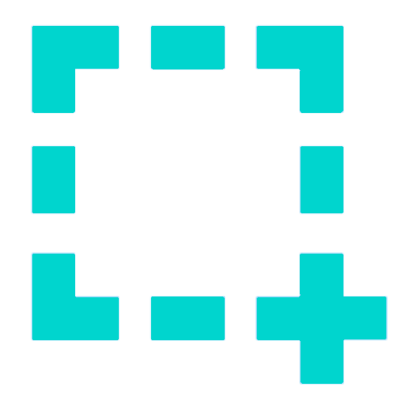

    <a href="https://vuetube.app/">
    <picture>
      <source 
        srcset="https://raw.githubusercontent.com/VueTubeApp/.github/main/readme_assets/dark/VueTube.svg"
        media="(prefers-color-scheme: dark)"
      />
      
    </picture>
  </a>
   
  

  
顯示 Readme 貢獻名單

標誌：<a href="https://github.com/afnzmn">@afnzmn</a>  
繁體中文 Readme 貢獻者：<a href="https://github.com/404-Program-not-found">@404-Program-not-found</a> 和 <a href="https://github.com/nokanol45">@nokanol45</a>

  

<strong>輕巧的開放原始碼影音串流客戶端，旨在再造不同影音串流應用程式的所有功能（以及更多！）</strong>
 
讀音是 View Tube (<code>/ˈvjuːˌtjuːb/</code>)

  <a href="https://github.com/VueTubeApp/VueTube/blob/main/LICENSE" alt="License"></img></a>
  <a href="https://github.com/VueTubeApp/VueTube/actions/workflows/ci.yml" alt="CI"></img></a>
  <a href="https://reddit.com/r/vuetube" alt="Reddit"></img></a>
  <a href="https://t.me/VueTube" alt="Telegram"></img></a>
  <a href="https://discord.gg/7P8KJrdd5W" alt="Discord"></img></a>
  <a href="https://twitter.com/VueTubeApp" alt="Twitter"></img></a>

其他語言版本：[English,](../readme.md) [Español,](/readme/readme.es.md) [简体中文,](/readme/readme.zh-hans.md) [繁體中文,](/readme/readme.zh-hant.md) [日本語,](/readme/readme.ja.md) [עִברִית,](/readme/readme.he.md) [Nederlands,](/readme/readme.nl.md) [தமிழ்,](/readme/readme.ta.md) [Bahasa Melayu,](/readme/readme.ms.md) [Македонски,](/readme/readme.mk.md) [Français,](/readme/readme.fr.md) [Português Brasileiro,](/readme/readme.pt-br.md) [Bahasa Indonesia,](/readme/readme.id.md) [Polski,](/readme/readme.pl.md) [Български,](/readme/readme.bg.md) [Italiano,](/readme/readme.it.md) [Magyar,](/readme/readme.hu.md) [한국어,](/readme/readme.kr.md) [Tiếng Việt,](/readme/readme.vi.md) [Română,](/readme/readme.ro.md) [Українська,](/readme/readme.ua.md) [Türkçe](/readme/readme.tr.md/)

<h2 align="left">

功能
</h2>

- 🎨 **主題**：明亮、黑暗、OLED，以及彩虹中的任何顏色！您可根據您的喜好選擇強調色和背景色。
- 🖌️ **自訂使用者介面**：自訂主題，甚至停用您不使用的一些介面，以獲得最佳體驗。
- ⬆️ **自動更新**：有新版本可用時接收通知，如果您不喜歡也可以撤銷更新！
- 👁️ **追蹤阻斷**：VueTube 預設不會傳送任何跟蹤數據，亦不使用任何外部 API。私隱是必要的！
- 📺 **自家製的 HTML5 影片播放器**：內置在應用程式的播放器，擁有您所需的任何功能，例如 16 倍速。
- 🌍 **翻譯**： 本應用程式支持超過 25 種語言！預設語言因您的裝置配置而定。
- 👎 **Return YouTube Dislike** - 帶回影片的「不喜歡」指標。[_更多資訊_](https://returnyoutubedislike.com)
- 💰 **SponsorBlock** - 自動跳過影片中的贊助廣告和煩人的片段。[_更多資訊_](https://sponsor.ajay.app)

<h2 align="left">

下載
</h2>

請訪問 [vuetube.app/install](https://www.vuetube.app/install) 來下載 VueTube，或在下面查看所有可用的版本：

  
🖱️ 按此顯示版本

 

### Android

|  |  |  |
| -------------------------------------------------------------------------------------------------------------------------------------------- | ----------------------------------------------------------------------------------------------------------------------------- | ------------------------------------------------------------------------------------------------ |
| 有最新的功能，並且經常有更新，但 bug 也最常見。                                                                                              | bug 比 unstable 較少，功能也比 stable 稍新。                                                                                  | 暫時未有 Stable 版本可用。                                                                       |

### iOS

|  |  |  |
| ---------------------------------------------------------------------------------------------------------------------------------------- | ------------------------------------------------------------------------------------------------------------------------------------------------------------------------------- | ------------------------------------------------------------------------------------------------ |
| 有最新的功能，並且經常有更新，但 bug 也最常見。                                                                                          | bug 比 unstable 較少，功能也比 stable 稍新。                                                                                                                                    | 暫時未有 Stable 版本可用。                                                                       |

<h2 align="left">

未來計劃
</h2>

- 🔍 **進階搜尋**：以日期、時長、「喜歡」數目等項目篩選搜尋結果。
- 🗞️ **本地儲存觀看記錄**：不用登入也可以查閲先前觀看過的影片。
- ✂️ **YouTube Shorts**：大概 15 至 60 秒長的垂直短片。
- 🧑 **Google 帳戶登入**：登入以訂閲頻道、在影片下留下評論和參與投票，獲得最全面的體驗。
- 🖼️ **畫中畫模式（PiP）**：使用其他應用程式時在懸浮式視窗中觀看影片。
- 🧩 **插件**：安裝由 VueTube 社群開發的第三方插件，取得更多功能！
- 以及更多！

您可在此軟體儲存庫發佈「功能請求」(feature request) 議題來建議新功能。

<h2 align="left">

截圖
</h2>

[在我們的網站上查看](https://www.vuetube.app/info/screenshots)，或在下面輕按以查看它們。

  
 🖱️ 按此顯示截圖  

 
  

     

<h2 align="left">

社群
</h2>

我們使用幾個不同的平台與我們的社群聯絡。你可以主動參與 VueTube 的開發，或加入以下群組，獲得最新的消息。

- Discord 伺服器 (https://vuetube.app/discord)
- Telegram 群組 (https://t.me/vuetube)
- Reddit 網頁 (https://www.reddit.com/r/vuetube)

<h2 align="left">

進度
</h2>

  
 🖱️ 按此顯示進度 

  
 
**一般** | **播放器** | [**提取器**](https://github.com/VueTubeApp/VueTube-Extractor) |
:-: | :-: | :-: |
🟢 評論 (100%) | 🟢 播放 / 暫停 (100%) | 🟢 自動完成搜尋 (100%) |
🟢 描述 (100%) | 🟢 輕按顯示／隱藏控制項目 (100%) | 🟢 主頁 (100%) |
🟢 主頁 (100%) | 🟠 進度條／滑動條 (80%) | 🟢 搜尋 (100%)
🟢 內置 RYD (100%) | 🟠 全螢幕 (80%) | 🟠 影片資訊 (60%) |
🟢 主題 (100%) | 🟠 畫質選擇 (50%) | 🔴 頻道 (0%) |
🟢 觀看頁 (100%) | 🔴 迷你播放器 (0%) | 🔴 評論 (0%) |
🟠 內置 Sponsorblock (95%) | 🔴 背景播放 (0%) | 🔴 即時通訊 (0%) |
🟠 自動更新 (50%) | 🔴 畫中畫 (0%) | 🔴 熱門內容 (0%)
🟠 頻道頁 (50%) |  🔴 字幕 (0%) | 🔴 互動 (0%) |
🟠 社群帖子 (10%) | 🔴 資訊卡 (0%) | 🔴 播放清單 (0%) |
🟠 可自訂的 Shorts 介面 (10%) |  | 🔴 通知 (0%)
🟠 可自訂的 YT Music 介面 (10%) |  | 🔴 登入 (0%)
🟠 可自訂的介面 (30%) |  |  |
🟠 媒體庫頁 (10%) |  |  |
🟠 評論回覆 (50%) |  |  |
🟠 第三方插件 (40%) |  |  |
🟠 VueTube 播放器 (參見右邊進度) |  |  |
🟠 VueTube 提取器 (參見右邊進度) |  |  |
🔴 本地儲存觀看記錄 (0%) |  |  |
🔴 訂閲項目頁 |  |  |
🔴 支援其他平台 (0%) |  |  |
  

### 使用的技術

       

### 為什麼要開發這應用程式？

開發這應用程式的主意其實已在 Return YouTube Dislike 的 Discord 上討論一段時間了，因此我覺得我應該要嘗試一下！

### 如何貢獻

很高興您有興趣貢獻！如您想貢獻原始碼，請移至我們的網站查閲貢獻原始碼指南：[vuetube.app/contributing](https://www.vuetube.app/contributing)

如您想翻譯此應用程式，請[按此](/NUXT/plugins/languages)查閲翻譯指南。如果 GitHub 對您而言太難或不適應，不用擔心，您亦可在我們的 [Discord](https://vuetube.app/discord) 上用文字檔案方式傳送已翻譯的字段，我們會替您把它們整合進應用程式內。

<h2 align="left">

GitHub 貢獻者
</h2>

儀表板由[contrib.rocks](https://contrib.rocks)自動製作。

<h2 align="left">

鳴謝
</h2>

- 感謝 [Twemoji](https://twemoji.twitter.com/) 提供的表情符號。授權於[CC-BY 4.0](https://creativecommons.org/licenses/by/4.0/)。
- 感謝 [@afnzmn](https://github.com/afnzmn) 提供 VueTube 標誌。
- 感謝 [Return YouTube Dislike](https://returnyoutubedislike.com) 提供的「不喜歡」數據。
- 感謝 Ajay 和 Sponsorblock 社群提供 [Sponsorblock 的 API](https://sponsor.ajay.app/)，授權於 [CC BY-NC-SA 4.0](https://creativecommons.org/licenses/by-nc-sa/4.0/)。

<h2 align="left">

捐款
</h2>

VueTube 永遠是自由和開源的，但您仍可捐款以支持我們的開發人員，幫助維護這個項目和開發新功能。我們歡迎任何方式的幫助！以下是可用的捐款選項：

[在 Ko-Fi.com 上捐款](https://ko-fi.com/vuetube) (官方)

[在 GitHub 上捐款給 PickleNik](https://github.com/sponsors/PickleNik) (維護者)

<h2 align="left">

免責聲明
</h2>

本項目及其內容不隸屬於 YouTube、Google LLC 或其任何關聯公司和子公司，也不受其資助、授權、認可或以任何方式與之關聯。YouTube 的官方網站是：[www.youtube.com](https://www.youtube.com).

本項目中使用的任何商標、服務標誌、商品名稱或其他知識產權均歸各自所有者所有。

如本文與英文版本有任何差異，以英文版本為準。

<h2 align="left">

其他 VueTube 軟體庫
</h2>

  
 🖱️ 輕按顯示軟體庫 

 

**VueTube 提取器** 是一個為從串流服務中提取數據而設的函式庫，為 VueTube 應用程式所用而設。

**VueTube 翻譯器** 是一個用來翻譯 GitHub 上的 JSON 或 JS 檔案等的字段和以正確的結構匯出結果的工具。此工具為輔助 VueTube 翻譯者而設，但亦可用作其他用途。

**VueTube HTTP** 是一個用作原生 HTTP 請求、檔案下載／上載和管理 Cookies 的插件。它是 Capacitor 社群的[ HTTP 項目](https://github.com/capacitor-community/http) 的分叉，擁有 VueTube 團隊的附加程式碼。

